## 目录

1. 一、前言
2. 二、经验分享
3. 政治
    1. 1.时间整体进度
    2. 2.细节补充
4. 英语
    1. 1.时间整体进度
    2. 2.细节补充
    3. （1）关于单词
    4. （2）关于作文
5. 数学
    1. 1.时间整体进度
    2. 2.细节补充
    3. （1）模拟题简单评测
    4. （2）数学套卷的练习与复盘
6. 408
    1. 1.408基本介绍
    2. 2.时间整体进度
    3. 3.如何加深对真题的理解
    4.   (1) 反复多次，思考交流，知其来源，晓其变化
    5. （2）利用好最新年份真题模拟
    6. （3）时间控制
    7. 4.真题之外？
    8. （1）如何利用考纲
    9. （2）思维导图和易错整理
    10. （3）书课补充
    11. （4）模拟题分析
    12. 5.一些补充
7. 三、后记

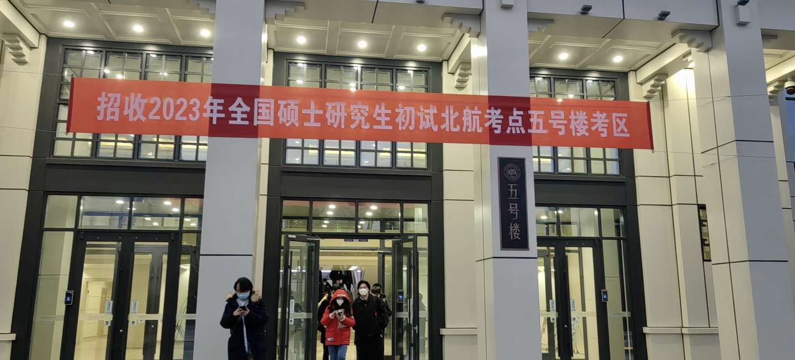

## 一、前言

这是一篇搁置许久的经验贴。写经验贴的初衷一方面是想记录自己一路过来的考研经历，另一方面也是想帮助后来者少走一些弯路，找到适合自己的学习方法。我在考研期间阅读了大量前辈的经验贴，在这些文章中我找到了属于自己的学习路线，也发现了共鸣，希望这篇帖子也能给每年的研友们一些小小的帮助。**文章内容稍长，全文约1.3w字，大家可以按照目录跳转查看自己感兴趣的内容。** 

先做下自我介绍，我是23年考研浙大计算机的sgt，初试总分440，最终以初试第三，总分第二的成绩顺利上岸。

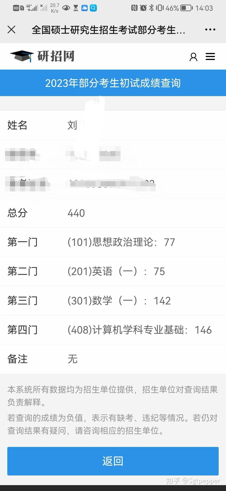

*初试成绩*

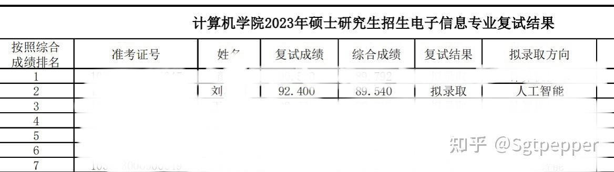

*录取结果*

我本科就读于北京航空航天大学计算机学院，因此作为科班在数学和408科目都有一定的基础，数学的高数、线代、概率论都有学过相应的课，但是备考期间基本等于重头来过了，408的四门科目也都学习过，其中计网是在大三下学习的。六级分数530（还是在备考期间考出来的）。在学校的排名大约在40%-50%。

整个考研的时间跨度大约是从6月底到12月底，学习总时长大约在1400h+，基本能保证每天6-8h的学习时长。

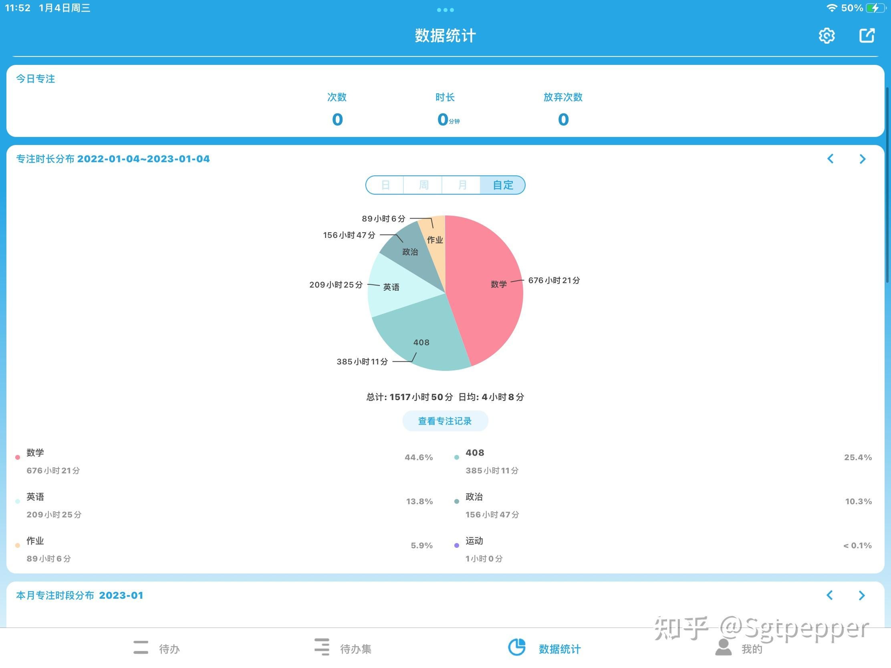

*考研时长记录*

## 二、经验分享

## 政治

### 1.时间整体进度

> 8月初——9月底  基础阶段 
> 
> 使用书课：徐涛强化班+《核心考案》+肖1000

在漫长的备考之路上，感觉多位老师为我提供了数不尽的快乐，让我在一天的疲惫之后感受到些许的宽慰与放松，而这其中必有徐涛老师的大名。

由于政治在前期的投入产出比较低，因此8月甚至9月开始都是完全ok的，在8-9月我沿袭了传统的徐涛强化班+肖1000的组合，**完成后大概对整个政治框架有一些基本的了解，但是具体细节往往会忘得一干二净** 。这里的建议是**每天花1h以内即可，后期再逐步提升时间** 。

> 10月  强化阶段 
> 
> 使用书课：腿姐技巧班+腿姐背诵笔记

可以说我在听完腿姐技巧班，并过完背诵笔记之后，才对整个知识体系有了比较清楚的认识，整个课程主要面向选择题应试技巧，因此听完之后做题和速度和准度都相对来说有一个质的提升，该阶段听课+看笔记必须两不误，这样才能保证知识记忆的广度和准度。

> 11月  刷题阶段 
> 
> 使用书课：腿姐背诵笔记+苍盾各类题库（肖8+米6+腿4+徐6） 

这段时间开始以复习腿姐背诵笔记和刷各种老师出的套卷选择为主，我这边的优先级排序是肖8>米6>腿4>徐6。其中肖8建议是刷2—3遍，尽量保证最后的正确率接近100%。可能很多同学最开始做的时候错误率会较高，尤其是时政部分会连着错，但随着刷题量的增多和之后对时政的补充，正确率会逐步提升。

对于在刷题时错误的题目，**建议把相关知识点标记在自己的背诵小册子上** （我的是腿姐背诵笔记），如果小册子上没有相关内容还可以自己补充。

> 12月  冲刺阶段 
> 
> 使用书课：腿姐背诵笔记+腿姐时政整理+肖4+米3+腿姐冲刺班 

最后阶段的复习基本以看背诵笔记+刷选择题+看时政+背肖4为主。

**1.看背诵笔记** 是我始终坚持下来的，因为只有反复的观看才能对知识点有较为牢固的记忆，减少遗忘，建议在考前至少整个小册子过3-4遍以上。 

**2.复习时政** 以做题补充为主比较高效，同时可以辅以看腿姐12月出的时政整理。 

**3.选择题** 的练习可以以肖4+米3为主，同时辅以之前错题的复习（苍盾上有错题的整理） 

**4.肖4的背诵** ，跟着肖4背总不会错，具体的背诵内容我是结合了**学长小谭整理的肖4背诵逻辑版+研木易精简版+肖4原文** 。考前2周基本能把肖4过个2-3遍，上考场就不愁没得写了，当然背书的过程还是会有些痛苦的。可以一天拆成几个时间段分别背诵，减少背诵负担。后期政治的复习时间基本在3—4h左右。

### 2.细节补充

今年真题的分析：

今年政治的真题选择和考前做的大量模拟题风格都很不相同，甚至有些知识点上考场会一点印象都没有。所以在我看来，适当的模拟练习还是有必要的，但是堆量可能意义不大了，我觉得比较核心的点在于：

**1. 坚持相信自己做题的第一直觉** ，在看腿姐技巧班的时候，腿姐有做过历年真题多选数目的规律，比如三选就会偏多，双选和四选相对来说数目会偏少，但是今天第一遍做下来之后，我选了远超正常数目的双选和四选，当然有些选项我也不是十分确定，前后纠结了许久，最终相信了自己的直觉，没有对答案进行修改，最后对答案也验证了我的想法，今年果然是一反常态，三选数目减少了。

**2.大题背诵可以一个资料为核心，其余资料可以在有多余时间补充背诵和阅读** ，我在复习的时候综合了**研木易+肖4原文+小谭肖4背诵逻辑版** ，最后还看了一部分腿姐的背诵整理版，最后上考场的时候基本能保证每道题都有话可说，当然有些几乎就是原题了。背诵上的压力还是比较重的，结合一些肖4的精简版/逻辑版辅助背诵比较合理，毕竟大题的关键是有话可说，很多时候原文背诵是没必要的。

3.复习的意义很多时候就在于查缺补漏，印象深的减少复习量，印象浅的增加复习量，这里利用复习小册子可以很好地起到这种区分和巩固的作用，我以自己使用的腿姐背诵手册举例，平常做题的时候就可以把自己错题的知识点和记忆不清的点标记其上，如果小册子上没有相关内容还可以自己补充，虽然这样会增加记录时间，但是对于之后的复习将是事半功倍，可以着重看自己错误的知识点部分。

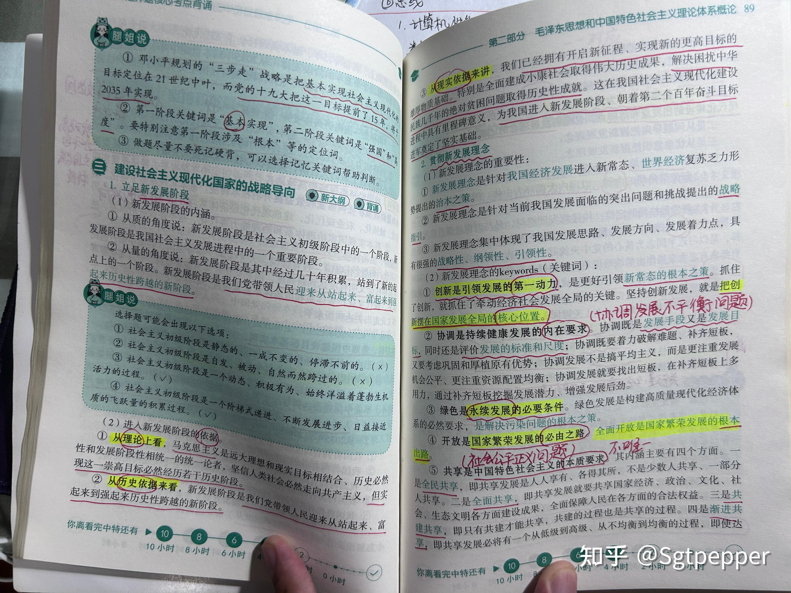

*背诵手册截图*

---

## 英语

### 1.时间整体进度

> 7月-9月中旬   
> 
> 使用书课：黄皮书，墨墨背单词，红皮书，唐迟阅读

该阶段的主要目标是**完成单词量的积累和阅读题感的提高。** 

我在该阶段基本保持1-2天完成一篇阅读，从02年阅读开始练习，基本到9月中旬就可以完成19年前的所有阅读（保留了3年的真题进行最终的模拟）。同时保证每天进行单词的背诵，前期主要是使用墨墨背单词，该app主要可以辅助进行及时有效的复习，到8月中旬开始使用红皮书进行单词的背诵，红皮书的单词释义和说明更加丰富。

> 9月-10月 
> 
> 使用书课：黄皮书，墨墨背单词，黄皮书单词，小三门相关书课

该阶段除了继续保持阅读练习和单词背诵，也可以开始小三门的练习，小三门由于分值低，而且投入产出比不成正比，因此**大家可以适当地看一些课，但是不应花过多时间** （实测我自己看了市面上的相关课程，效果都不算很好），有时间多写真题练习才是正道。**尤其要小心新题型的排序题。（考场上狠狠摔跤了）** 

> 10月-11月 
> 
> 使用书课：黄皮书，墨墨背单词，黄皮书单词，石雷鹏大小作文视频课，小三门相关书课

到了10月中旬就需要花一定的时间开始准备作文了，我在备考期间使用的是石雷鹏的大小作文课，基本上跟下来，再自己练习几篇，总结一些功能句，作文就能拿个比较稳定的分了，当然要想得到作文高分，可能还需要结合其他老师和资料，同时阅读应该进入二刷或者三刷，小三门也应基本进入尾声了。

> 11月-12月 
> 
> 使用书课：黄皮书，黄皮书单词，石雷鹏大小作文视频课

最后阶段要做的事基本如下：

- ***适当练习，保持题感*** 
- ***利用整个下午的时间进行全真模拟（我留了3张试卷），模拟中发现时间控制和作文熟练度等很多问题，并纠正*** 
- ***继续整理功能句，挑选作文进行练习*** 
- ***背单词！！！！*** 

### 2.细节补充

### （1）关于单词

考研单词词汇量一般在5500左右，但常考词的数目大概只在2000左右，因此在时间有限的情况下，**应该优先把常考词的释义烂熟于心** 。此外考研题型对于词汇的掌握主要偏向于释义，而考察固定搭配等较少，因此一本精简的单词释义书很有必要，我在复习阶段主要使用了三种不同的单词书/软件辅助单词背诵，同时也是为了缓解背单词过程的无聊（太太太太太无聊了！，但是还是得背）

**1.墨墨背单词（前中期）** ，它是一个可以方便背诵和复习固定单词数目的app，作为前期积累单词记忆还是比较有效果的，而且app中提供了一部分奇异的助记，确实能很大程度上辅助记忆。

**2.红宝书（中期）** ，红宝书可以在一定程度上补充对于考研词汇的理解，但是因为考研英语不是非常强调对于单词的理解和使用，因此红宝书的优先级不是很高，可以在中期背单词作为一种补充。

**3.黄皮书配套单词（中后期）** ，强烈推荐的一款单词书，还是在黄皮书中免费赠送的，它的一个特点是会给出每个单词的考频，因此在背诵时就可以了解每个单词的重要程度，中后期选择一本精缩版的单词其实就够用了，它只需要包含基本的单词释义和重要性分类。我的背诵方法是第一次背诵时对于不会的单词进行标记黄色，然后第二次背诵时着重背诵标黄的单词，如果还是不会就标橙色，以此类推，这样就可以把单词背很多轮，而且不断消化不清楚的单词，实测是非常有效的后期单词背诵方法。此外还可以找研友互相测试背诵，只要能背出单词对应的释义就可以。

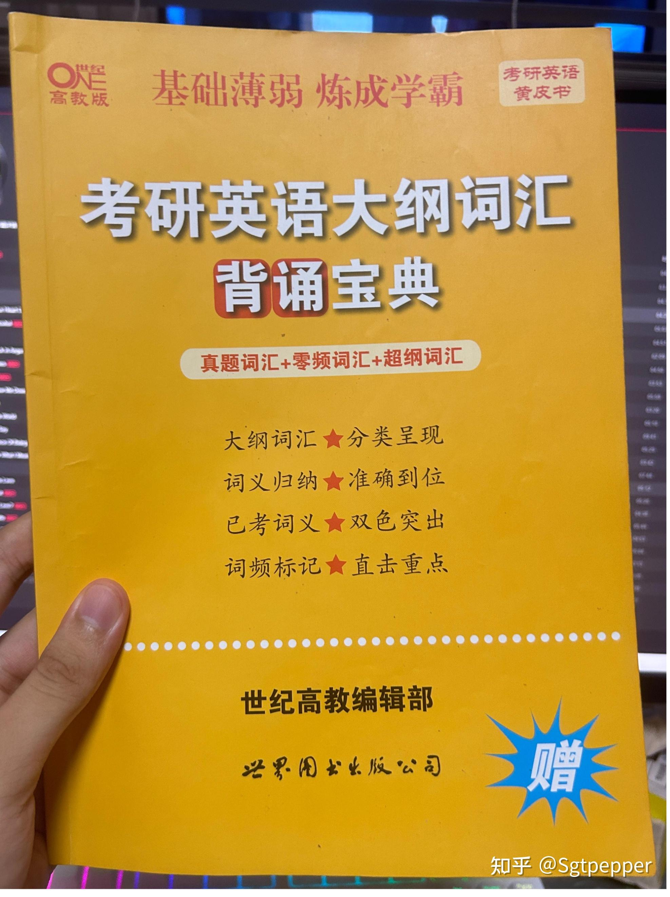

*黄皮书配套单词*

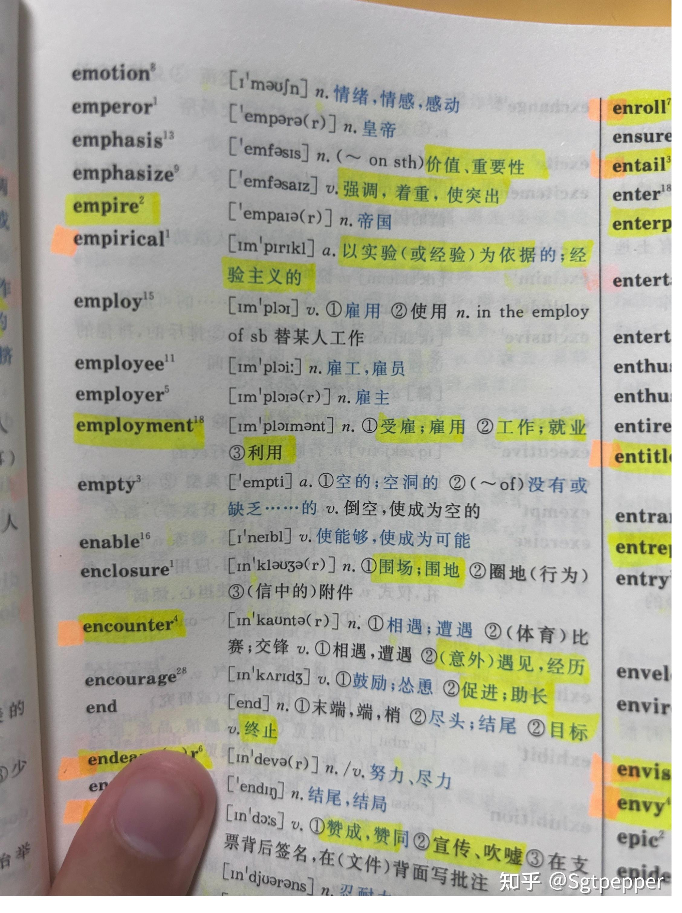

*黄皮书配套单词*

### （2）关于作文

考研作文类型和题材整体来说还是比较固定的，因此整理和背诵功能句的方法就显得十分有效，执行起来就是对于几种类型的小作文或大作文，能够理解记忆基本的叙述脉络和表达句式，然后在自己进行练习即可，这里我强烈推荐石雷鹏的作文课，只需要听个4-5节掌握规律，就可以自己进行总结了。练习时最好是各种类型的作文都训练一遍，因为不同的作文题目，写作思路上会有一些区别，如果只掌握了一种，考试一变题目很容易抓瞎。例如20-22年3年的大作文基本都可以用一个套路写下来，但是23年的题目就突然发生一些变化，我做的准备不充分，就导致写23年的作文花了大量的时间。

---

## 数学

### 1.时间整体进度

> 6月中旬-8月初 基础阶段 使用书课：张宇30讲+300题

基础阶段我使用的是张宇30讲，主要是把高数+线代+概率论的知识进行第一轮预习，这个工作最晚应该在8月初之前结束，前期数学所需要花的时间偏多，最好是能保证4h以上的时间，很重要的一点是一定要自己动手写题，只看课不写题对于水平的提升会有很大的负效果。

> 8月-9月中旬   强化阶段 使用书课：张宇18讲+李永乐线代讲义+张宇9讲+660+880

强化阶段需要增加**题目的练习量，计算的复杂度，训练的思维度** ，这样才能真正地训练出自己在**有限时间** 内**正确** 解决问题的能力。这个阶段主要是通过学习强化讲义和刷习题集来进行提高，习题集中660的高数比较有训练价值，线代和概率论则稍逊一筹，880的习题整体质量都非常高，强烈推荐。

> 9月中-10月底  真题练习 使用书课：880+李艳芳历年真题解析+张宇8套卷

强化阶段之后就可以衔接一部分真题进行训练，体会真题的难易程度和出题方式。这里我推荐使用李艳芳的历年真题解析，它分为1987-2008和2009-2023年两个版本，每个版本都提供了十分详细的答案解析。前一版本（1987-2008）是按知识点将每年的题目进行整合，后一版本则是完整的每年套卷。这个阶段可以先将前一版本完成，同时夹杂着880题目进行训练。之后可以把模拟题和真题交叉着进行训练，即写一年真题订正完之后，再写一套模拟题，这样一方面可以把握真题风格，另一方面也可以练习新题，体会难度。最晚在10月底基本把真题给写完（记得留2-3年最后模拟）

> 11月-12月  模拟题练习+总结+查缺补漏 使用书课：各类模拟题+武忠祥17堂课

越到后期，越要增加试卷练习和订正的时间，减少看课的时间，后期推荐可以看一下武忠祥17堂课中的部分专题课程进行一下突破，包括中值定理之类的。模拟题市面上全写完很困难，但是保证20套以上的练习量对于考场上的发挥具有较为良好的促进效果。此外后期政治和英语的复习时间上来之后，可以降低数学模拟的练习频率，也可以单独练习选择和填空来适当保持手感，节省时间。

这里想特别提一下，可能到考前的2个星期，大家对于数学模拟的练习量会逐渐下降，2-3天1套卷子也是正常的，但是最好不要停止练习，因为3天不练习一张卷子很容易导致手感下降，我自己也是考前3天因为疫情等方面的原因没有动过数学，上考场就明显感到手生，思考速度变慢，对时间的控制也开始下滑。

此外还想特别推荐一下**武忠祥老师的每日一题** ，我中间断断续续写了90天左右，每日一题的题目质量相当高，而且还有完整的解析，做起来可以很好地扩展做题思维，强烈推荐。

### 2.细节补充

### （1）模拟题简单评测

这里简单分析一下我做过的模拟题的感受和质量，完全是一家之言，我在考前总共做了大约有50套模拟题，对于提升自己的数学手感和理解感觉还是有很多帮助的。

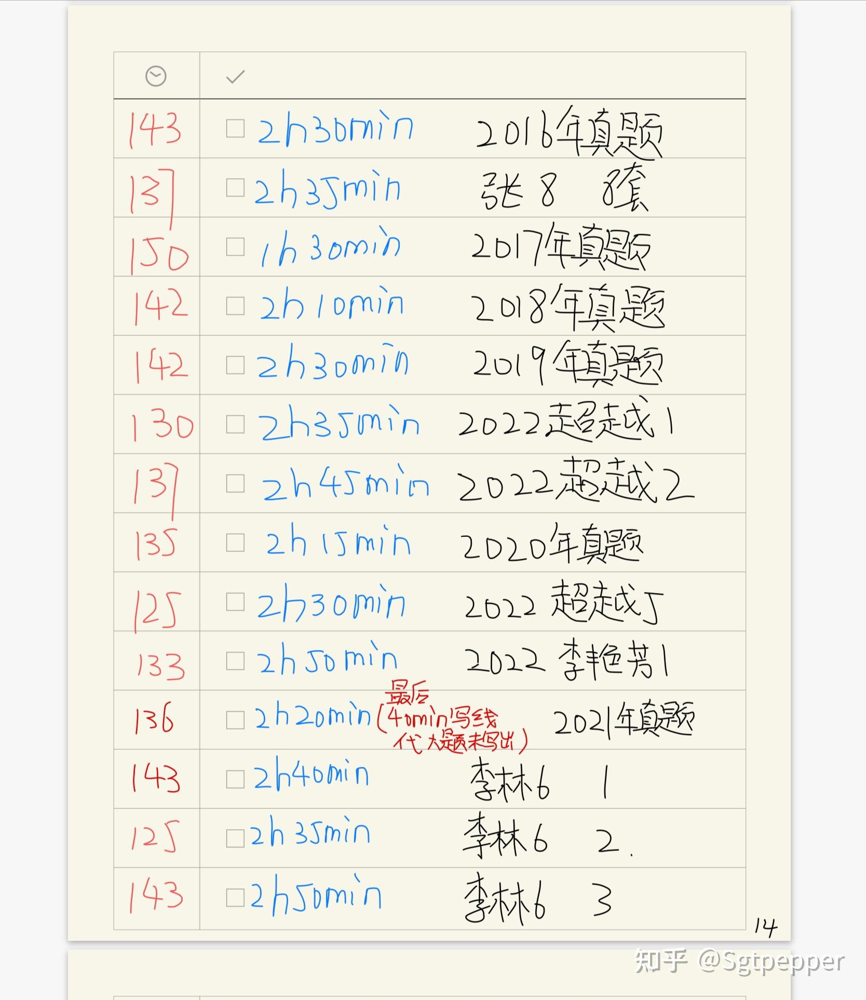

*模拟题练习记录*

**张宇八套卷** ： 4/5（推荐度） 

它是我做的第一套模拟卷，（因为也是最早出的模拟），整体难度偏高，每张卷子基本都有3-4道坑点或者难题，但是对于训练抗压能力效果很好，夹杂着真题做体验极佳（冰火两重天），试卷质量不错，有少量错误，题风偏激进一点，和真题风格有一定偏差。

**李林6套卷** ：3.5/5 

一般来说李6的评价都是比较简单，上手容易，但今年的做起来却是相当水土不服，整体做下来相当新颖的题不是很多，甚至很多题你直接能看到真题的影子，但是实际做起来却是相当别扭，也很容易在一些选填上奇妙翻车，部分试卷可能堆出3道古怪的大题，把人直接做到心态炸裂，同时也还出现了题目错误。总体概括起来就是别扭，但是又能明显看到真题的影子。

**2022、2023年超越** ：4/5 

合工大超越的卷子可以说是自成一派，本身难度不低，有相当数量的新题但也不偏，第一次做超越会相当不适应，但多做几套就会适应它的风格，我做了22超越的1，2，5套，23超越的全部5套，都有很多收获。

**22年李艳芳** ：4/5 

究极抗压卷，做的就是一个刺激，大家学有余力可以尝试，它的风格就是计算量大，有较多新题难题，想按部就班在限时内把题目做完相当困难，但确实试卷质量很高，解析十分清楚明白，练习完有很多收获。

**张宇4套卷** ：4.5/5 

相比张8，张4的卷子就相当比较温和，题目的计算量和难度都在适中的范围内，同时补充了一小部分的难题，我觉得是考前练手的好资料。

**李林4套卷** ：4/5 

李4相比李6难度明显下降，比较平稳，题目还是以真题风格为主，辅以一定的改编，具有较好的练习价值，也可以找回信心（在被狠虐之后）

**余炳森** ：2.5/5 

可以说是唯一一套做完我直接心态爆掉的卷子，题风相当奇怪，有很多独树一帜的新题，但感觉和真题有一定的区别，整体难度和计算量也不小，可以心态良好的时候体验一下，（只写了第一套）。

**武忠祥** ：4/5 

武老师因为一直做高数方面的教学，因此今年他在公众号出的两套模拟题中一套他只出了高数，另一套为150分的高数卷子，整张卷子质量也是相当高，题目都有比较好的设计，还附有长达2-3h的全题讲解，十分推荐。

### （2）数学套卷的练习与复盘

**首先在写题和看视频之间，写题应该占据学习时间的大部分篇幅，而到了中后期应该以套卷练习作为主题，以专题性的单题练习作为辅助。** 这部分想主要分享下我是如何进行数学笔记的整理和套卷练习之后的复盘，大家可以根据自己的情况选择适合自己的总结方式。

我做总结的思路就是要**用尽量少的篇幅囊括尽量多和必要的信息，从而减少后期复习的工作量，抓住核心知识点，** 因此我没有对每个章节做全覆盖的笔记，因为感觉这样做和直接看各种辅导书没什么区别，而且会花费同样大的时间成本。

经过整理我总共做了大约200页左右的总结，主要包括以下部分的内容：

> 1.**复习任务清单** 
> 
> 内容主要就是我需要复习的资料和完成的任务。

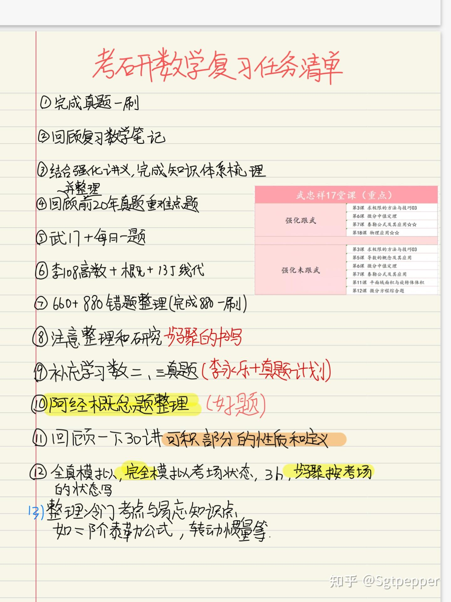

*复习任务清单*

> 2.**计算注意点** 
> 
> 内容主要为在练习过程中出现的各种计算错误以及需要注意的问题

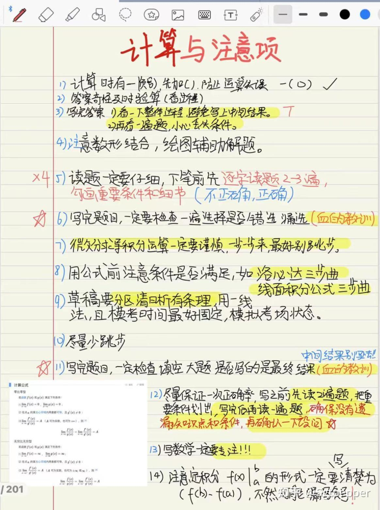

> 3.**考研数学知识体系** 
> 
> 内容其实就是高数，线代，概率论宏观的思维导图，方便进行概括性理解和延申

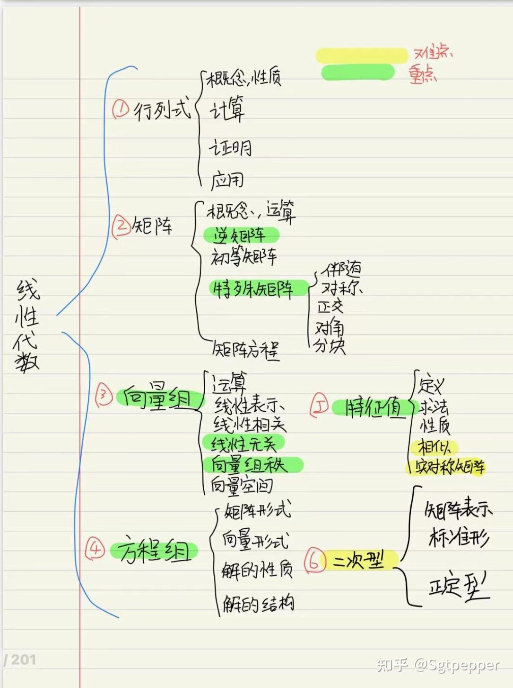

> 4.**各章节的部分知识点总结** 
> 
> 内容主要为我在做880过程中题目复盘的一些知识和易错点总结

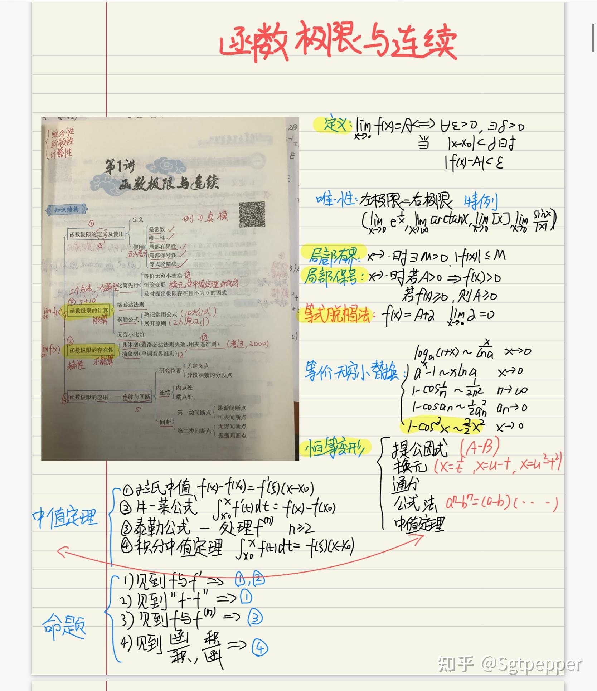

> 5.**每日一题** 
> 
> 内容：每日一题错题或者好题的整理

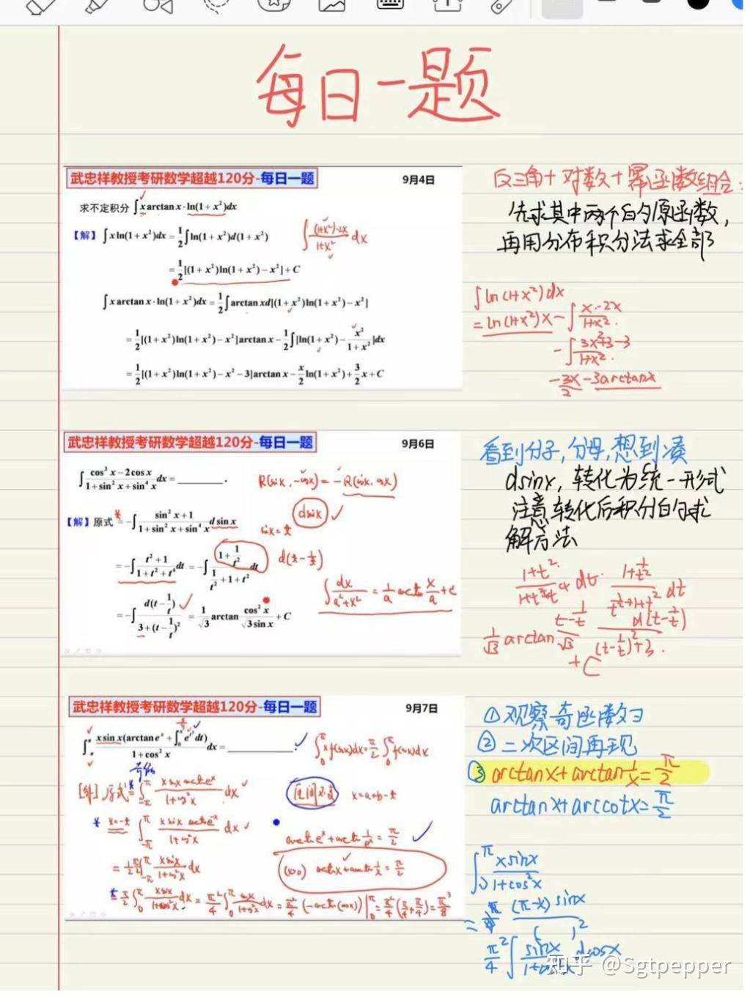

> 6.**试卷分析** 
> 
> 这个是整个笔记占比最大的部分（150/200），内容为我在做真题和模拟题过程中进行复盘的总结。我主要是在完成试卷的订正之后，对于错题和好题通过拍照的形式整理到笔记当中，并在旁边附上我对题目的理解和分析，方便我之后进行回顾和勘误，同时可以在每张试卷分析的开头进行简短的评估并附上时间和扣分信息。 它的优势在于可以较好地囊括试卷中的有效信息，减少后续的复习负担，同时也能更好地评估自己的进步和问题所在

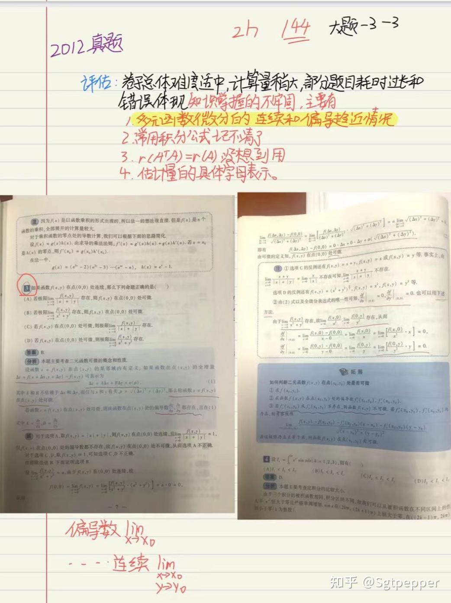

> 7.**错题频率统计** 
> 
> 这个是我在偏后期进行的工作，因为到这个阶段算上真题和模拟题在内已经写了大约50套左右的卷子，因此可以通过对试卷错误的知识点和原因分析，较好地推断出自己的薄弱点（计算错误多还是知识点掌握不牢），并进行及时的查漏补缺。

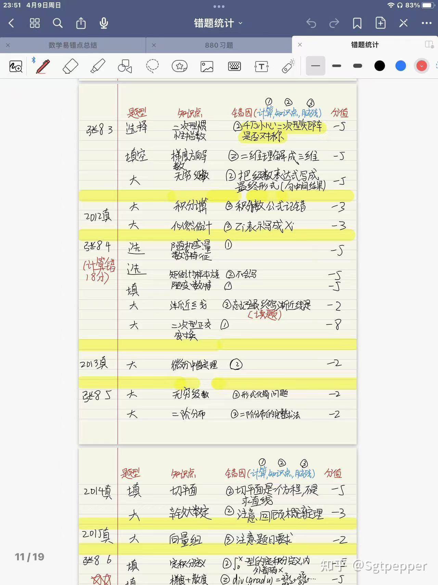

---

## 408

### 1.408基本介绍

408的经验之前也有做过直播分享，大家可以前往[https://www.bilibili.com/video/BV1Ch4y1W7xD/](https://www.bilibili.com/video/BV1Ch4y1W7xD/)观看。以下是文字版本结合了部分ppt内容。

408总共分为计算机组成原理，数据结构，操作系统和计算机网络四门科目，知识点覆盖内容广，且需要补充一定的前置知识，总体难度还是偏高的，但由于计算机的热门和大量学校不断转考408，使得408的重要性与日俱增，这里的经验未必对所有人都有效，但希望能帮助大家找到适合自己的学习路径。接下来简单分析一下四门的学科特点：

- **计算机组成原理** ：共占45分，选择11道，大题2道。内容量大，知识杂，有难度，需要花比较多的时间进行研究和复习
- **数据结构** ：共占45分，选择11道，大题2道。需要前置c语言知识，难度适中，后期做起来可能会发现数据结构是最简单的，因为没有太多模棱两可的部分，记住了结构就能做对。
- **操作系统** ：共占35分，选择10道，大题2道。抽象度高，有难度，主要是涉及到一些计算机设计细节会难以理解。
- **计算机网络** ：共占25分，选择8道，大题1道。占比不大，内容不少，记忆点多，关键是多加记忆和勤练大题，掌握之后也算是偏简单的。

**学科特点：** *广度很大，深度有限，兼有文理科属性（记忆+理解）*

**备考思路** ：*加深理解，反复多次，查漏补缺，由厚至薄*

### 2.时间整体进度

**图四：时间安排** 

我这里的进度是自己实际的复习进度，大家根据自己的实际情况调整各轮复习的开始时间和节奏，跨考的同学可考虑提前2个月及以上。

> 0.前置知识

对于非科班同学可能需要提前补充一些c语言的基础知识，当然也可以在408备考期间补充该部分知识。

> 1.基础阶段 
> 
> 时间：6-8月

该阶段主要是完成王道4本书的内容，同时进行课后选择题的练习，并结合相关课程进行辅助理解，目标是能对各学科知识有基本的印象，学完一轮发现知识好像都忘完了，也不用怕，都是正常现象。

> 2.强化阶段 
> 
> 时间：9月

强化阶段需要对王道4本书进行第二轮的复习，并在该过程中完成课后大题的练习，建议是只做真题，因为其他题目质量参差不齐，说实话有可能误导自己的复习方向和知识点理解，可以之后学有余力再练习。

这个阶段的复习我建议开始采用**交叉复习法** ，具体来说就是可以把多门科目放在一起间隔性的学习，基础阶段大家往往会一次性把一门科目学完，再去看下一门这都是合理的，但是它的缺点就是遗忘速度很快，不利于大家对4门科目同时保持记忆。

**交叉复习法** 举例来说就是

周一：复习计组，操作系统

周二：复习计网，数据结构

周三：复习计组，操作系统

周四：复习计网，数据结构

周五：以此类推

同时之后的复习阶段也建议大家采用这种方式，可以一直使用到考前。

> 3.**真题一轮** 
> 
> 时间：10月

这个阶段开始可以**按年份将选择题和大题分开** 进行练习，原因是选择和大题考察方向不同，而刚开始写真题时大家对知识点的掌握往往还不够充分，分开练习有利于及时的巩固和提高。

同时在练习真题的时间也可以进行思维导图和易错点整理，这个也会在后面的部分具体展开，此外也可以补充阅读一部分教材来加深对知识点的理解。

> 4.**真题二轮** 
> 
> 时间：11月

该阶段可以**按年份** 进行真题的全真模拟，因此最好选择每天下午的固定时间2：00-5：00进行训练，并控制和记录自己的时间与正确率。在这个过程中可以继续完善思维导图，进行易错点整理，并可适当地选择一些模拟题进行练习（以选择为主）。

> 5.**真题三轮** 
> 
> 时间：12月

到了十二月进入冲刺阶段，应适当减少刷题的数目和频率，增加对知识的回顾和真题的分析。这个阶段可以再次对每年真题进行**题干、选项、思路** 的完整理解和分析。由于普遍这个时间大家真题做的很熟了，甚至练习的时候几乎是凭借肌肉记忆了，但这往往会使我们忽略对真题的进一步挖掘，这个阶段大家可以把真题**当成阅读材料而不是题目来看** ，对**于题干的每一个条件与说法，每个选项所对应的内容，题目的解题思路都要确保充分理解** ，而不应是知道答案即可，而且该阶段大家一定还会对有些题目存在疑问，这个时候就需要寻找高质量的真题解析，保持勤于思考的头脑，怀有刨根问底的态度，及时在考研群中或者和自己的研友进行交流，把各种疑惑解开。

最后还需要适当地进行练习，保持题感。

### 3.如何加深对真题的理解

毫无疑问在408中，最重要的资料就是真题，通过分析14年真题，我们一方面可以良好地掌握几乎覆盖全考纲的各类知识点，另一方面也可以发现历年真题的演变和一些出题规律，这可以为我们做本年度的真题打下良好的基础，也建议大家在复习的中后期一定要以真题为主，一定要多过几轮，效果会很明显。

**首先先分析一下真题经典的出题方式** ：（80%以上的题目）

- **重组往年真题** ，即a年考了b知识点，c年考了d知识点，新年份将b和d知识点结合在一起考察。
- **往年真题增加新条件** ，即过去几年某知识点考法固定，而新年份在原考法上增加新条件，增加了分析的任务量。
- **原题照搬** ，可能是完全相同的题目，换了个数值或者背景就搬过来，但可能是选择变大题，或者反之。

如果大家做多了真题就可能会发现这些规律，因此很多时候掌握了往年真题，也就大概率增加了你做对新题的概率。

对应的方法论我概括如下：

###   (1) 反复多次，思考交流，知其来源，晓其变化

具体实施起来，就是大家要注意从两个方向去分析真题：

- 充分把握和吸收题目**自身包含的信息** 
- 注意和挖掘**历年题目之间存在的联系** 

这里我可以举几个例子来帮助大家理解

> case 1

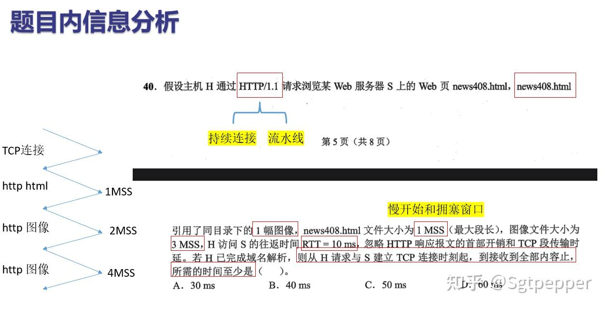

*case1 例题*

这个题是2022年的40题，是典型的**在往年真题上增加新条件（也可以理解为是往年真题的重组）** ，http的这种传输计算之前也有考到过，但是和tcp的拥塞结合在这里是第一次，故而当时错误率很高。

破解题目的关键其实就是仔细读题和联想分析，首先**http1.1** 带来的条件就是**持续连接和流水线** ，而1MSS和3MSS这个往往只在tcp里考察的条件就是想引导你往**慢开始和拥塞窗口** 的方向去考虑。

同时其他标红线的部分都是你在读题时需要注意的点，因为稍微一换表述，就可能影响到答案，例如**从H请求与S建立TCP连接时刻起** 和**完成H与S建立TCP连接时刻** 这种一字之差。

> case 2

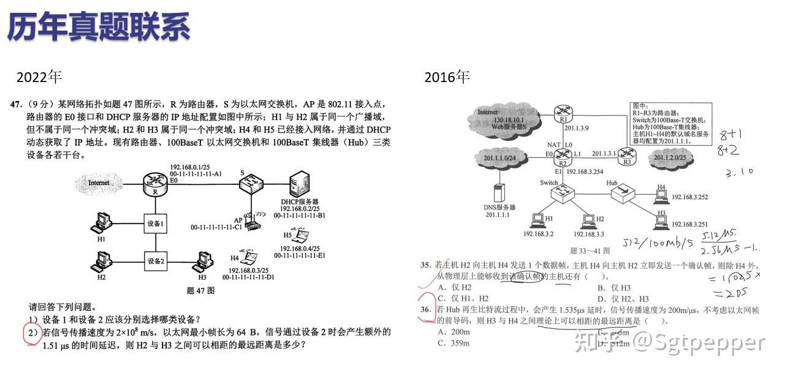

*case2 例题*

这个例子是典型的**原题照搬** ，只是题目从16年的选择题搬到了22年的大题，但仔细读题会发现两者除了部分数值不同，其他几乎完全一样，甚至22年降低了难度，直接说了以太网最小帧长为64B，这种就是会了之前的就可以做对。

> case 3

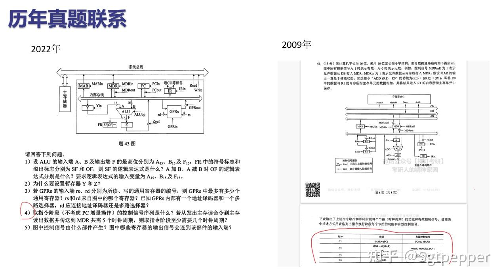

*case3 例题*

这个例子是一个更加隐蔽的真题联系，09年中考察的是**指令执行阶段** 每个节拍的功能和有效控制信号，同时给了取指和译码阶段的例子以作为参照。而到了22年的考题则直接问取指令阶段的控制信号序列是什么。这相当于把**往年的条件挪用过来作为题目考察** ，本身这个点相对冷门且有难度，但估计大家很难想到该题的答案其实就在过去出现过。

或许细心的大家会发现我举的几个例子**全都是22年的题或是22年与往年题的对比** ，这里我就想引出下一个非常重要的点：

### （2）利用好最新年份真题模拟

我是23届考生，因此当时最新年份真题就是22年真题，由于该真题和考纲一样都是当年9月份才出，因此它的特点就是完全的新题，而之前的题大家都或多或少做过几遍了。

以上对真题的对比和分析，很多都是我在写22年真题时发现的，因为当时最直观的做题感受就是**像** ，也就是除了几道新考点的题，其他几乎所有的题我都能看到往年题目的影子，或许哪个年份我记不起来，但是看到就意识到是之前做过的。在这种条件下，虽然我做的也是磕磕绊绊，花了整整3h，但对答案的时候发现自己做错了1道选择和10余分的大题，也就意识到自己对真题的理解已经比较透彻了。这里可以给大家一些建议和复盘的注意点：

**练习时间点的选择：11-12月** ，偏后期练习可以更好发现自己问题，早练可能浪费了

**最有价值的模拟资料：完全新题** 

**回顾和分析知识掌握的牢固程度，发现薄弱点** ，做完题我发现最明显的问题就是我的算法题掌握不熟，因为模拟时花了大量的时间，同时对于计组和操作系统的一部分知识点也还有遗漏，所以又很快投入到查缺补漏的工作中。

**检验做题时间分配的合理性** ，之前我没太考虑过做题顺序，就想着从头到尾写就完事了，但是算法题花了近40min，选择题花了80min，导致我3h才写完试卷，这让我对于时间的把控和做题的顺序有了新的思考。（例如我决定考场上先估计算法题的难度，如果10min没有思路就直接跳过，放最后再写）

### （3）时间控制

- 开始成套真题练习时，**需要注意题目的时间控制** 
- 选择题的建议时间在50-60min，最多不得超过80min
- 最好预留10-20min时间进行**选择题的检查** 
- 可以对每一套真题的**练习时间都进行记录** ，后期便于回顾分析

### 4.真题之外？

虽然我十分强调真题的重要性，但在真题之外还是有很多工作可以辅助我们来加深对于408的理解，这里我主要给大家提供以下的一些建议：

### （1）如何利用考纲

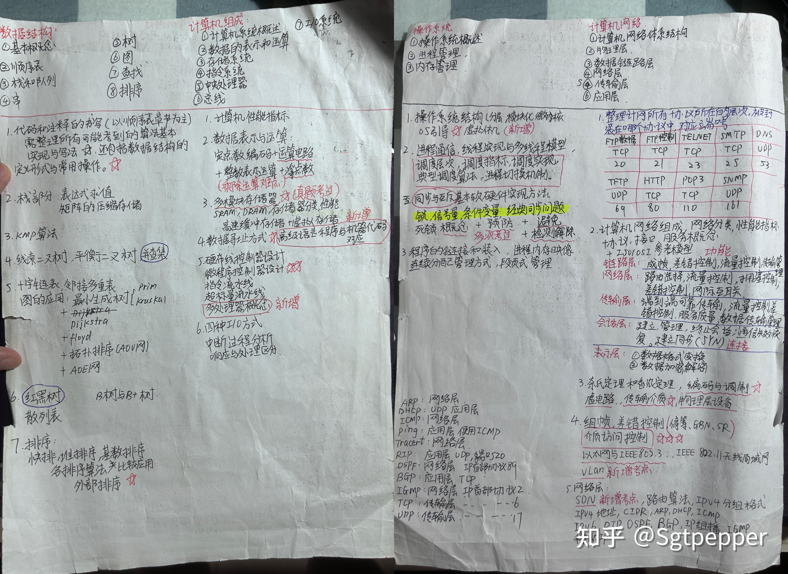

*考纲整理*

**1.A4纸列出所有不熟悉的考点内容，再进行专项突破** ，考纲的信息可能大家往往会忽略，但对于后期复习来说却十分重要，通过记录不熟悉考点，可以在后期进行快速地针对性复习，提高效率。

2.后期**对每一个考点回忆知识点，有记忆模糊的部分及时复习** 

**3.针对可能的新增考点专项复习（红黑树等）** ，可以在导图上特别标注

4.最好做到可以完全**在脑中构建出该科目的知识体系，并延伸出各知识点** ，这个可能对大家的要求比较高，但是整理和完善知识点具有很好的效果。其实各科目中的一些重要流程图，大家也可以试着自己绘制一下，可能本以为烂熟于心的流程也会记错（**而且这种分析流程的题408也考过** ）

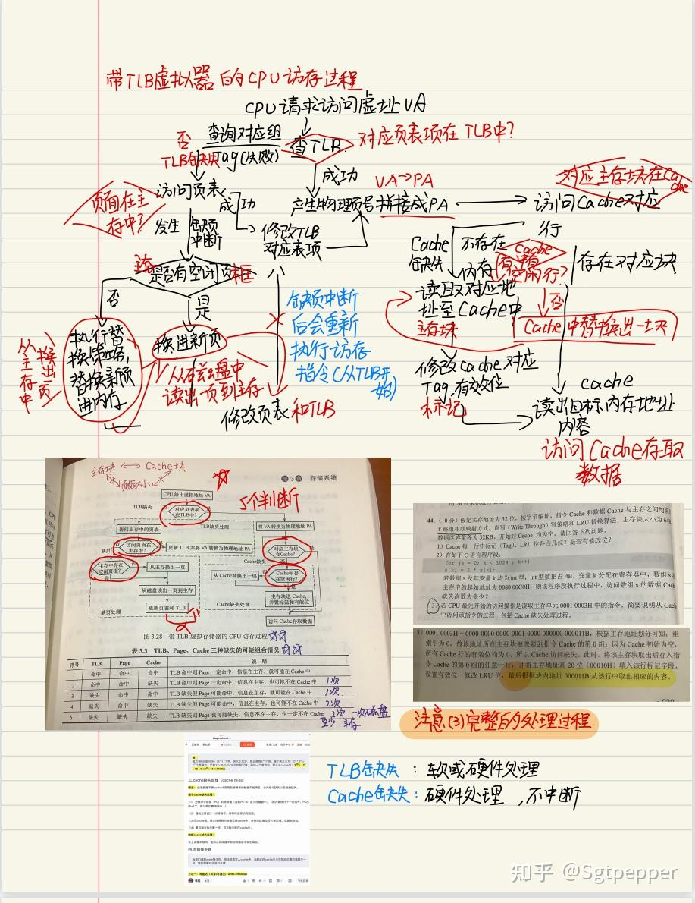

*带TLB虚拟存储器的CPU访存过程（流程图）*

### （2）思维导图和易错整理

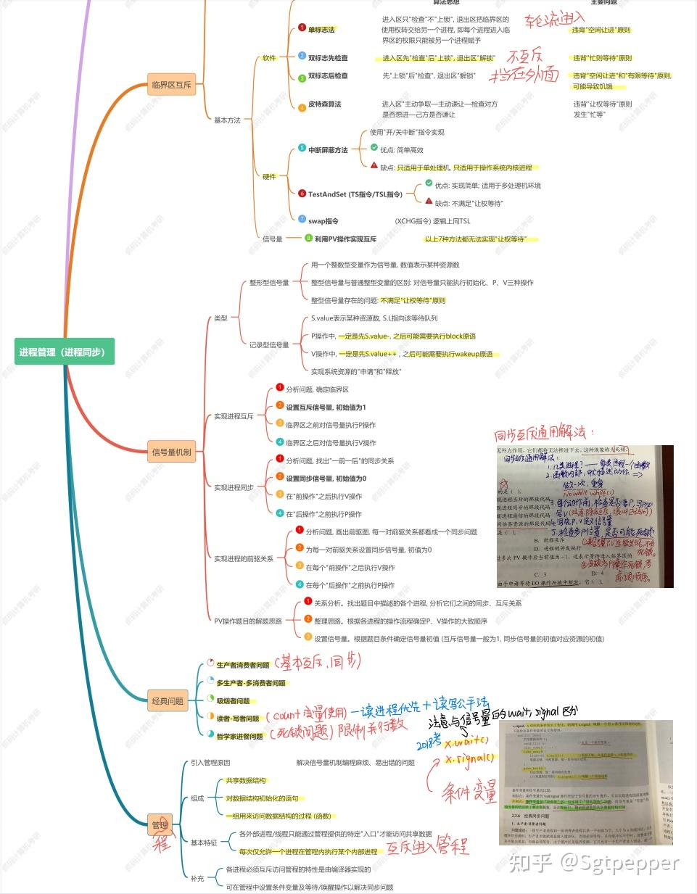

*思维导图示例*

**思维导图的重要性** ：加快复习速度，方便提炼知识点，把握重点

**制作思维导图的时间** ：建议在9月份做真题开始（早期难以把握重点，制作思维导图很容易面面俱到，而失去其自身效果）

**笔记的设计目标** ：可以一体化高效地完成复习

**如何制作和使用思维导图** （需要根据自己的时间进行取舍）

1. 自己制作思维导图（耗时久，记忆牢）
2. 王道纸质版思维导图（内容多，覆盖面广）
3. 抓码思维导图（内容精简，可以自己视情况增加，我选择的是这种方式）

- **易错整理该写什么内容** 

同样可以把错题和易错点整合在导图中，统一复习。

### （3）书课补充

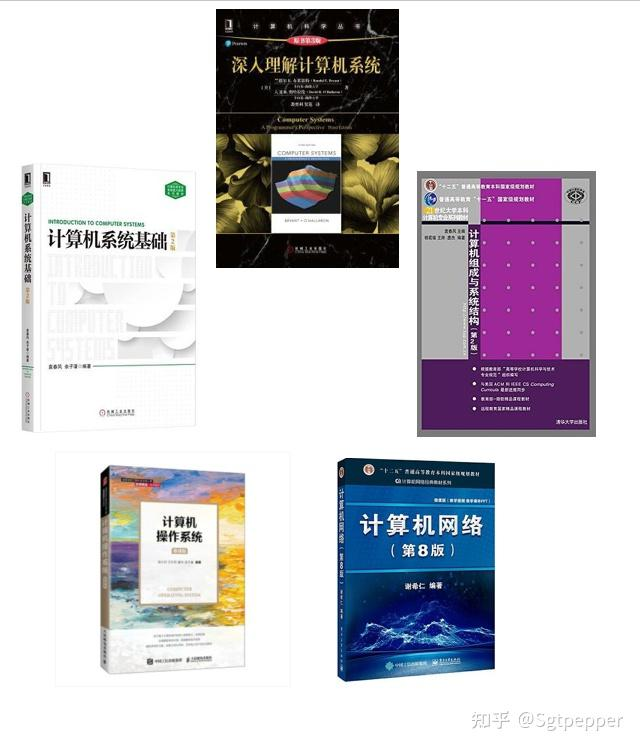

*408教材推荐*

（1）**教材优劣分析：** 

**优势：** 内容更全面，知识更体系化，适合进一步提高，建议在中后期的空闲时间内阅读（早期难以把握重点，不如直接看辅导书）

**劣势：** 重点不突出，与408匹配度有限，时间有限时不建议阅读

（2）**教材推荐：** 

**深入理解计算机系统（CSAPP）** ，声名远扬的计算机读物，其中有4个章节和408练习紧密，可以认真阅读，其他关系不大的可以略读或者不读。

**计算机系统基础（白书） 袁春风** ，一般认为是csapp中译版本，值得一看

**计算机组成和系统结构（紫书）袁春风** ，对于计组的部分细枝末节有更详细的说明，部分冷门的题干也可以在该书中找到原型

**计算机网络 谢希仁** ，标准字典书，有问题都可以在该书上查，从头学习建议跟湖科大

**计算机操作系统（慕课版）  汤小丹** ，os的补充教材，学有余力可以阅读。

（3）**课程推荐：** 

**湖科大计网课程+ppt+真题解析+模拟题：** 暂时是全网计网最精致和良心的课程，不管是前期学习还是后期复习，都可以跟湖科大，其课程可以直接在b站上找到。除此之外真题解析无比详细，模拟题也很有设计感，直接吹爆）

**王道强化课：** 咸鱼主讲的计组和操作系统课程都非常好，可以帮助大家更好地学会大题的做题技巧，同时对于部分复杂的章节也可以有一个高屋建瓴的理解，同样十分推荐。

### （4）模拟题分析

后期大家也可以适当选取一些模拟题进行练习，虽然普遍市面上的模拟题和真题的质量还有很大的一段距离，但是一些质量相对较高的习题我还是很推荐大家练习的。

首先模拟题大家**可以只做选择** ，因为大题的训练价值普遍不是很高，具体说来**我比较推荐王道和抓码的模拟题** ，王道经过一年的修正后基本保证了选择题的正确率（出错很少），**同时还有一小部分的新题，模拟效果良好。** 此外抓码也有部分新题考察到一些不常见的点，很有价值，同时整体难度系数也偏高，唯一的小问题可能就是错误较多，但在视频讲解里都进行了修正和说明（只写了抓码的第一套）

还要注意的就是如果**模拟题和真题产生冲突，肯定要以真题为准** ，不要因为模拟题而改变了自己固有的认知，对于解析模糊不清的题目也不用强行理解，该放掉就放掉，真题会尽量避免很多模棱两可的内容。

### 5.一些补充

**考场：检查+审题** ，当最后上考场的时候，很建议大家把这四个字写到草稿纸上提醒自己，408由于文字量比较大，很多细微的表述差距就会使答案完全不同，**认真审题** 很多时候能帮大家减少至少10分的粗心错误，不论是选择还是大题，最好都是多读几遍题目，重要的信息进行标注以防忘记。做完**及时检查** 往往也能减少一些粗心错误，毕竟很少有人能保证40道选择能一个粗心错误都不犯，我也在考场上检查出了两个选择的错误。

**度过瓶颈期，胜利在前方** ，相信准备很充分的同学在考研后期一定会对408产生一定程度的生理性厌恶，毕竟知识就这么多，真题做了不知道有多少遍，想继续提高又不知道该往什么方向走，甚至会有摆烂的倾向，所有这些想法我其实都产生过，我的做法就是保持基本的学习时间（至少1h），同时尽量从多种维度刺激自己的学习动力，前面的很多方法也可以说是我在这个阶段摸索出来的，**但是唯一别做的就是开摆** ，请至少保证1h的408学习时间，所有的付出都会在考场上进行回馈。

**平时：交流+思考+记忆+做题！！！** 

---

## 三、后记

> 吐槽部分：其实这个经验贴在4个月前的4.10就已经写完了，但是因为电脑空间不足和marktext软件的一些不明功能导致我9000字的经验贴直接暴毙，连一点历史记录都没保存下来，当时写完是1点多，瞬间心态就爆炸了，又因为平常时间也很紧张，暑假期间又出门了很多次，因此该经验贴也就搁置了如此之久，直到现在才完成了新稿。

到这个部分应该可以聊聊和经验无关的事情了，考研虽然相当漫长甚至枯燥，但是它至少给人一种简单的生活模式，这种生活只有单一的目标、手头要做的事情、还有始终悬在头上的倒计时。这让我回想起高中，尽管高中的压迫感更加强大，那时的我却始终幻想着未来五彩斑斓的大学生活，而当真正来到了大学的校园，我却又围城一般回忆起高中单纯的生活状态。

但是仔细想来我的大学生活其实十分丰富，我并不讨厌这种生活，甚至还挺喜欢，可是那些喜欢的部分好像更多是和这所学校里的人相关，而不是学校本身，我时常感受到从每个时刻里挤出的压力覆盖到全身，在往往是全周无休的状态下，我只能在每晚床上短暂的半小时读书时光中寻求片刻的安宁。

当然无论是借口或是的确如此，在漫长的纠结之后我选择了尝试新的学校，寻找新生活的可能，长达6个月的考研生活也便开始了，这或许是在学校待的最漫长的一个暑假，由于封楼的原因，我们的根据地从5号楼搬到了3号楼，虽然路程变长了，但是有单桌单椅的新教室无疑是更优的学习场所，我们甚至买了很多零食放在固定的座位旁边，那个小小的角落成了新的复活点，在燥热和蝉鸣声中，安静而无声的校园在疫情的背景下成了我们的世外桃园。

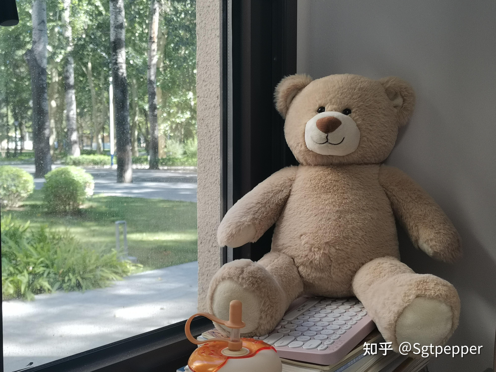

*漫长的季节*

无论时间多么缓慢，9月依然准时来到，于是空旷的校园里又充满了喧闹的空气，这空气闻起来是隐隐的压力和束缚，随着预报名和报名结束，我们真正意识到考研不再是遥远而不用担心的事情。我们像吉普赛人一样四处迁徙，最后定居在图书馆的5楼北，因为总是起晚，找不到座位是经常发生的事情，这时我们就只能无奈地来到5楼南短暂地学习一会，等到合适的时机再回到北侧找到零星的座位。

我们依然会偶尔逃离这个遍布考研的宇宙，去看个电影，去吃顿大餐，可大部分时间我们就如上班族一般过着三点一线的生活：宿舍——图书馆——食堂。这种生活没什么不好，因为我们知道12.25号之后两个最自由的人将突然出现在这个世界上。

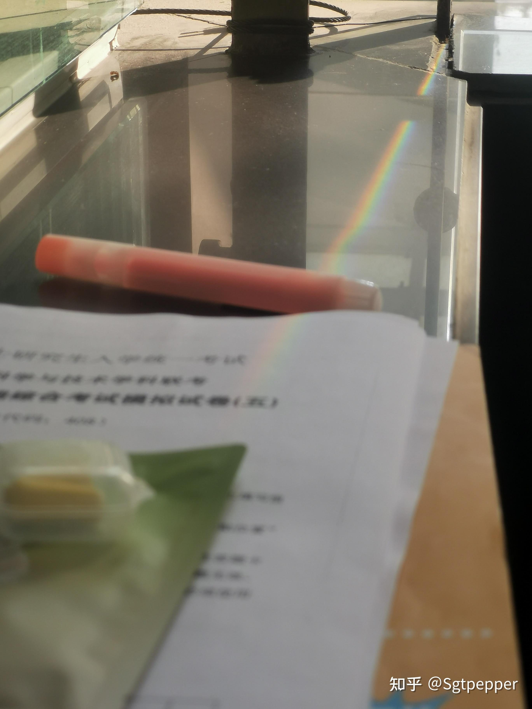

*图书馆的一道彩虹*

怀揣着这种期盼，我们像每一个考研人一样生活着，仿佛明天世界毁灭也与我们无关，我们是这样认为的，可现实又往往事与愿违，疫情又一次像洪水一样冲击着每个人的生活，每天早上醒来不再是担心自己复习的状态，而是检测器上的两条红杠，偏偏怕什么来什么，在考前2天的时候我的体温开始飙升，很快就来到了温暖的39°c，躺在床上时我和同样发烧且考研的室友聊天，我说“也许半年的努力会成为一场空了”，说来奇怪我那一直紧绷的神经竟然奇迹般地松开了，也许在那个夜晚我对所有的可能结果都释怀了。

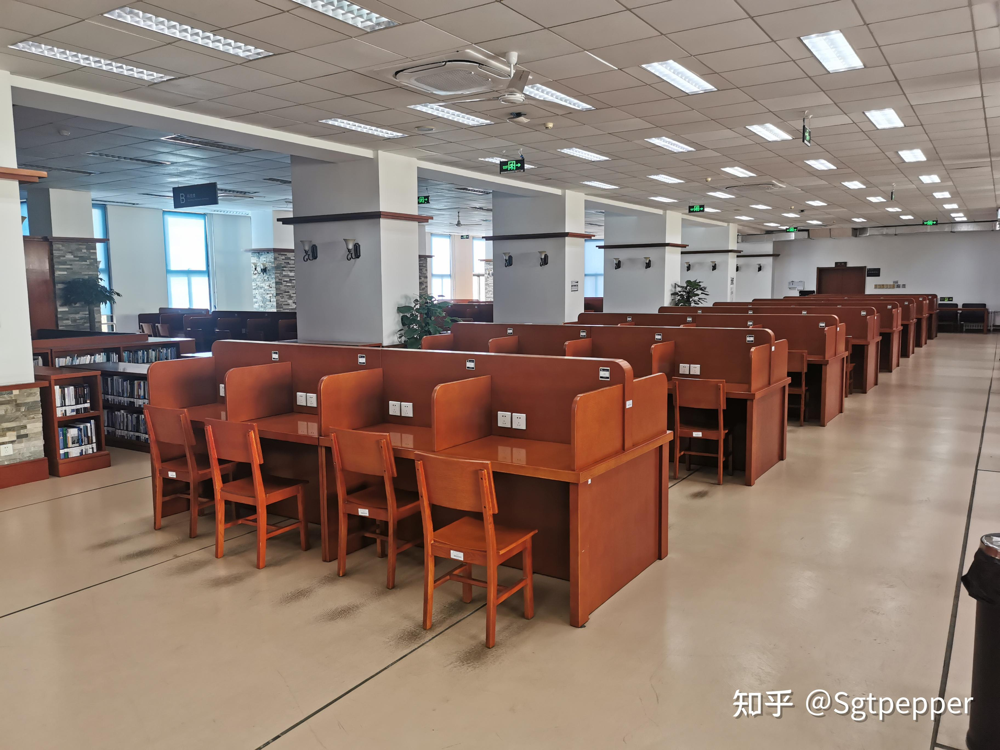

*离开前的最后一眼*

多谢幸运女神，考试的两天我退烧了，虽然刀片嗓无比痛苦，但至少不影响考试了，于是我相对顺利地离开我的战场，回到人间，等待一个未定的结果。

或许直到现在，我才真正感受到那段最普通，最日常，最机械的生活实际上是最美好的日子。我们不是我自己，而是我和她，帖子的最后我想特别感谢我的npy，陪我度过考研的每一个日夜，她总是在我困顿时指引我，沮丧时鼓励我，难过时安慰我，于是我才能看到漫长黑夜后的黎明。

我还要感谢我的父母，在考研乃至整个人生阶段给予我始终的支持和鼓励。此外浙大考研群里的家人们给了我众多的快乐和帮助，（虽然我是个万年潜水怪），考浙大请速速进群冲浪（群号：241321218），二维码如下：

广告时间：如果学习408遇到重重困难，如果真题不知如何分析，可进Ace考研群（群号：577752623）了解诸多答疑和课程服务，都是由浙大高分上岸学长亲力负责，十分可靠！

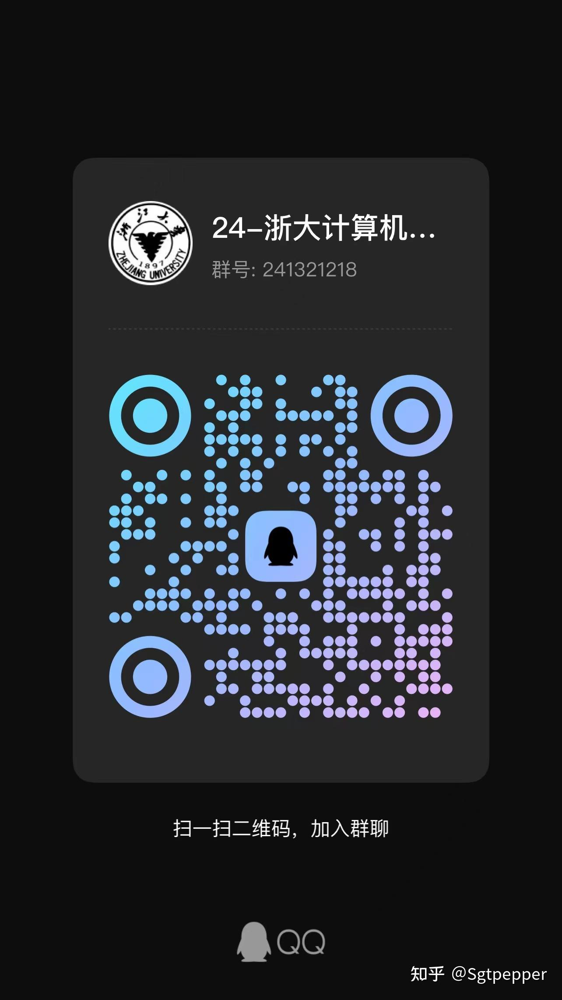

