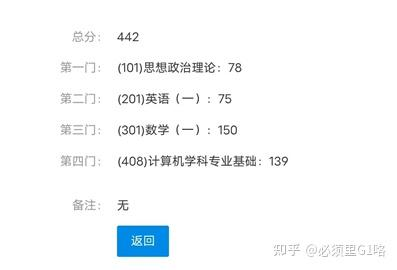
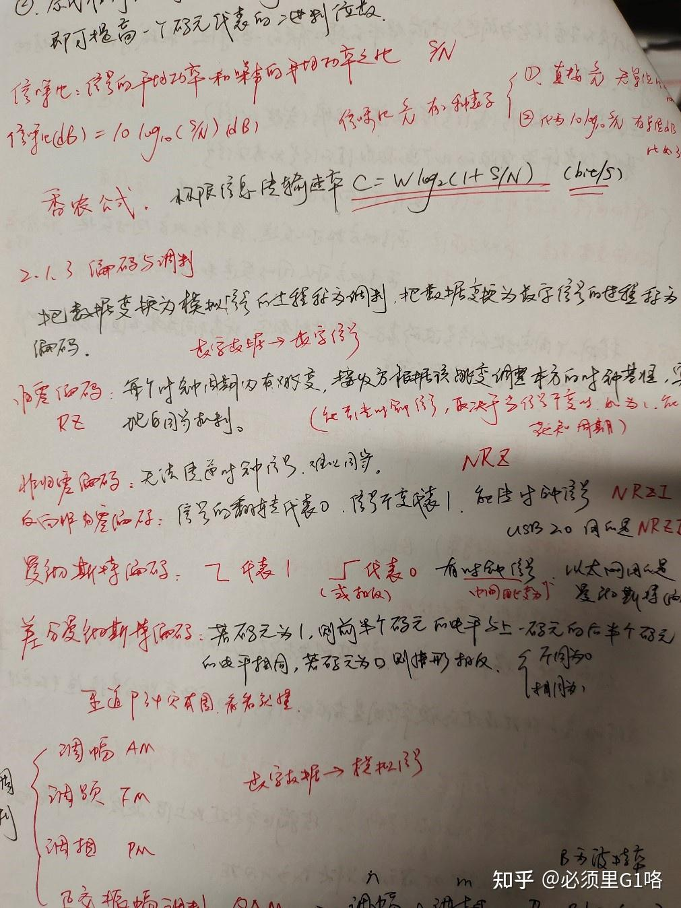
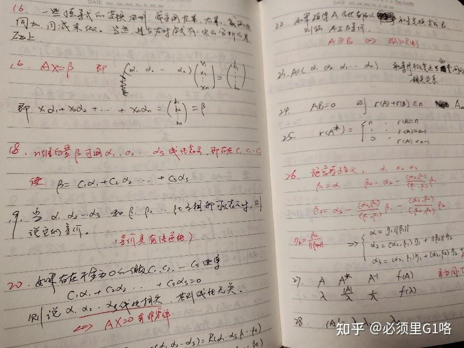

分数如下。 

本⽂是经验贴，希望对⼤家有所帮助。考研这件事没有那么难，当然也没有那么简单，它需要你一步步地过关斩将，初试、机试、面试都不能有大的差错。考上了也不是就前途光明了，没考上也不是天就塌了，因为失败也能带给人极大的成长。有二本上岸北大的，也有清北考研失败的，备考过程你的态度是最重要（而不是基础、学习能力等）。(本人一对一腾讯会议答疑辅导，数学408全课答疑，复习规划，5000元每月，按月续费，有需要加qq2498544156,有丰富辅导上岸经验。)

**⼀、我对学习经验、方法、规划的看法** 

⾼分考⽣的学习⽅法⼀定有借鉴意义，好的学习规划、学习⽅法可以节省时间，提⾼效率，⽤更短的时间取得更好的成绩。所以，我推荐准备考研的朋友们可以多看⼏篇经验贴，找⼀找⾼分考⽣的共同规律，学习好的⽅法。 但是，经验贴的学习规划不可以照搬。为什么呢？⽐如，你看到某450分⼤佬的经验贴，⾥⾯有全年的详细学习规划，那么，你只要和他的规划⼀模⼀样，就可以复刻他的成功吗？当然不能，学过⻢原的都能明⽩，这是教条主义，不可取。每个⼈的基础不⼀样，擅⻓的科⽬不⼀样，实事求是地，切合实际地，采⽤适合⾃⼰的学习规划，远⽐机械套⽤别⼈的经验好得多。（这⾥涉及的⻢原原理是⽭盾的普遍性和特殊性）

**⼆、我的经验贴** 

我将把我的基础情况，每个阶段的学习过程，所⽤资料等如实记录下来。我尽量详细地把我的经历写下来，希望为朋友们找到适合⾃⼰的学习规划和⽅法提供素材。 

**三、我的基础 ** 

数学： ⼤⼀学过基础课⾼数、线代、概率论，我喜欢数学，所以这些课在⼤⼀基本在90分以上。 ⼤⼆、⼤三也没有完全扔掉数学，参加了两年⼤学⽣数学竞赛（考察⾼数），所以我的⾼数可以说是学过几遍，因为每年数学竞赛前都会稍微复习⼀下。线代和概率中间有两年没怎么看过。 

408 : 本科是四川⼤学材料科学与⼯程学院，和计算机毫不相关。本来对计算机没什么概念和感觉，也没想过学这个，但是参加了⼀次数学建模国赛和⼀次美赛，学了matlab和⼀点python，了解了⼀点算法，所以产⽣兴趣，加之对材料专业的**教学** 不太满意，遂打算跨考计算机。408的数据结构、操作系统，计算机组成原理，计算机⽹络都是零基础的。 

英语：四级507分，六级510分，四级是⼤⼀考的，六级是⼤三考的，英语⽔平⼀般。我对英语的感觉是，花时间的话都能学得比较好，但是主要是费时间，跨考仔尤其要把时间花在刀刃上，就是要拿捏数学和408，死磕政治和英语？除非你数学和408稳稳140了，否则感觉性价⽐不⾼，对于一般人政英70分够用。

政治：政治基础就是在知乎评论区看别⼈建政 (乐)。

**四．方法论** 

**1.** **问题导向**  **阶段检验** 

什么是问题导向？我们备考的目的是考个高分嘛，比如你的目标是12月25、26号的考试中考到380分或者400分或者420分或者440分…… 问题就是你现在去考280分都够呛。为了解决这个问题，所以得学习。又比如你背了两个月单词，但是不知道自己啥水平，不知道是应该接着只背单词还是要着手准备做阅读真题了，那你就得找到自己的问题，自己判断。最好的找问题的办法就是看真题，你拿一篇真题的阅读看一看，如果发现自己读不懂句子很多是因为单词不认识，那就赶紧加强背单词，顺便反思自己是不是背单词的方法有问题，时间花了很多，效果却不好。

数学和408也是一样，你可以在搞完数学一轮的时候做一张真题，限时3小时，看看自己能考几分，这张卷子就能暴露出非常多问题，指导你二轮的时候去努力解决问题。如果你学习的时候不是问题导向，就很容易混日子水时长。我观察到有的同学二轮复习408的时候，就在那看王道书，一行一行看下来，笔都不动，书上干干净净，笔记本也没有，好像是在看小说一样。看了一个上午感觉时间很长，实际上没怎么过脑子，因为他的学习不是问题导向的。你发现自己没有掌握一个知识点想去搞懂、发现自己遗忘了一个知识点去复习的效率，与漫无目的地翻书的学习效率是相差很多倍的。

主打一个面向真题备考，学太多超纲知识是没有用的，你要阶段性地评估自己与考研真题之间的差距。建议刚开始备考就买好真题。

学习的目的是解决疑问，学到东西，如果你觉得11408你都懂完了，开摆打游戏也不是不可以。

**2.高效学习8小时** 

学习时间的话我是平均每天8小时，偶尔也休息一天。基本的学习时间必须保证，比如你让我7月8月开始备考，我基本上很难上400分，但是多给我两个月时间备考（比如把考试时间推迟到2月25日），我也不会多考几分。所以保证一个基本时间就好，多了无聊浪费，当然少了就寄了。我觉得跨考比科班多2个月时间，数学基础差的（比如文科）比数学基础好的多两个月时间，这样基本足够了。然后每天也不必要追求时长，比如十几个小时，时长不解决任何问题，学到东西提高分数才解决问题。

影响学习效率的因素，很多人是因为电子产品，去自习的时候可以远离电子产品，自己把握嗷。假学习骗得了别人，甚至骗得了自己，但是骗不了分数嗷。

**五、408学习过程 ** 

第一步：C语言基础

⼤概是从2021年10⽉开始决定跨考计算机，从10⽉到三⽉在B站学了C语⾔，还学了⼀点C++，⾛⻢观花地看完了浙⼤慕课数据结构，刷了⼏⼗道浙⼤PTA⾥的题。跨考仔可以对照这个进度，不建议⽐我慢，⾄少在3⽉前学完c语⾔的基本语法知识，最好还能做一些力扣简单题或PAT。

**第二步：408一轮** 

3⽉到5⽉看王道咸⻥的视频，计算机⽹络没有看王道的视频（因为感觉讲的不好，不适合零基础的⼈学），是计算机⽹络谢希仁的配套视频，他的书上扫⼆维码可以看⼀部分，完整的视频课我是花了⼤概60块钱在⽹站买的，这个视频挺好的，湖科大的视频也可以。

我的顺序是计算机组成原理，操作系统，计算机⽹络，数据结构，⼀⻔⼀⻔看，也可以多⻔课同时进⾏，看完⼀节视频课做完王道书对应章节选择题，把选择题全做完并红笔订正（以便二轮的时候知道你一轮错了哪些题），对于错题尽量弄懂。事实上，错题是极其宝贵的，错题说明你有些东西理解不够透彻，研究错题可以帮助你找出问题加深理解，即便是因为看错、粗心才错的题目，你也要想为什么会粗心，并尽量改正，考场上的粗心是非常可惜的。

关于408一轮的学习顺序只要计组在操作系统前就是合理的。因为计组是操作系统的底层，没有硬件（计组）也就不需要软件的调度和管理（操作系统）。

对于我们跨考仔来说，⼀轮的时候，咸⻥的视频应该能看懂，但是有可能做不出题⽬，也有可能某⼀章的⼀个⼩节，这个知识点很难理解，⽐如kmp,还有⼀些计组⾥的知识点，乘除法这种（这个搞不懂可以战略放弃，不会考的）。我作为⼀名跨考仔，⼀轮的时候有不少⼩节因为没搞懂跳过了，这个⼩节的习题就没做，还有的时候看完咸⻥的视频后还是不太懂，但是强⾏做完了选择题，错误率很⾼，错了有三分之⼀。⼀轮的时候搞不懂和错误率⾼是⾮常正常的，尽⼒去理解，理解不了就放⼀下，毕竟还有⼆轮三轮，有的知识点就是得你全部学完才能融会贯通，⽐如计组和操作系统，就有很多交织的知识，学计组的时候没搞懂，放⼀放，说不定你搞完操作系统的⼀轮就轻松理解了。408⼀轮过完只留了个印象，⼤家基本都是如此，是没办法做卷⼦的。

建议至少在7月前把408一轮过完。

**第三步：408二轮** 

我⽤的教材是袁春⻛的《计算机组成与系统结构》第二版（紫皮）和第三版（白皮）都可以，谢希仁的《计算机⽹络》第八版，汤⼩丹的《计算机操作系统》第四版，这三本书是必买的。有⼈说吃透王道就120了不⽤看教材，我不是很认可，现在考研越来越卷，但凡你⽬标考个985及以上，我都推荐你要看教材，做王道时有疑惑的地⽅看看教材，查查百度，问问群友（乐），对加深理解会很有帮助。

王道书的问题是大部分是知识点的罗列，如果只看王道很难把知识点串联起来，形成对计算机的整体认识、宏观认识，没有整体的认识只是死记硬背，是很难记牢的，记忆的压力会很大。就相当于记忆helloworld短语和lorwdleolh乱码，虽然长度一样字母组成一样，但记忆难度相差很大。数据结构我不推荐教材，看教材很费精⼒，我买了⼀本天勤的数据结构，与王道的数据结构教材进⾏互补，天勤有两个优点，一个是介绍了c++的语法，一个是给出了很多算法的代码，比如迪吉斯特拉算法王道只介绍了步骤，天勤给出了代码，各位按需购买。

二轮的书籍材料是：3本教材+一本天勤数据结构+4本王道。二轮就不需要视频了，通过一轮你已经入门了，很多知识点你都知道，但是记不住，因为知识点理解不够深，不能串联起来。同样的，按你一轮的顺序来开始二轮，比如先数据结构再计组。二轮用两到三个月完成。

主要的工作是看一轮时的错题+做大题（真题必做，王道题选做）+记笔记。前两个工作好理解，但是笔记怎么记捏？笔记按王道的顺序按篇按章地一节一节写，把你可能会忘的知识点，把你对一个知识点或者一个题目的理解都写上去。最终甚至可以达到的效果是，你有了自己的四本笔记本之后，可以不需要翻王道书了，知识点忘了翻你的笔记就可以。

二轮的时候多看教材，教材和王道结合着看，然后写笔记。笔记是挑重点，易忘的点写下来。我的每本408笔记都有A4纸30张以上，加起来也100多张了。记笔记的时候可以多一点留白，方便之后加内容。这个过程有点像抄书，但不是抄书，它是输出你的理解的一种方式。因为你看书、看视频是被动输入，而总结重点，写自己的理解就是输出的过程，可以加深你的记忆。

**如果你只输入，而不输出，你的复习是很成问题的。** 比如数学，看视频看辅导书是输入，做题才是输出。同理，408看视频看王道书是输入，自己做总结笔记，做思维导图，做题才是输出。实际上，有很多人沉醉在输入的轻松里，逃避输出。

建议在9月左右完成二轮。早一点完成是有好处的，因为后期政治英语压力会变大，你早点学好408就不会那么慌张。

这是我当时的计网笔记。随手拍了其中一页。

**第四步：做真题和研究考纲** 

通过第三步，你已经获得了4本笔记本，这是非常宝贵的，可以帮助你快速复习。在开始真题之前花一两个星期看一遍你的4本笔记本，就可以把遗忘的内容大致捡起来。408没有什么别的题目，只有真题是最宝贵的，怎么研究都不为过，所以要榨取真题的所有价值。王道有8张模拟卷，质量比不了真题，但是可以做做选择题复习知识点。

现在你可以开始做一张真题，第一张大概率痛苦面具。虽然你在王道书上已经做过，但是还是有遗忘的，或者记忆模糊的，只能连猜带蒙。做真题的时候，边把你不确定的题目的序号圈出，不熟悉的关键词圈出，因为有时候你虽然不确定，但大概率能蒙对，凭着你做王道书的时候的印象。如果你不做记号，你订正总结的时候，你这道题没错，就会忘了对它进行分析和回顾。

对于你错了的题和不确定的题，回到你的王道书或者笔记对应章节，认真分析和复习。因为真题只有十几张，做一张可以分析沉淀两天。对这张卷子涉及到的知识点进行分析，不熟悉的内容进行回顾。

还有一件事是**研究考纲**，可以**把最新版的考纲抄一遍**，看看**过去考了哪些点，每个点考得多深，有哪些点还没有考察过**。408复习一定记得反复多次和全面，近年来的真题不断在证明这一点，尤其是参加了23考研且做错外排大题的同学最有体会。**有不少人认为过去不考以后也不会考**，复习的时候就**逃避了这些知识点**，结果就是**考场失分**！事实上，**在考纲上的点都可能会考，过去没考过的知识点恰恰更有可能考**！

**六．数学学习过程** 

数学一轮提供两种方法：

a. 基础好的版本：数学教材（比如同济的高等数学）+辅导书（比如张宇的或者李范全书），看一章教材做一章辅导书和一些习题。

b. 基础薄弱的版本：数学视频+配套辅导书（比如武忠祥李永乐或者张宇的）+数学教材，看一章视频做一章辅导书和一些习题，数学教材为辅。

数一有三本书，和408一样东西很多，我的学习顺序是高数->线代->概率，我学到概率的时候高数里的很多东西都忘了，这非常正常，没必要焦虑的。战胜遗忘的方法就是多搞几轮，反复多次。

数学是公共课，网上有成千上万的贴子。一轮要怎么搞你们可以多去看看别人的贴子。虽然我数学150分，但是基础比较好，分享不出太多的经验，全程可以自己理解，题目有可能做不出，但基本可以看懂答案，不需要别人答疑。对于基础差的，显然会有很多内容看教材和辅导书理解不了，可能需要别人来答疑。我自己用过的书籍材料有数学教材、李范全书、张宇基础30讲和提高36讲、李林880、张宇1000题、真题卷和各种模拟卷。我经验贴提到的书籍资料都是自己用过且觉得很好的。大体上，一轮过一本辅导书+半本习题，二轮写一本习题册。至少在9月前完成二轮。

关于数学我自己有两个很重要的点可以分享：

**1.** **做笔记。** 好记性不如烂笔头。把你做错的题，或者一个巧妙的方法、重要的公式、易忘的知识点写在你的笔记本上，一条一条标好序号。错题笔记不是抄题目，是把这道题考察的知识点简明扼要地写下来，比如这道题你做错了是因为没掌握二维正态分布的公式，那你把二维正态分布公式抄下来就好了，没必要抄题目。我到考前有好几本笔记，都是重难点，易忘点，后期只要看笔记复习就行，比看辅导书更高效。

这是我当时的一个线代数学笔记。

**2.** **做套卷。** 二轮完了之后刷套卷。这是提高你的水平最最关键的事情。套卷我觉得市面上有的都可以刷。张宇的、李林的、合工大的、李艳芳的、加上10年真题。刷题就3个小时限制，不能超时，当然你很自信可以提前结束。不管这张模拟卷是不是真题的难度，刷卷子就把它想象成你在考研考场上面对这张卷子，你怎么样在3个小时内拿到尽量高的分。改完卷子后看看自己的分数，分析自己为什么没有拿到150分，没有满分就有改进的空间，改进了问题就是提高了自己的水平。当然你张张150分的话当我没说。大概9月份开始刷，一开始错得比较多，可以2天一张，一天做卷子加改分，一天订正分析，如果是知识点掌握有问题就回到辅导书对应章节看看。记得要做错题笔记。如果你模拟卷张张140+，考场上低于140的概率是很小的。

如果没有做到吃透40张卷子以上的话，考差了很正常奥。

**七、英语学习过程** 

我英语挺差，所以只能简单说几个点。英语只要做真题就可以，我是3月到6月只背单词，6月开始做真题，做近20年。真题是按类型做，不是一张一张完整的做，比如你开始做阅读就每天做两篇。当然背单词不能断，每天都要背一点。作文也可以早点准备，八九月开始这样。

我用过的书：唐迟阅读的逻辑、三小门的逻辑，还有一些英语作文书。

**八、政治学习过程** 

政治推荐8月9月开始学，看徐涛的强化视频课，买一本《政治考点一本通》作为配套书，看一节做一节1000题。视频课可以只看马原，当然也可以全看，休闲娱乐了属于是。1000题我只做了一遍，我觉得做三遍太夸张了。真做了三遍也没有多显著的帮助。

模拟卷大概在11月的时候出，模拟卷涉及很多时政，每年政治考研时政占比很大，时政我是从一些考研博主的公众号下载的。这个时候腿姐的小册子是必买的，多看几遍小册子。模拟卷只要做选择题就可以，模拟卷选择题分比较低的话，比如40分以下，要反思一下原因，是不是应该多回顾知识点，如果错的是时政，那就想想怎么提高时政。

腿姐的冲刺课可以看看，重点看看她教的怎么写大题，大题格式啥的。大题基本还是背肖四，考前阳了，没怎么背，我只背了前两张吧，其他的只看了看，也凭借着平时对知识点的印象写。

我用过的资料有：肖1000题、肖4肖8、腿姐4套卷、政治考点一本通、腿姐冲刺背诵手册

注意时间安排，后期你数学408英语政治都要学，怎么分配时间呢？假如你一天学8个小时，那么数学3个小时，408学3个小时，政治英语加起来2个小时。当然你后期的话最好每天能学久一点，能学10个小时最好。

**九、关于计算机择校** 

我从一开始就决定要考数一，因为自己数学比较好，只有考难一点的卷子才有优势。而且我并不愿意考自命题，感觉找资料啥的太麻烦了，所以很快就锁定了11408，认真准备去了。如果你学习数学感觉比较困难，选数学二是更合适的。选择408的同学前期建议好好学习，不要太关注哪个学校好，哪个学校冷了还是炸了的信息，你只要考到400分，无论在哪都稳一个复试名额。11408的好处在于学校很多，可以摇摆，后期根据自己的水平改志愿。

华五的学校中，科软、软微、浙大这些招人多的，是最不需要博弈的，既不可能捡漏，也不可能非常爆炸，适合求稳的人选择。我是不打算博弈的，因为博弈成功的毕竟是少数人。年轻人还是好好学习，提高自己的水平。

对于跨考，尤其是本科课程c语言都没有的那种大跨，c语言还是为了408数据结构而学的，一点计算机积累都没有的同学，不要给自己整什么超高难度学校，比如清华计算机系学硕，北大信科叉院学硕这种。当然你非要选，就想好二战在哪租房子。大跨的同学，即使你初试400+，你自己想想你还有什么东西可以说服复试老师，让他选你，不选华五科班，人家几年的积累不比你一个初试400分值钱吗？

复试很多学校都有机试，机试是非常重要的！跨考仔时间紧张的话，可以初试完再练机试，但是一定要认真练，不要摆烂。如果你初试一般，更是如此，很多学校是可以靠机试高分逆袭的！

**十、结束语** 

帖子写得不好，有问题和改进意见的同学可以评论区留言。

祝各位好好学习，天天向上！