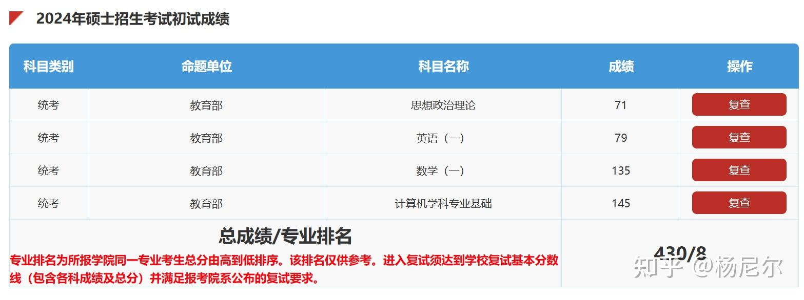
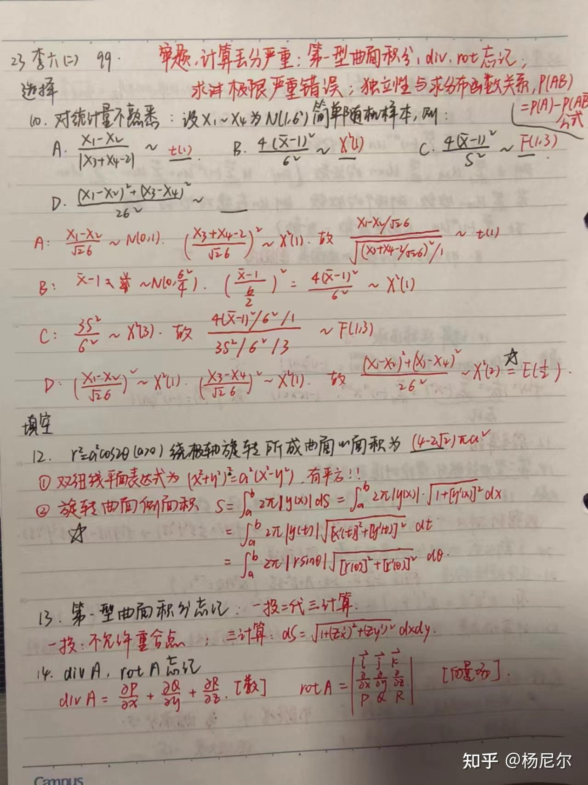
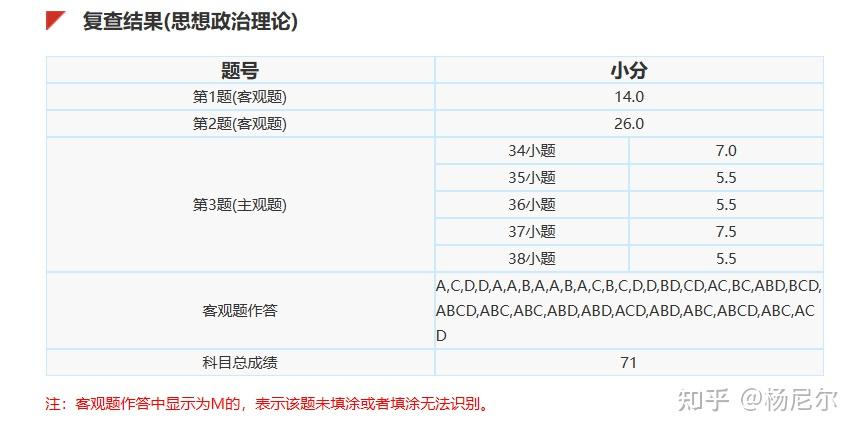
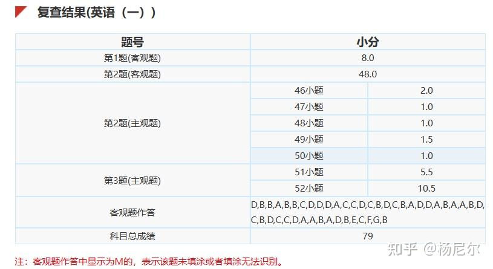
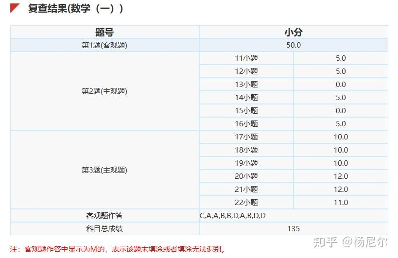
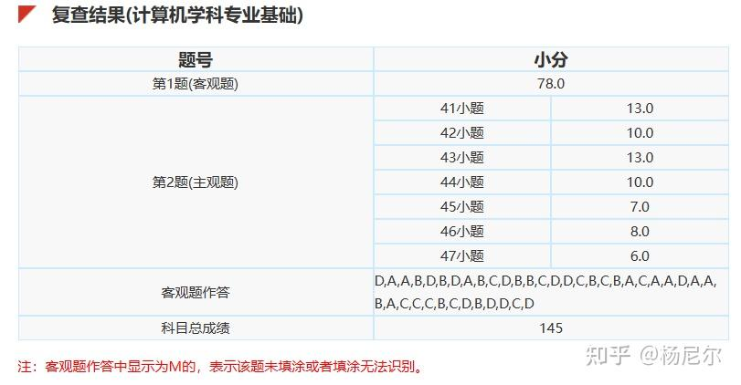
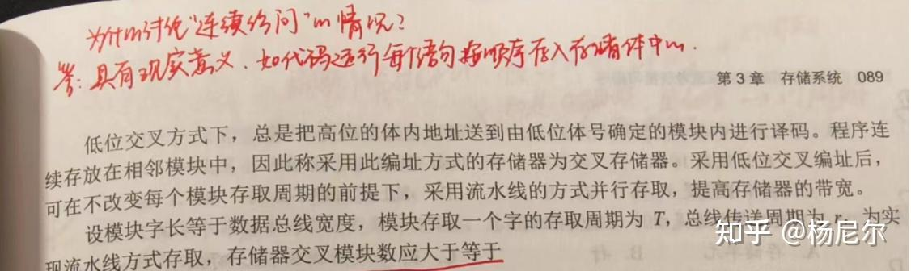
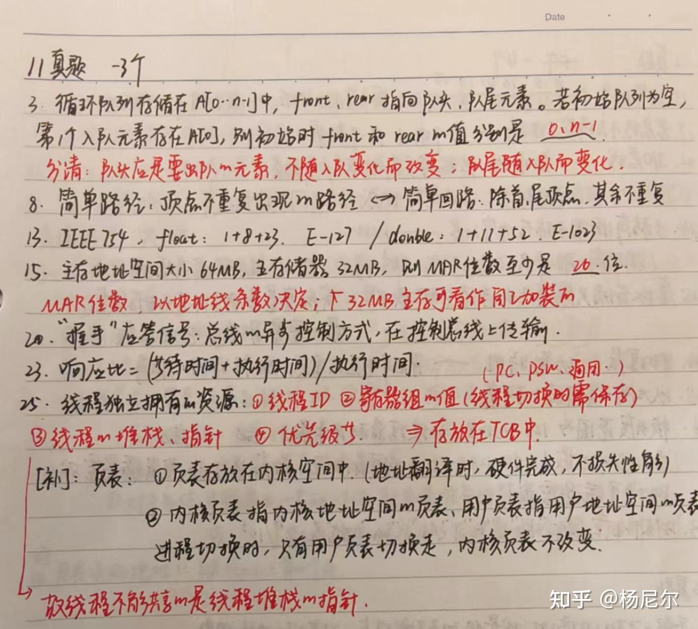

> 昔日龌龊不足夸，今朝放荡思无涯。

## 一、写在前边

在过去备考的一年中，我阅读过大量前辈们的经验贴，对我产生了巨大的帮助。在感叹互联网社区的共享互助精神之余，我也常常会沉浸在若自己有幸上岸，会如何撰写属于自己的经验贴的幻想之中。如今，我终于有机会站在这里，分享一些经验，再讲一些故事。我会尽可能回忆自己备考时各科的经验教训，但碍于文笔欠佳，有些地方可能会表述不清或过于冗长，请各位读者包涵。

## 二、基本情况

大家好，我是杨尼尔，在刚刚过去的24考研中，取得了430分的成绩。其中，政治71分、英语79分、数学135分、408 145分，全方向排名第8名，其中408专业课（疑似）全国第一。

我本科就读于北航的生物与医学工程学院，排名50%。高考河北考生，自认为小镇做题家，擅长题海战术。数学基础较好，本科数学课程的成绩均在90分以上；英语基础一般，四级561分，六级518分；高中有OI经历，因此专业课的数据结构部分我学的相当轻松，但其余三门课皆为零基础。由此可见，我比一般跨考的同学省去了学习C语言、数据结构及算法的时间与精力，客观来讲相比一般的跨考同学，确实是占了很大优势。

### 跨考的决定

因为学习信息学竞赛的缘故，高中阶段的我就早已明确大学的意向专业，即学习计算机科学与技术专业。但碍于高考的个人发挥与“不舍得分”的典型高中生思维，只得无缘错过计算机专业，进入北航的航空航天大类进行学习。

在中途也并非没有考虑过转专业的相关事宜。但同许多大学一样，北航的转专业充满了严格的限制，如果想往计算机方向转，必须满足的一项要求是，转专业后一定要降级一年进行学习，也就是所谓降转。而当时已经在大一摆烂了一年的我纠结再三，考虑到：即使降转到六系（计算机学院），凭借我大一非常摆烂的成绩想必也无法在卷王众多的六系获得保研资格，届时肯定需要考研；而如果不降转，到时候大不了也只是跨考。都要考研，我还有什么必要留级一年呢？凭借着这样的心理，再加上对生物、医学方向实在不感兴趣，我浑浑噩噩地度过了在生医的大二、大三生涯。

直到大三下学期，真正着手准备考研时，才开始搜集计算机考研的相关信息，并把目标初步定为了浙大计院。一是当时浙大群的氛围非常不错，且恰逢浙群管理员换届，目睹一批23级上岸浙大的学长走马上任担任浙群管理员，这种薪火相传的传承感与使命感在深深吸引着我。二是因为在北京上学待的很不爽，时刻想着要逃离北京，杭州又是一个人杰地灵的好地方，自然非常吸引我这个北方小孩。后来，在对科研有了一点浅尝辄止的了解之后，在对北大软微的放实习政策有了了解之后，在得知软微是名正言顺的北大本部独立院系之后，毅然将目标定为了软微。

## 三、经验分享

### 备考过程

**一轮：二月末-六月中旬（基础）** 

实际上我是一个很健忘的人，无论是数学还是408，在一轮复习中学到的很多知识点，在二轮再次看到时真的就是毫无印象，但是我在看到书上自己做的笔记时，要么帮助我迅速回想起知识点，要么记录了一轮时让我困惑的疑问的解答，这些笔记让我在二轮复习时不至于完全从零学起。因此我对一轮的建议是，打基础为主，理解为主，勤做笔记。

这段时间我每天复习时间在4-6h，主要是以看网课为主，做练习题为辅；408只做了课后的选择题部分；英语开始了背单词。

我是一个很懒的人，习惯于被动接收知识（可能是中学养成的坏习惯），所以即使有很多人推荐基础不用看课，我还是把张宇、咸鱼的课开着二倍速三倍速看完了，一是基础一般，二是看了课会给我内心带来一种踏实的安心感（不然总怕错过内容）。具体是否需要看课还需各位根据自身情况进行选择。同样是由于本科时的过于摆烂导致备考初期难以找回学习状态，我在过基础时直接跳过了数学的概率论部分和408的计网全部内容（没错，我就是如此摆烂）

在这一阶段，使用到的资料有：
数学：张宇基础30讲、张宇300题、660题 
408：王道三本书（没学计网）

**二轮：八月中旬-十月中旬（强化）** 

因为学校生产实习的安排加上暑假返校后沉迷于网络游戏，导致我暑假两个月几乎是荒废状态。直到八月中才开始有一搭没一搭地重新复习起考研。复习408的时候发现基础阶段学的内容一点也记不起来了，急忙开始过第二轮408，整理笔记的同时做课后选择题+大题。数学则是花了一个多月时间看强化网课+做1000题。英语则是会不固定地做历年真题。

这段时间每天复习时间为6-9h，基本是九月开学前6h左右，开学后恰逢离考研还剩100天，自觉不能再摆烂下去了，复习时间增加为8-9h。

值得一提的是，我在九月末十月初时，数学强化已经过完，但是只做了1000没有做880，彼时的李林还没有跌下神坛（偷笑）。按道理在这个时间点应该开始进行套卷练习了，但880一点都没做让我无比慌张，总觉得相比别人少做了题就很“亏”。咨询邂逅哥的意见后集中两周刷完了880的选填，同时每周穿插两张23李六作为检验。第一周做的两张卷子得分分别为109、99，我依然记得上午兴高采烈卡着时间做完卷子，结果对完答案后批出来99分的心情，当时恰逢国庆假期，许久未见的大一好友跨越半个北京来找我吃饭，得知我上午模拟卷只考了99分后，不无担忧地说“那你不是寄了”，我笑笑没有说话。当时虽有些焦虑，但一方面非常相信自己的能力，这源于高中竞赛、高考、本科屈指可数的几次成功，使我一直具备“虽然我本科没怎么努力很垃圾，但我是有能力的”这种自欺欺人的普信感；另一方面是虽然只剩100天听起来很短，但若每天真正潜下心来埋头学习的话，其实100天也并非那么短暂，是可以实现质变的。

我写下上边这段话的原因，绝非想让各位学我一样在考研前期肆无忌惮地摆烂，而是一来想告诫各位，请尽可能在考研前期，最晚暑假开始时进入学习状态，暑假两个月一定要好好利用；二来想勉励各位，若是在考研中后期看到此贴，与其焦虑时间不够学不完了，不如抓紧时间专注当下。要知道有个人他在距离初试还有一百来天的时候还没学过计网、概率论没做过题、甚至做模拟卷只有99分。

*做完第二套卷子后 我的错题整理*

在这一阶段，使用到的资料有：
数学：张宇18讲（高数和线代）、李林概率论辅导讲义、张宇1000题、880题
408：王道四本书，湖科大计网

**冲刺：十月中旬-考前（刷题）** 

最后冲刺阶段自然是数学做套卷，408做真题加上反复回看，空闲时间由背英语单词逐渐转变为政治刷题小程序，以及由于卸载了手机上所有的娱乐软件，吃饭时间只能一遍又一遍看微信收藏里的懒懒经验贴（感谢懒懒在经验贴里贴了许多链接，让我不至于只能看一个帖子）。

这段时间每天都拉满了，早上八点出宿舍，晚上十一点回宿舍，白天的时间都在图书馆度过。时间安排基本是：

8:30~11:30   数学模拟
11:30~12:00 午饭
12:00~13:30 英语单词、政治小程序、休息
13:30~17:00 408
17:00~17:30 晚饭
17:30~18:30 英语单词、政治小程序、休息
18:30~22:30 408、英语等（想学什么就学什么）

但由于不想逃离舒适区（哭），政治的刷题、英语的作文到很后期才开始（甚至英语是考前一周背的monkey模板），初试之前政治选择没有一次上40分。这样看来我的成绩其实充满了偶然性，如果政治选择题出的再像去年一样怪，亦或英语客观题的难度与去年相仿，可能结果会有很大不同罢。

这段时间刷了408真题；数学做了偶数年的真题和近40套模拟卷；英语依然是背单词和做真题，最后几天突击了作文；政治是零基础先看的腿姐技巧班，看了几天之后发现零基础看还是有些吃力，速看了腿姐背诵手册和肖秀荣背诵手册过了一下知识点，然后又翻回去看的技巧班和冲刺班，最后十几二十天意识到时间不够的时候把苍盾上大部分模拟卷选择题都刷了，但是得分不是很理想，最后阶段背的腿姐大题9页纸和时政7页纸。

在这一阶段，使用到的资料有：
数学：李艳芳真题解析、张宇八套卷、张宇四套卷、合工大超越十套卷、合工大超越历年模拟卷（19-23）、李林六套卷、李林四套卷。
408：王道四本书、湖科大计网每日一题和模拟题、王道真题解析、零壹模拟卷。
英语：黄皮书真题、monkey作文模板。
政治：苍盾小程序、腿姐背诵手册、腿姐技巧班、腿姐冲刺班讲义、腿姐大题9页纸、腿姐时政7页纸。

### 各学科备考逻辑及思路分享

考研满分500分，各占150分的数学和408毫无疑问是分数大头，是备考重点。因此，我建议将至少前期80%、后期60%的时间投入到数学与专业课的学习中。

**政治** 

*政治小分*

选择题40分，大题31分，在北京是个还算不错的主观题分数了。

1. 对于政治选择题来说，我认为理解和背诵是两条并行赛道，缺一不可，既需要理解知识点的含义，又需要记住一些常见正确或错误说法。总的来说，建议暑假或者九月份开始可以概览知识点，对每个知识点至少要抱有印象，可以通过看徐涛强化课的方式落实。
2. 腿姐技巧班建议一看，她的技巧班是为了让你更深刻地理解知识点，即使不打算跟腿姐也建议听一听。
3. 腿姐冲刺班会整理时政7页纸，建议打印下来没事看一看时政相关，感觉市面上没啥整理时政的博主，除了看7页纸好像只能通过嗯刷小程序记忆了。
4. 因为我对政治的理解基本全部来自于腿姐，所以大题选择了腿姐9页纸。今年证明无论是背肖秀荣还是腿姐都是能答上大部分大题，所以在答题时“结合材料”的技巧就显得非常重要，这个技巧简单来说就是在默写自己背诵的大题内容时，要适当地将材料和题目的相关内容穿插进去，给阅卷人呈现一种你不是在僵硬地默写，而是在结合材料答题的感受。

**英语** 

*英语小分 我的作文真是烂完了*

1. **单词** 是重中之重。我希望各位在准备考研的第一天就开始进行单词的背诵。我使用的墨墨背单词，前中期大概一天1~2个小时，通常是吃完午饭晚饭回到图书馆，边溜达消食边背的；后期因为政治需要刷题的原因，缩减了背单词的时长，但每天也保证了至少1小时的背单词时间。关于英语的备考逻辑，可以参考 [这篇经验贴](https://zhuanlan.zhihu.com/p/617418138)中提到关于“理解文意”的逻辑与建议，我认为写的十分到位。
2. 英语的真题相对来说比较少，很多人在后期会碰到无题可做的情况。我建议可以学习 [赵少风](https://zhuanlan.zhihu.com/p/622211007)这位学长经验贴中提到的英语学习方法，即每天只高质量完成一篇真题（无论是完型、阅读还是新题型），我认为这样是比较科学的利用真题的方式。
3. 新题型可以听刘琦的课，比较高屋建瓴，技巧很实用。听她的课前我总是通篇读完文章和选项再做题，速度慢不说，正确率还不高；听完她的课后再做题仿佛开悟了一般，新题型就没错过，而且速度也快了很多。
4. 如果觉得时间紧张，做题顺序建议是：作文、阅读、新题型、完型、翻译，确保在最清醒的时间拿最高的分。我在考场上是先写的作文，然后按顺序从前往后做的。
5. 今年的作文有点新花样，如何备考作文可以借鉴一下其他高分经验贴。

**数学** 

*数学小分*

在我的理解中，考研数学的终极目的是，通过一道题或几道题，掌握一类题型或一个特定知识点的解题方法，从点推广到面。之后再碰到这类题或者题面相似的题时，可以不由自主地想到自己先前已经整理好的，针对这种问题的解决办法，进而做出题目。**整理的过程是反思和输出的过程** ，如果真的经过提炼、归纳、整理等一系列过程为自己建立解题的方法论，那这一定是记得最牢固最不容易忘，已经内化为自己的方法论。

1. 基础阶段看的是张宇，做了300题和660题。今年好像没有300题了，做1000题的A组也是没问题的。一轮复习的核心是理解知识点，对各个知识点有个印象，可以针对难理解、易错点在书上做一些笔记，目的是为强化再次复习到这里时快速唤醒相关记忆。
2. 强化阶段高数和线代依然跟的张宇，概率论是看的方浩的课，书使用的是《李林概率论辅导讲义》。此外刷了1000题、880题。这个阶段刷题是重中之重，虽然我很喜欢看课甚至到依赖的程度（因为不费力基本不用动脑子），但是这时候我也意识到需要大量刷题来建立“**数学思维** ”。这里提到数学思维，我很认可 [邂逅哥](https://zhuanlan.zhihu.com/p/491196569)所说关于建立“数学思维”这部分内容。自恋地讲，我自高中阶段起就属于数学应试较好的那批同学，我将原因归结为，在考试时，看到一道题目几乎能条件反射般想到在考什么知识点、用什么方法解题，再加上快速准确的计算，虽然常有做不出来压轴题的情况，但应付套路固定的普通题还是没什么问题的。我将该经验挪用到考研学习上，确实取得了不错的成果。
3. 接上一条。掌握套路也是需要下苦功夫的，我的方法是**大量做题+整理好题错题+频繁回看** 。如上所说，考研数学不需要我们在考场上面对从未见过的新颖题型从零发明一个严谨高超的解法，而是根据备考以来积累的多种题型及其相应解法，拨开新颖题型的外壳，转化为常见题型进行解决。整理什么呢？我的错题本中绝大部分题来源于张宇的1000题，这就引出了我推荐张宇全家桶的原因：张宇无论是书上配套的例题，还是配套的习题集中的练习题，都是质量很高、不落窠臼的题目。再加上真题绝大部分题都是给常规题套上一层看上去很新的壳，所以如何剥下这层壳就成为了我们备考需要主要关注的内容，而通过整理好题错题加上频繁回看，恰恰能够训练这个能力。
4. 关于如何整理。仿照高中，我的做法是拿一个活页本作为错题本与知识点总结本。从强化阶段开始。我的笔记就没有记在书上，而是单独记录在这个总结本上。记录的内容主要是在听完一讲后，将这部分特别出彩的例题、通过例题归纳出的几种题型以及他们的解决方法、以及一些需要记忆的公式定理等整理在一起，方便之后反复回看。在后期回看的频率大概在每两周将整个总结本过一遍，常看常新。如果真的坚持了下来，慢慢会发现一些在初见时显得无从下手的题目如今也变得稀松平常了。
5. 最后冲刺阶段，建议模拟卷使用顺序为（在25模拟卷还没出的情况下，否则用老卷子上手之后就可以刷25的了）：23李林六套卷（就是我做99分的卷子，对于刚刚从强化刷题不如模拟阶段来说刚刚好，可以快速上手）、24李林四套卷（理由同前）、24张宇八套卷、24超越5+5，此外推荐的还有超越历年五套卷（这是一个合订本，一共50套卷子，19~21年可以只刷选填）、24李艳芳三套卷，可以将真题安排在做完李六李四之后，也可以把过去的模拟题刷过之后再做真题，最后做25新出的模拟卷，推荐度同样依次是张八、超越、李艳芳、张四、李六、李四。超越、李艳芳的模拟卷给我的感觉最像真题，给人的感觉都是初见题目时都无法一眼想到解题思路，需要自己分析题目性质方能作答。模拟阶段多见见新题有利于考场上的发挥，不至于上了考场头脑一片空白。

**408** 

*408小分*

408的四门课程给我的第一感觉是：量大、不难、注重理解，类似于高中阶段学习的生物化学。因为高考是人生中为数不多经历过的大型考试，我理所当然地将高中时针对生物、化学的复习思路挪用到了408的备考中，而备考思路也非常简单，我将其概括为八个字：**反复多次、融会贯通** 。
所谓反复多次，是针对知识点相对较多、记忆含量相对较高的专业课来说，如果将四门课的王道书、自己整理的笔记、错题等从头到尾认真看一遍叫做“过一遍”的话，我们可以通过多过几遍的方式不断刷新自己的记忆，确保在考前将每个知识点装入脑海中。注意是**每个** 知识点，即不能错过王道书上的任何角落。我之所以提倡这个方法，是因为我自认为还算看书细心的人，整理笔记也比较勤快，但是我在备考期间发现每次我在重新过一遍课本之后，总能从之前早已认真看过的某章某节某页的某段话中，领会到新的知识，感悟到全新的内涵。这样说起来有些玄乎，各位不妨按照我的方法一试。
虽然408四门课内容庞杂，但总的来说，他们都是最近两三百年发展起来的学科，无论是计算机组成还是操作系统，他们的设计一定是以实用性为前提，以工业上的应用为第一导向。因此我们学习到的计算机组成和操作系统，一定是有完备的、严密的内在逻辑深藏于其表层之下的，一切结构的设计都是有依据的。在看课本的时候，就要想办法思考这些逻辑，分析为什么这些内容要放在一节里，为什么这些内容要放在一章里，etc。我们要做的就是在零散知识点的基础上，挖掘其内在逻辑，织起一张串联各知识点的大网。若能体会到各知识点之间的相互联系，再加以总结归纳，那么掌握408只是时间问题了。

1. 基础阶段时，可以看王道课本和咸鱼的视频，计网可以选择看湖科大视频。顺序就按照正常的数据结构、计算机组成、操作系统、计算机网络来就可以。可以选择在看每节视频前先概览一遍王道课本这一节的内容，也可以看完视频后再看书，我认为都是ok的，只要及时做笔记就好。但无论看课还是看书，一定要带上自己的思考去做，不要当被动接受知识的人。上边也提到了，408以建立内在逻辑为宜，思考开始地越早、思考地越多，一定都是没有坏处的。
2. 第一遍可以只做王道的课后选择题，做完后及时订正并且一定要搞懂错题，对于那些很难理解、费了很大劲才搞懂的知识点or错题，一定要及时把当下的理解和思考记录在旁边。建议不要太高估自己的记忆力，可能今天搞懂过一周就又弄不明白了，**好记性不如烂笔头** 。在第一遍学习的时候，无论是在听课时还是在做课后题时，一定会因为碰到陌生名词或说法，或是在思考时产生各种各样的问题，这些问题看起来有可能很蠢很傻，但它若是真的让你想不通，不妨在认真思考、确认没有想错后，将问题记录下来，去拼搏群(915624426)问问他人，寻求群友的解答，大可不必为了所谓面子而不好意思向他人寻求帮助（但也不要频繁水群）。

*在学习低位交叉编址时遇到的问题，解决后记录了下来。很幼稚的问题，但如果搞不清楚请尽快开口问吧！*

3. 因为我基础跟强化相隔时间太久基本把知识点忘完了，在强化时索性选择了在浏览完每节的王道书后，分条整   理该节的笔记。一开始是想仿效高中化学生物的学习方法，他们共同特点就是知识点多、碎、细，所以起初是拿了个笔记本，想着每一节记录一些重要、我觉得有必要记下来的知识点。但是在计组和os的时候，我发现王道的知识密度其实还蛮大，整章都是知识点，所以就变成了“抄书”。但不是不动脑子的抄书，而是先将当前这一节通读一遍，仔仔细细逐字逐句的读，读完一整节之后，回到这一节开头，开始整理这节的笔记。我觉得笔记非常重要，输入和输出是不一样的，做一遍笔记基本就能保证知识是你的了。所以不能死板，要灵活变通。做笔记千万不要拘泥于形式主义，一定是觉得这个知识点重要、值得记下来才要记下来。

4. 王道书在一些知识点上肯定会有遗漏或错误，这时候建议通过多问群友、多利用互联网资源、多看课本的方式来矫正错误。我全程复习几乎没有用到课本，所以今年考完网上很多说王道书很烂的，其实都有点渲染焦虑的嫌疑... 王道的书自然不是十全十美，但是在考研408领域就是最全面最优秀的教材。我的建议是，在将王道教材整体过3-5遍、真题至少做1遍，确保基础扎实、了解408命题方向之后，再有选择地回归课本进行查漏补缺，而不是上来就对着跟408大纲并不符合的课本一顿乱看，没有针对性的习题训练是无法留下扎实清晰的记忆的。

5. 充分利用真题。我使用的是王道408真题解析，冲刺阶段每天下午掐表三小时写真题（一般只用1~2小时），对答案之后认真分析自己的错因，并回归王道教材，将出错的相关知识点再仔细看书，整理到错题本上。

*笔记是写给自己的，做题时没有把握但做对了的题也有整理的必要*

从图上可以看到，如果是做题时想错了，那就把应该怎样想写下来；如果是概念模糊，就把概念抄下来；如果是某个选项涉及到的知识点记不太清了，那就回归教材好好整理相关知识点。总之，笔记没必要写的多么精美，高效整理、方便回看，这就够了。

6. 面向大纲备考。建议在考前一个月-半个月，复习得查不多之后，从网上搜一份408最新大纲，面对着每个大纲要求的知识点进行查漏补缺。

7. 理性运用模拟题。时刻谨记真题永远是最权威的一手资料，请各位谨慎筛选模拟题。我个人是只做了零壹的第二、三套模拟卷的选择题，比较有收获但王道以外的知识要求掌握不少，各位可视自己情况进行选择。值得一提的是，零壹的遇见哥今年出了一道页表有关的大题，如果做过那道题可以秒杀今年408页表真题。向遇见哥表达瑞斯拜！

8. 在考场上保持冷静。今年的真题大家也都知道，出现了很多王道书上从未出现过的名词及知识点。我在上考场前同样从未听说过，但有相当一部分是可以通过做题技巧选出正确答案的。例如可以分析这道题在当前科目的什么位置，从而大概判断考察的是哪章的知识点；再比如可以通过排除法，分析一下其他相熟选项跟题面的关系，从而将不熟悉的那个选项定为答案。总之，在考场上看到不熟悉的题目千万不要慌乱，通过冷静分析、抽丝剥茧，还是可以做对题的。

### 四、其他

行笔至此，这篇经验贴也就到了尾声。回顾备考这近一年时光，也有数不清的人为我提供了帮助和鼓励。感谢我的父母，不论我做出什么决定都会默默支持我，你们的爱是我最大的力量。感谢我的朋友们，枯燥的备考时光中有无数次被你们所在的群聊中的话语逗笑。感谢我的女朋友，总在我迷茫时鼓励我、在我困顿时陪伴我，带给我莫大的慰藉。感谢遇见哥，在群聊中为我解答了许多困惑；感谢M哥，在我考前最迷茫的时间不厌其烦地安慰我甚至是所有考生的情绪。

强烈推荐对考研有任何问题的同学都可以去找M哥聊聊天，M哥为不计其数的考生解决过很多问题，有非常丰富的考研规划经验及决策能力，如果同学们有问题的话可以去找M哥聊聊天，咨询一下。

同时，我们24上岸的三个同学在做**408考研辅导全程班** ，今年(2025/10/1)即将开始第三年招生，这里在自己的经验贴中小小的宣传一下，感兴趣的同学可以找M哥咨询一下（当然只向M哥寻求建议也是没问题的，M哥就是爱聊天，来者不拒！）。当然，无论你报名与否，我都真心希望这篇经验贴可以帮助到你。

最后，推荐一个QQ群（794738815），再依照惯例贴上一些经验贴链接。

M佬：

[北大考研 软微11408(初试409 数学一140，408 135）， 一站式/超全面 考研经验贴/指导贴(持续更新)](https://zhuanlan.zhihu.com/p/470513896)

邂逅哥：

[22考研数学一143分经验贴(针对26考研进行了大改)——by邂逅遗憾](https://zhuanlan.zhihu.com/p/491196569)

懒懒：

[11408北大软微计算机 412分菜鸡帖](https://zhuanlan.zhihu.com/p/609004723)

开开：

[23医学跨考软微11408一战433分交流帖](https://zhuanlan.zhihu.com/p/621765126)

sgt学长：

[23年一战考研浙大计算机440分经验贴](https://zhuanlan.zhihu.com/p/653603019)

一位浙大学姐：

[2024考研，想考浙大计算机，该如何准备呢？](https://www.zhihu.com/question/581869474/answer/2959491862)

其他24届的同学：

[24考研北京11408一战软微434分记录贴](https://zhuanlan.zhihu.com/p/684253427)

[24考研一战北大计算机11408 414分经验贴](https://zhuanlan.zhihu.com/p/689705995)

[24考研北大软微11408个人分享](https://zhuanlan.zhihu.com/p/689632281)

[24考研双非跨考上岸北大计算机11408 408分经验贴](https://zhuanlan.zhihu.com/p/689762918)

（最后提醒，经验贴虽好，请不要贪杯^^）