## 目录

1. 最近一次 更新内容(2026.01.05）：26考研 考情分析（2月份会再次进行帖子的全面整理，根据26考研情况 补充一些内容～）
2. 看帖声明 & 须知
    1. 补档记录
    2. 前言
    3. 免费咨询帮助｜可以直接知乎私信我，也可以加我QQ：674799975～
    4. 组织的各类考研qq群：
    5. 本贴主体分为以下部分
3. 第一部分：不定期内容更新的历史记录
    1. 2025.10.27：帖子第三次补档～
    2. 2025.10.15：研招网和软微官网，出了招生人数
    3. 2025.05.16：政审、调档，发出啦
    4. 2025.03.28：25级软微，新生群（QQ/微信）已建立（全方向）
    5. 2025.02.23：25级软微，复试群已建立（仅计算机方向）
    6. 2024.07.28：北大本部科研导师招人情况
    7. 2024.07.27：24级开始，rw要有新生晚会啦！
    8. 2024.05.31：25级二学位取消招生了
    9. 2024.04.01：24级软微，新生群（QQ/微信）已建立（全方向）
    10. 2024.02.15：24级软微，复试群已建立（仅计算机方向）
    11. 2023.12.08:关于如何在备考过程中放松
    12. 2023.12.02：大部分人没有良好的学习方法，可以参考 费曼学习法，这是目前我经过大量人员的测试下，100%有效的方法之一
4. 第二部分：软微计算机考研，历年情况总结&分析（22考研 至 25考研）
    1. 1. 历年 分数线
    2. 2. 历年 招生名额 & 报考人数
    3. 3. 初试/复试情况 详细统计 & 分析
    4. 4. 软微复试，总结性分析（随年份，每年更新）
    5. 5. 软微不同方向的区别
    6. 6. 24考研，整体考情分析（380超高分数线 背后原因的深度解析）
    7. 7. 软微的实习 & 就业
5. 第三部分：四个科目（11408）的通用学习建议
    1. 写在前面：
    2. 重要性标记符号的含义（本部分会一直使用本记号，一定要先看一下）
    3. 1. 政治
    4. 2.英语
    5. 3.专业课408
    6. 4.数学
    7. 5. 备考时要注意的一些事情：
    8. 6. 以下为比较热门的咨询问题（经常会更新）
    9. 7. 学习方法、学习思路、学习习惯、学习思维等总结（待更新）
    10. 8.处事方法 看签名
6. 第四部分：关于如何鉴别和选择考研辅导（公共课、专业课、机构、规划、答疑、讲课、一对一等）
    1. 1.依据
    2. 2.如何识别广告
    3. 3. 如何看待上岸学长/学姐做考研辅导
    4. 4.上岸学长学姐们与机构的合作形式：
    5. 5.不同辅导形式的优劣势 & 适合的内容
    6. 6.如何不通过机构，去找一对一 & 如何判断学长学姐靠不靠谱（更新到这了）
    7. 7.机构是如何统计，上岸某学校的学生，的本科分布情况的
7. 第五部分 个人考研经历（一战清华本部 11912 复试失败，二战北大软微 11408 成功上岸）
    1. 1.个人背景
    2. 2. 考研经历
8. 第六部分 关于跨考、在职与辞职
    1. 1.跨考
    2. 2.在职与辞职
9. 第七部分 关于研友、租房、在校等学习环境
    1. 1.研友
    2. 2.租房
    3. 3.在校
10. 第八部分 其他
    1. 科研（北大的一些老师）
11. 第九部分 关于复试(因为签有保密协议，不能透露具体内容，只简单说明复试要准备哪些方面）
    1. 最后，十分荣幸你能认真的看完本帖，感谢你的信任。如果觉得有用的话，可以点个赞！同时也希望上岸之后，能在您的经验帖或考研群里，添加上本帖的链接，让更多的考研人看到，我们一起帮助以后辛苦求学的学弟学妹们吧
12. 附录 其他关于软微的经验贴（持续更新）
    1. 24考研 上岸贴
    2. 24考研 失败贴
    3. 23考研经验贴
    4. 22考研经验贴
    5. 21考研经验贴
    6. 励志区
    7. 整活区

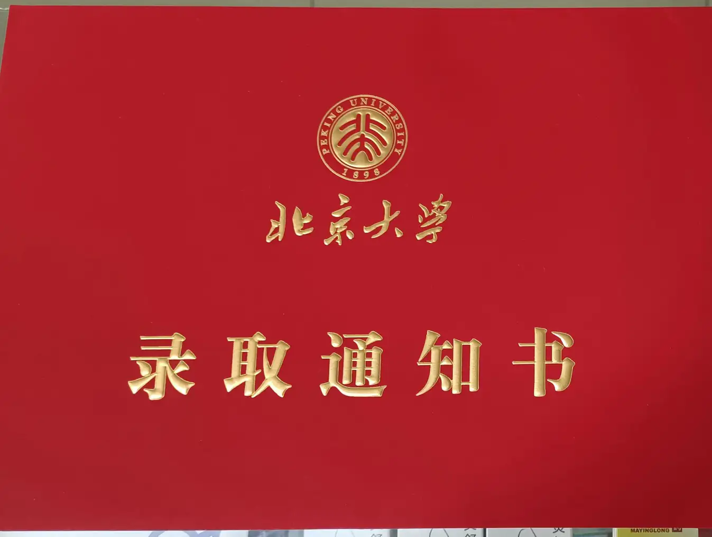

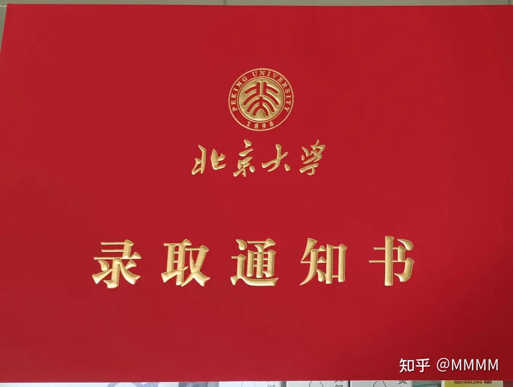

*你也会收到这个的！加油！*

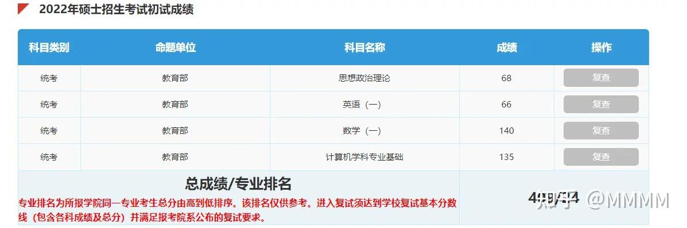

*22级 11408 北大软微 全方向统一排名（计算机+集成+金科）数学第二名 408第二名*

## 最近一次 更新内容(2026.01.05）：26考研 考情分析（2月份会再次进行帖子的全面整理，根据26考研情况 补充一些内容～）

**政治、英语：中规中矩（去年太抽象了，今年不难）** 

**数学：整体较简单。没有太多的创新，依旧是拿下基础者拿下分数，当然大量的练习肯定还是必要的，但是没必要去看太多奇怪的题型，常规的都掌握了才是关键。** 

**408：都说难，其实没有超纲知识（往年每年都会有那么几道题有些超纲），但是计算难、题目长，很吃对408的理解。大部分人是选择题做的慢（正常应该是60-70min就能做完，今年不少人做了90min，导致后面时间紧张）。部分题目有争议。综合来说，408难度主要是对于那些中等水平和中等偏下水平的同学不友好，估计分数会有较大波动。对于前排高手来说，408今年并不难，甚至因为没有了超纲内容，高手们的上限甚至更高了。** 

**每年初试考完之后，大家好好休息几天先，都很累了，好好陪陪家人朋友、玩自己想玩的游戏、看剧、旅游！【复试群会在每年2月底出分后，统一拉群】，凭初试分数截图和准考证截图 进群，进群分数会根据大家的分数情况灵活调整；3月底复试结束 拟录取发布后，复试群解散，会建立新生群～** 

## 看帖声明 & 须知

### 补档记录

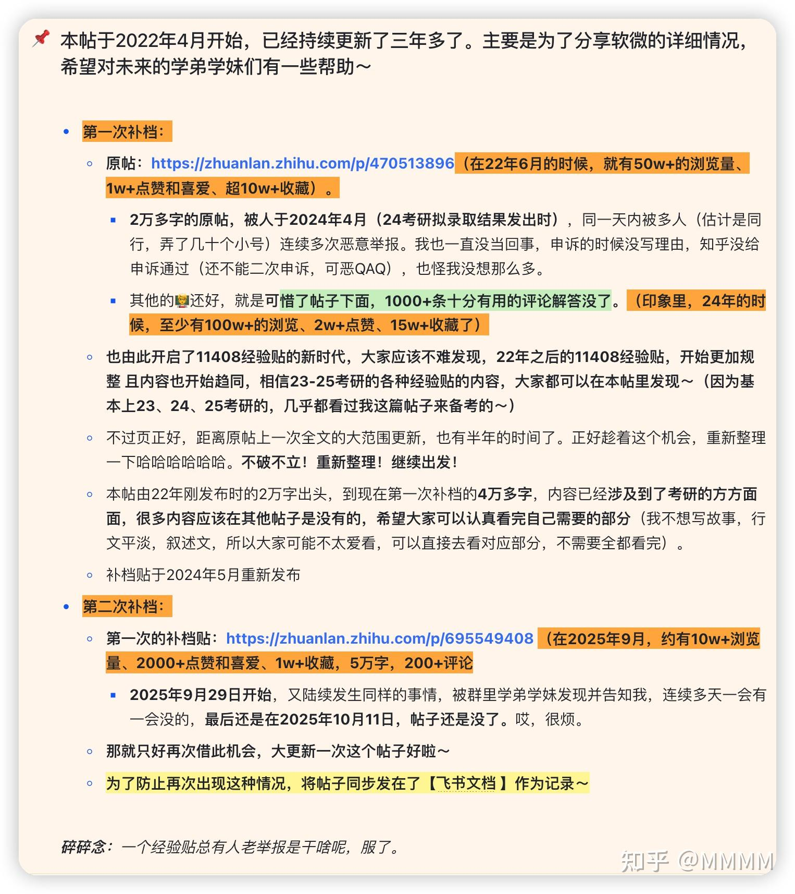

*补档记录｜飞书文档见下方链接（可以存一下，以防帖子又没了）*

飞书文档备份，详见另一个帖子～

[M学长的考研Top帮：介绍](https://zhuanlan.zhihu.com/p/703621920)

### 前言

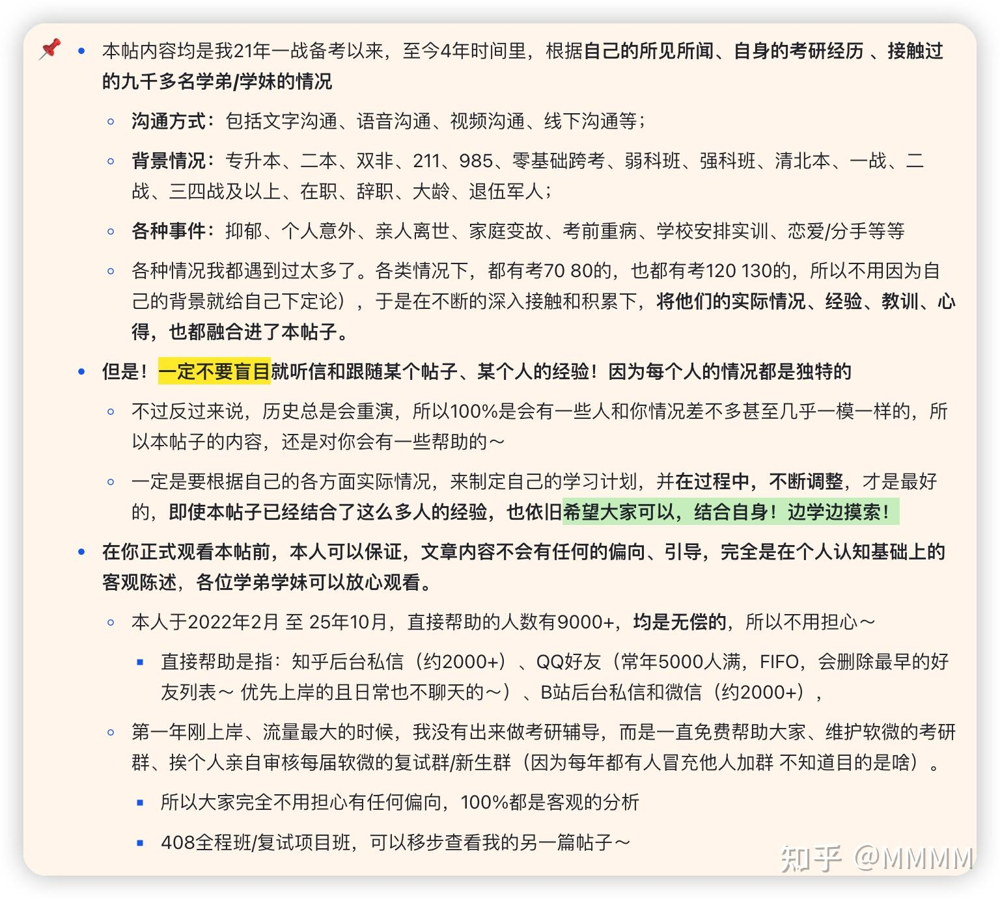

*本帖是：大量经验的聚合筛选｜一定要结合自身实际情况，边学边调整！*

### 免费咨询帮助｜可以直接知乎私信我，也可以加我QQ：674799975～

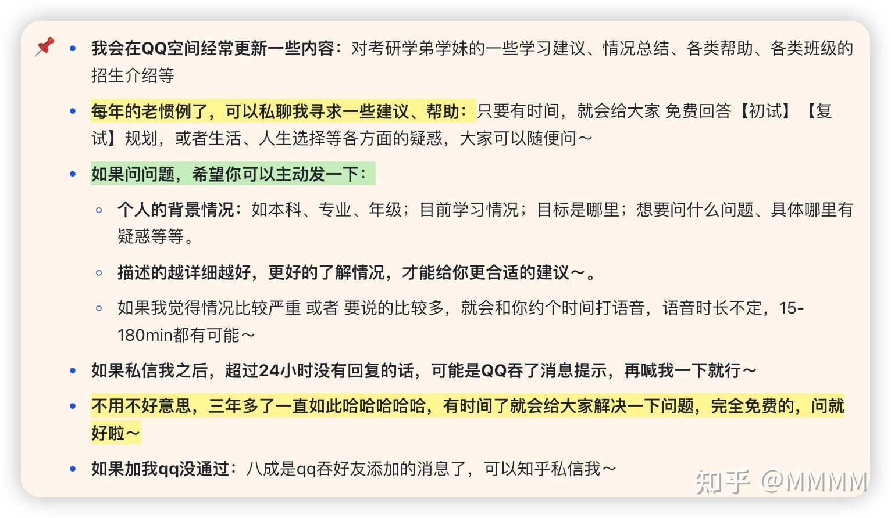

*三年多一直都是如此～ 放心问就好啦～*

### 组织的各类考研qq群：

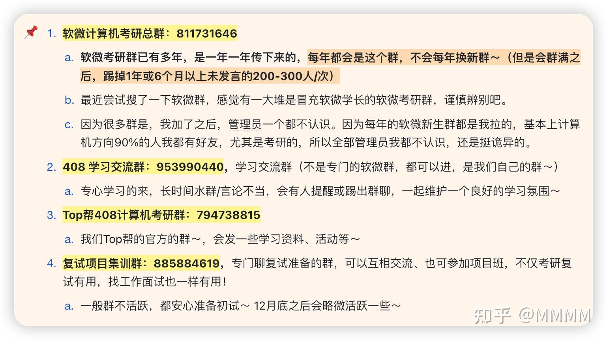

*目前一共4个群～ 如果有想要其他类型的群的话 也可以和我说～*

### 本贴主体分为以下部分

- **第一部分：不定期内容更新的历史记录** 
- 这3年多，一直在更新，担心会乱，所以**会把其中相对重要的更新情况，按照日期保留更新的历史记录～** 
- **第二部分：软微计算机考研，历年情况总结&分析（22考研 至 25考研）** 
- 24考研、25考研，已将408方向和其他方向，完全区分开，且统计率为100%
- 22和23，没有完全分开方向
- 历年分数线、招生名额、初试和复试的分数分布
- 软微复试的分析
- 不同方向的区别
- 其他关于软微的一些信息等，比如：实习/就业等
- **第三部分：四个科目（11408）的通用学习建议** 
- 如果只想看备考的**学习计划** ，那么只看这部分即可
- 前言 & 标记符号的含义
- 政治、英语、数学、408
- 备考过程中要注意一些问题
- 一些建议和经验
- 几个焦虑高峰期（基本每年大家都一样）
- 推荐的学习方法、学习习惯
- 热门问题汇总
- **第四部分：关于如何鉴别和选择考研辅导（公共课、专业课、机构、规划、答疑、讲课、一对一等）** 
- 这3年多，大大小小的机构、个人做考研辅导的，了解过大几十家了；从学生、机构老师、合作人员等多个角度接触过，这部分是对此的总结。
- **第五部分：个人考研经历** 
- 本人工作几年后，辞职跨考的，本科是文科类专业
- **第六部分：关于跨考、在职与辞职** 
- 涉及一些值得思考、注意的点
- **第七部分：关于研友、租房、在校学习等学习环境问题** 
- 如何选择研友
- 涉及一些学习效率的问题
- **第八部分：其他** 
- 个人这一路走来的感悟
- 关于心态、世界观的一些想法
- 一些不知道如何分类的事情
- **第九部分：关于复试** 
- **附 录** ：其他关于软微的经验贴链接
- 筛选了一些写的比较有价值的经验帖，将链接写在了最后，这部分更新的不是太多，因为也没必要看太多帖子

接下来就是帖子的正文部分了，希望大家可以静下心来，找到对应的部分，结合自己的情况，来看本文内容。**内容仅供参考，因为每个人情况都不一样，很多东西因人而异，不要生搬硬套，也不需要看太多的帖子，用处不大，甚至看多了可能会有害。** 我完全可以理解你们一战的迷茫和二战的焦虑，因为我就是这么过来的。加油！你一定也能够上岸的！

## 第一部分：不定期内容更新的历史记录

每隔三个月，会将更新记录，写入对应部分；同时每隔一年，进行一次大规模翻新，提高本帖可读性。

### 2025.10.27：帖子第三次补档～

因为帖子很长，有5万多字，这次大更新呢，把一些整块的内容，从文字改成了截图的形式，感觉更方便大家聚焦观看～ 同时本次大更新，将很多大块的结构化文字，换成了图片（全文字的话 超过五万字，换成图片，大家看起来可能会更方便一些？）

### 2025.10.15：研招网和软微官网，出了招生人数

**408方向招生人数：60+110+（60-40）+（27-21）=196人（和去年基本一致，没有啥波动）；报名马上结束，全力学习！不要再焦虑啦～ 焦虑就行动！** 

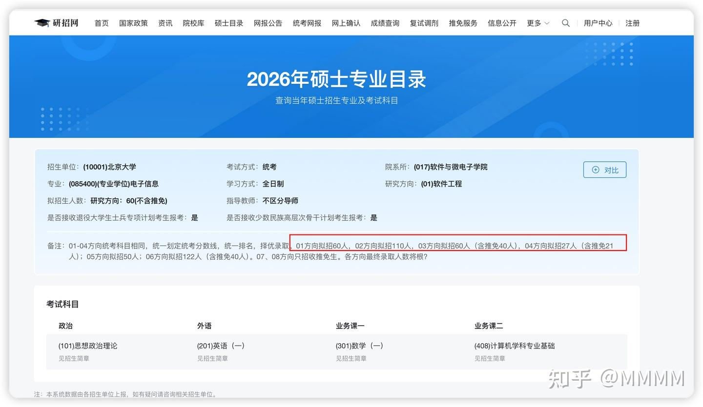

*研招网通知*

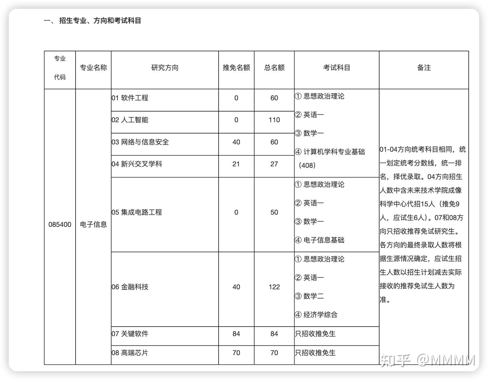

*北大软微，官网通知（和研招网一致）*

### 2025.05.16：政审、调档，发出啦

政审表、调档函发快递了，快递是EMS，如果报名时填写的地址有变动 及时修改一下（目前学院 没发邮件通知，没在新生群里的可能会错过，大家看到了可以扩散一下～）

### 2025.03.28：25级软微，新生群（QQ/微信）已建立（全方向）

发送【准考证】【北大研招网 分数截图】【拟录取通知】，与拟录取名单进行核对后，即可入群（管理员：674799975 也就是我本人）

### 2025.02.23：25级软微，复试群已建立（仅计算机方向）

出分后，发送【准考证】、【北大研招网 分数截图】，分数>=350即可入群；复试期间，复试群会禁言，严谨讨论复试相关的具体内容，发现后立即踢出；本群仅用于大家一起准备复试、一起学习使用。拟录取通知发出后，复试群就会解散，建立新生群。

### 2024.07.28：北大本部科研导师招人情况

想要科研/未来读博的学弟学妹，可以看这几个老师（都是北大这几年新来的老师，每年面向软微大量招人的），具体如何 就得自己分辨了哈。详见《第九部分 其他》。

### 2024.07.27：24级开始，rw要有新生晚会啦！

学生自己组织的哈哈哈哈哈（不是学院官方组织的），不过也会有策划组、节目组、赞助商等等，预计9月初开学的时候举办～

后续顺利举办啦！顺便请整个晚会组织方的24级学弟学妹们吃个了饭，算是庆功宴啦～（希望24级开了这个头，以后每一年都可以有我们自己的新生晚会哈哈哈哈哈）

25级开始，新生晚会正式由学院研会接管啦～ 成为常驻项目啦！2025年9月举办了25级的新生晚会！

### 2024.05.31：25级二学位取消招生了

软微每年的总名额，基本上是固定的，就是二学位+考研+保研。二学位今年因某些原因取消招生了，明年可能会重新继续招生。今年的名额，会给到考研和保研，目前夏令营的名额已经确认增加了，具体保研和考研的名额还没公布，还不确定考研名额是否会增加，还是会减少

### 2024.04.01：24级软微，新生群（QQ/微信）已建立（全方向）

发送【准考证】【北大研招网 分数截图】【拟录取通知】，与拟录取名单进行核对后，即可入群（管理员：674799975 也就是我本人）

### 2024.02.15：24级软微，复试群已建立（仅计算机方向）

出分后，发送【准考证】、【北大研招网 分数截图】，分数>=365即可入群（管理员：674799975 也就是我本人），复试期间，复试群会禁言，严谨讨论复试相关的具体内容，发现后立即踢出，本群仅用于大家一起准备复试、一起学习使用。拟录取通知发出后，复试群就会解散，建立新生群。

### 2023.12.08:关于如何在备考过程中放松

首先，需要精神集中的，不是放松，而是消耗精力：比如LOL这类的竞技游戏；

可以玩无脑的割草游戏之类的

其次，抖音这类的短视频，有强烈的听觉视觉刺激效果、强记忆点，很不适合用来放松，只会占据你的大脑空间。

可以看一下舒缓的长视频

最后，最好的方式就是，闭目塞听，闭上眼，捂住耳朵（别完全一点声音没有，安静环境就行），然后给自己的脑袋、肩颈做个按摩

### 2023.12.02：大部分人没有良好的学习方法，可以参考 费曼学习法，这是目前我经过大量人员的测试下，100%有效的方法之一

建议：找一个水平相当或者略超过/低于自己的同学/朋友

因为这个方法有反馈、交流和没有反馈，差别是非常大的。当对方水平很好的时候，可以找到你的错误、问题、不全面的地方等等，但可能就没有你的输出空间了；当对方水平很差时，对方一般能听出来你的错误就很好了，很难听出来你的细节不完善或者逻辑框架不完善，但是你给对方讲解的空间就比较大了，也有利于自己复盘；如果实在没人一起，那就自己 自言自语，也会有点效果。

[学习方法系列：费曼学习法——让你的学习事半功倍](https://zhuanlan.zhihu.com/p/581553792)

## 第二部分：软微计算机考研，历年情况总结&分析（22考研 至 25考研）

### 1. 历年 分数线

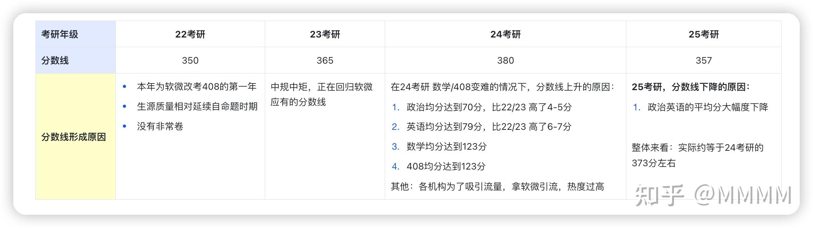

*22考研-25考研｜历年 分数线｜及相关原因总结（大量统计调研得出）*

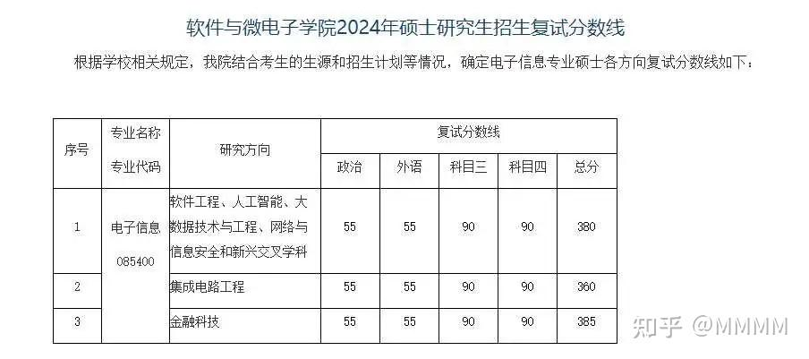

*24考研 软微各方向分数线*

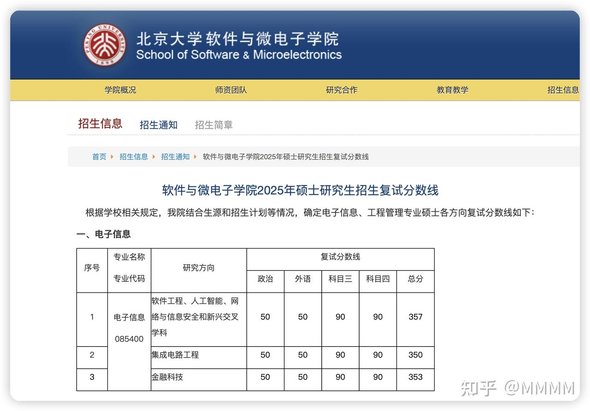

*25考研 软微各方向分数线*

### 2. 历年 招生名额 & 报考人数

注：以下招生说明，均来自北大软微官网

**22级：** 有点忘了，应该是300人左右

**23级：** 254人，和通知的人数一样

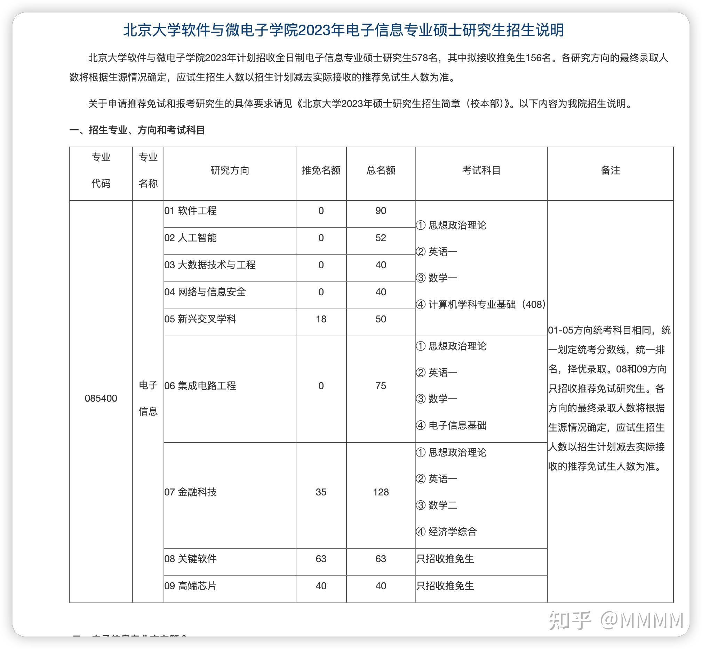

*23考研 软微招生说明*

**24级：** 官方通知190人，实际187人，额外有两个2个专项计划，一共189人；名额减少 是因为，24级的保研人数上升了，考研名额相应减少64个（考研+保研的总名额，一般是是保持不变的，保研多 那考研名额就少）

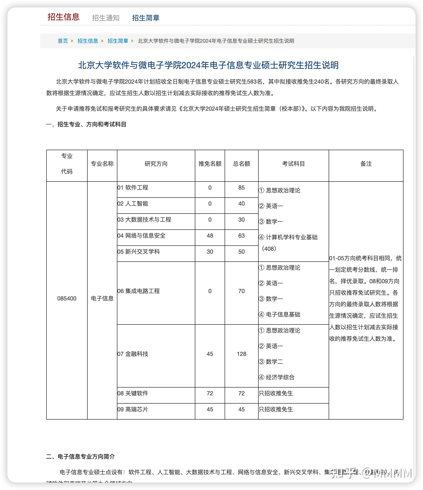

*24考研 软微招生说明*

**25级：** 官方通知198人，实际人数190人，和去年持平

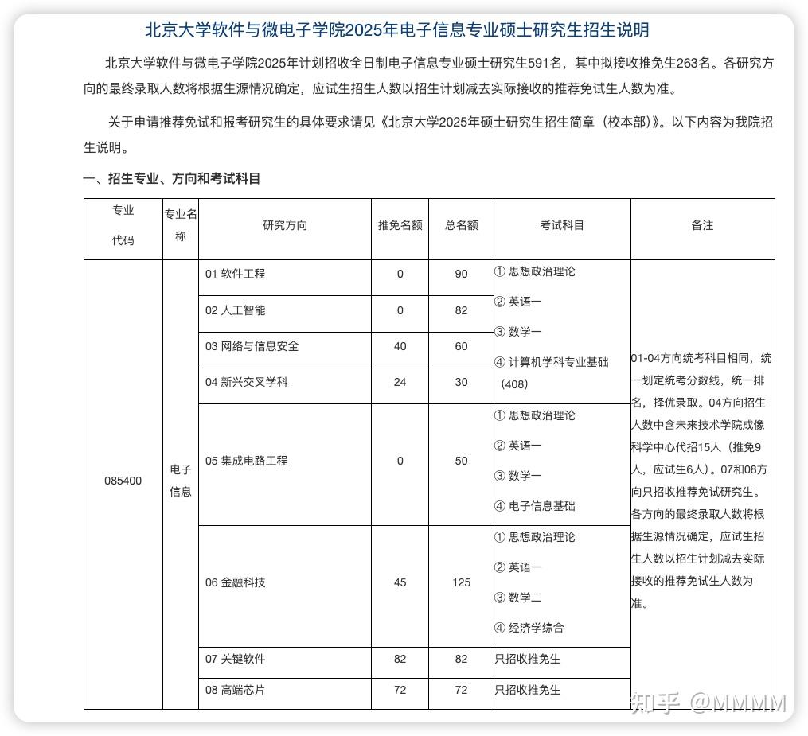

*25考研 软微招生说明*

**26级：** 官方通知196人，实际人数（待定），和去年基本持平

*25考研 软微招生说明*

### 3. 初试/复试情况 详细统计 & 分析

**3.1 22考研（全方向，此时还不能 完全区分开 计算机和金科/集成）** 

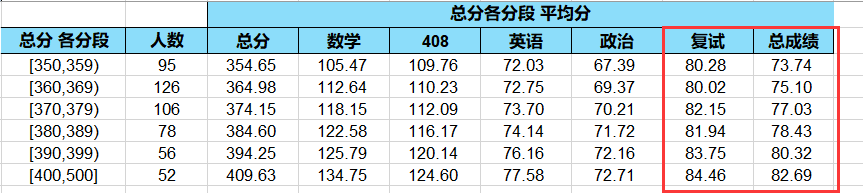

*22考研 初试&复试&总成绩（全方向）*

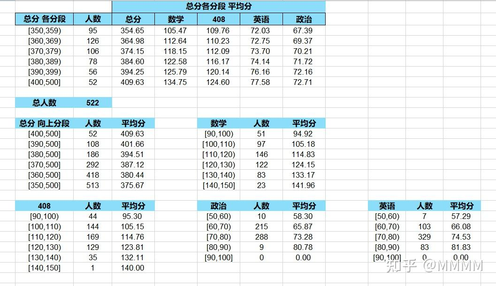

*22考研 电子信息全方向（复试群 统计情况）*

其他信息过于零碎，改为文字描述：

- 复试高分为：92分（3人 初试分别为358 365 366），91分（6人 初试分别为350 355 363 373 383 406）

**小结：** 

- 复试高分大多为初试低分，推测为老师在捞，但是捞上来的也不是很多
- **初试高分的，复试分数很平稳** ，基本都在81-87
- 350-360的，复试大约需要88以上
- 360-370的大约需要83以上
- 370-380的需要80以上
- 有3名同学复试低于60分，不知道是哪个方向的（不是计算机方向的反正），具体原因不清楚

**总结：** 初试高过分数线25分以上 就基本稳了。

**3.2 23考研（全方向，仍然未能 完全区分开 计算机和金科/集成）** 

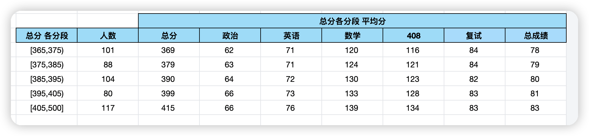

*23考研 初试&复试&总成绩（全方向）*

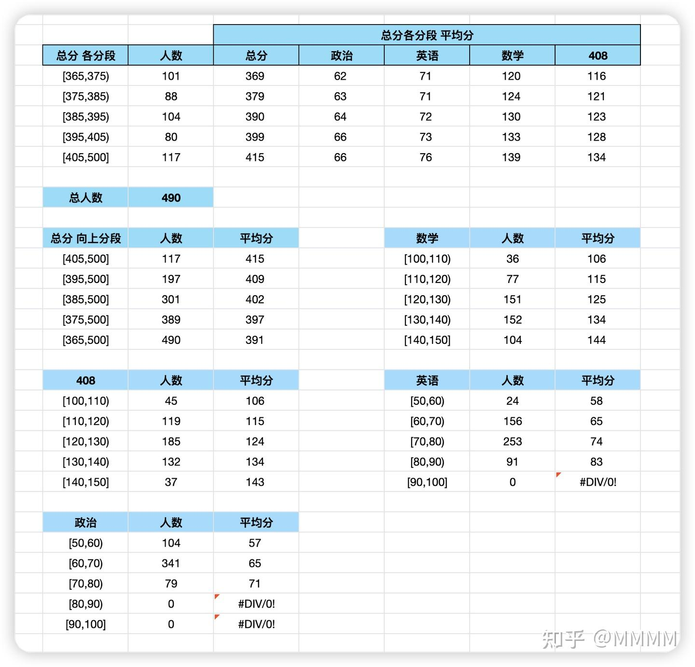

*23考研 复试群统计情况（全方向）*

**23考研与22考研的区别：** 

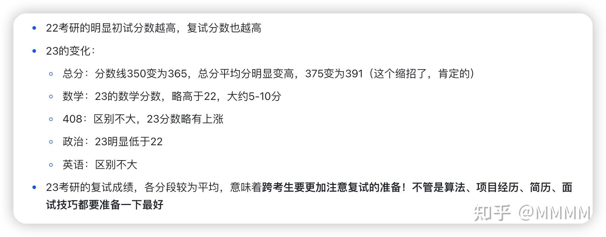

*23考研 与 22考研 的区别*

**大家比较关心的刷高分的问题** 

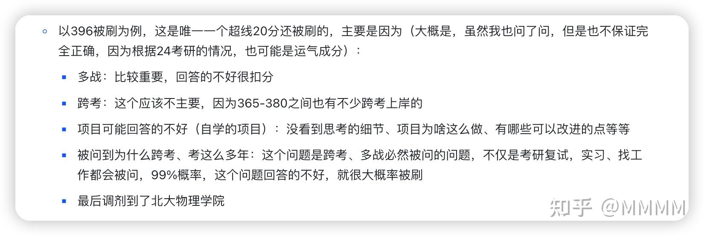

*396分被刷*

**3.3 24考研（仅408计算机方向，今年开始，我能够把 计算机和金科/集成 完全分开啦！统计率是100%！）** 

**3.3.1 统计人数和分段分布：** 

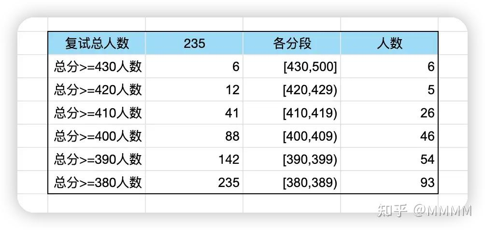

*24考研 进入复试 总分人数分布情况（仅计算机方向）*

**3.3.2 单科 各分数段 初试平均分、中位数、人数：** 

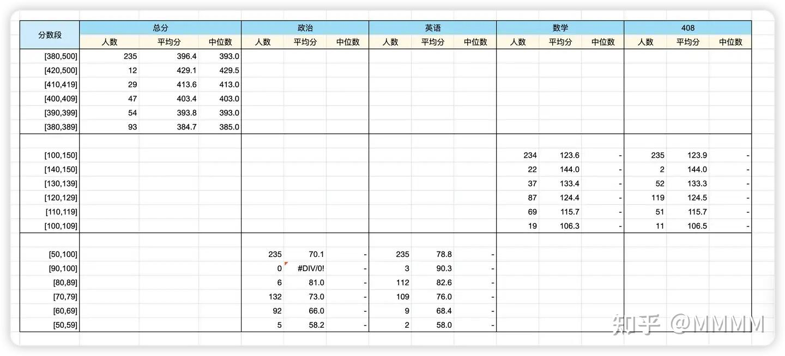

*24考研 进入复试 总分/各科 人数/平均分/中位数（仅计算机方向）*

**3.3.3 各分段的复试平均分：** 

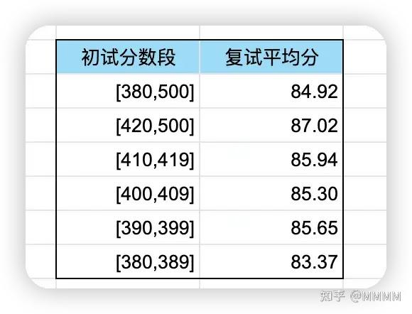

*24考研 不同分数段 对应复试平均分（仅计算机方向）*

**情况分析：** 

- 初试分高的，复试分也会高一点点；
- 380-390里，高分也不少，所以上岸了，比如最高有个92分的；
- 390-400没有被刷的；
- 400+刷了两个人 403和406（原因大家别猜了，也不要去四处打听、加好友问了，不然就和去年的396哥一样，他们总被打扰，可以理解为运气不好+准备不够充分）

**初试380压线，想上岸的话，复试需要多少分（85.8）** 

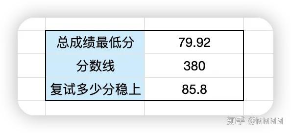

*24考研 计算机方向 复试85.8必上岸*

**本科院校 分布情况（上岸人员）：** 

- **985:211:双非** ，经过调查 比例为 **7:2:1** ，和往年是一样的（基本比较稳定，连着3年都差不多这个比例）。
- 双非也有初试低于400 复试高分的，也有初试400+的。
- 但不建议盲目报考，因为985也有很多不过线或者复试被刷的。
- 软微复试不歧视跨考，也不歧视本科挂科（补了就行）或者没有竞赛和论文的（有肯定更好）。

**3.4** **25考研（仅408计算机方向，今年依旧，计算机和金科/集成 完全分开啦！统计率100%）** 

**提前的预测：分数线出来之前，复试群里的统计情况（基本上统计了90%+的CS分析的学弟学妹），预估了分数线为355或360（最终没卡5卡10，分数线357）。预测基本上是完全的准确！** 

复试群，单人手工，一个个核对了成绩截图、准考证截图进的复试群，然后进行的手工统计、核对，所以统计情况误差比较小～（彻底杜绝了乱填、不填的情况～ 最大程度的保证了数据的可靠性！就是有点手疼 眼花哈哈哈哈）

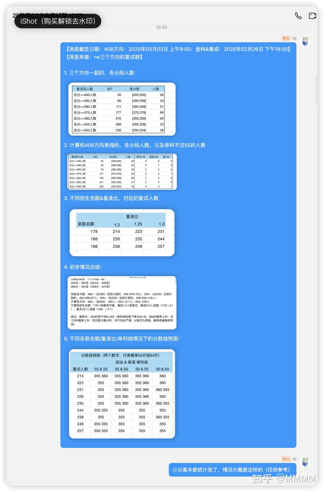

*25 rw 计算机408方向 复试群：成绩截图+准考证截图进群*

**3.4.1 统计人数和分段分布：** 

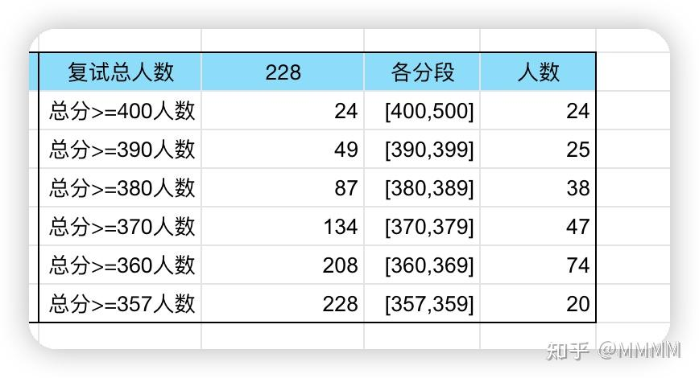

*25考研 进入复试 总分人数分布情况（仅计算机方向）*

**3.3.2 单科 各分数段 初试平均分、中位数、人数：** 

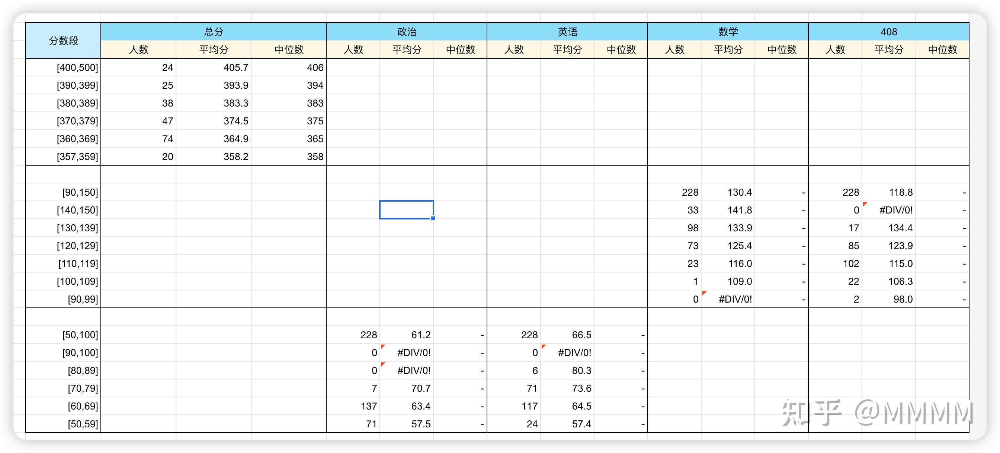

*25考研 进入复试 总分/各科 人数/平均分/中位数（仅计算机方向）*

**3.4.3 各分段的复试平均分 & 357分的话 需要复试84.2最低：** 

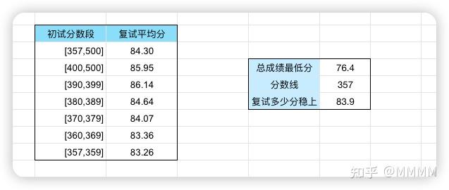

*25考研rw 复试只要高于84.2 就100%能上岸*

**情况分析：** 

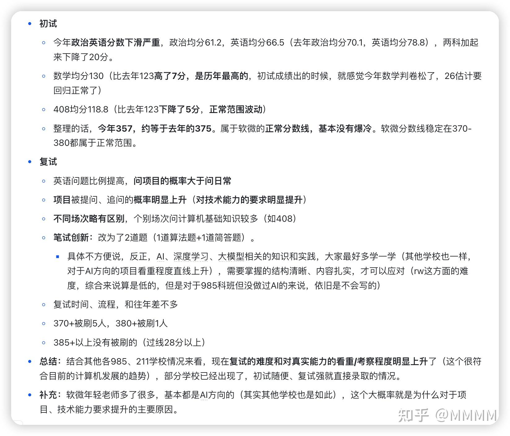

*25软微复试 对于实际能力的要求 明显上升了*

**本科院校 分布情况（上岸人员）：和往年基本一样，985:211:双非 大约7:2:1** 

### 4. 软微复试，总结性分析（随年份，每年更新）

**以下分析来源于对22/23/24/25软微复试的成绩分布和实际细节情况** 

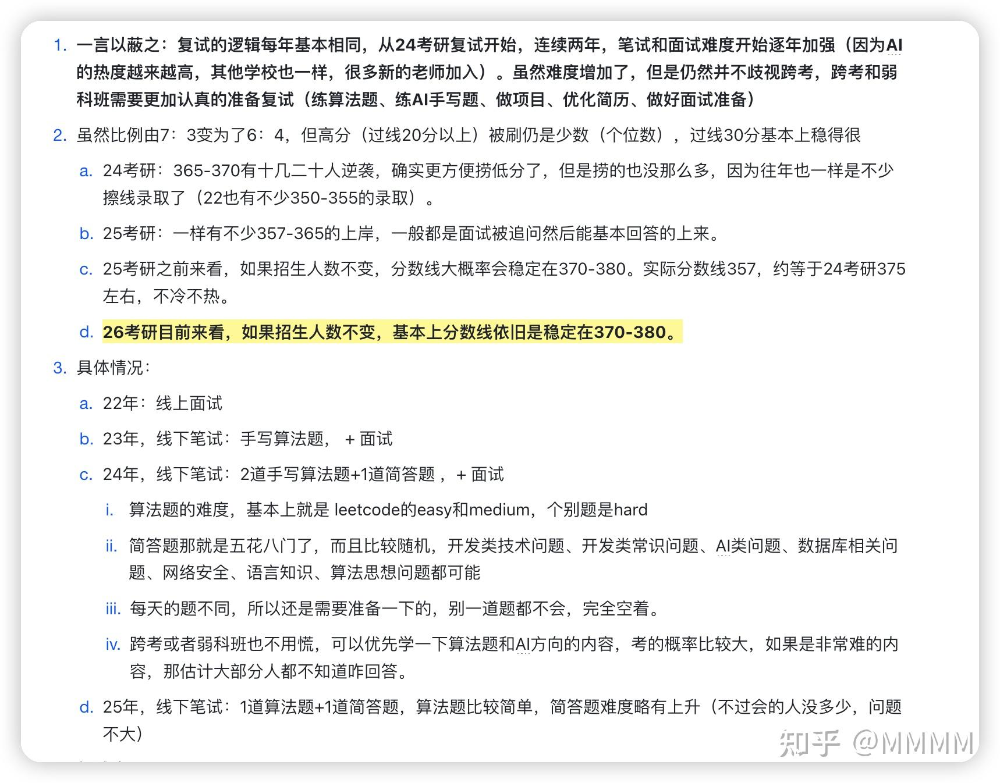

*22-25考研 软微复试总结分析*

**复试详细流程：** 

[软微复试：流程、QA](https://zhuanlan.zhihu.com/p/26930675365)

### 5. 软微不同方向的区别

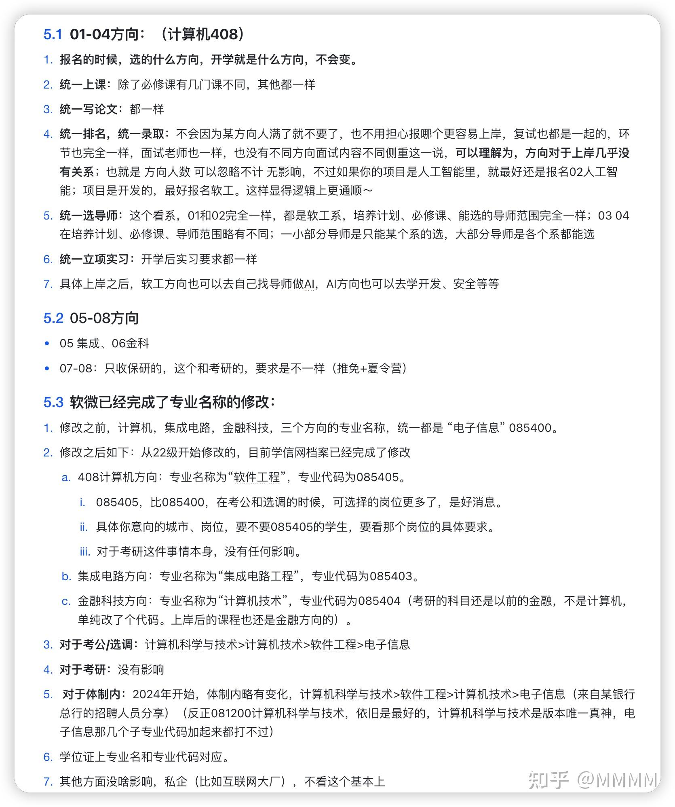

*方向 不影响 考研是否能上岸*

### 6. 24考研，整体考情分析（380超高分数线 背后原因的深度解析）

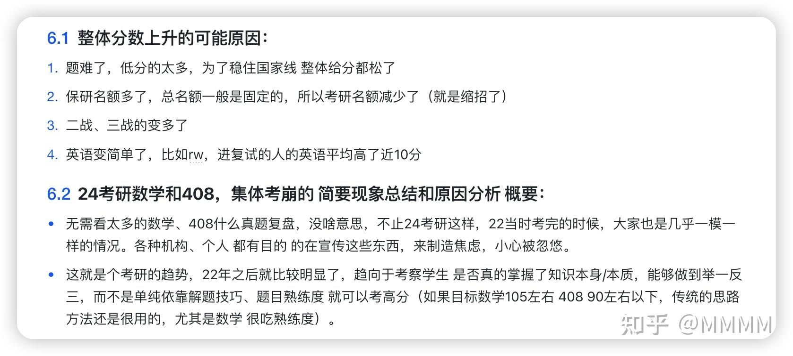

*出题问题 + 缩招*

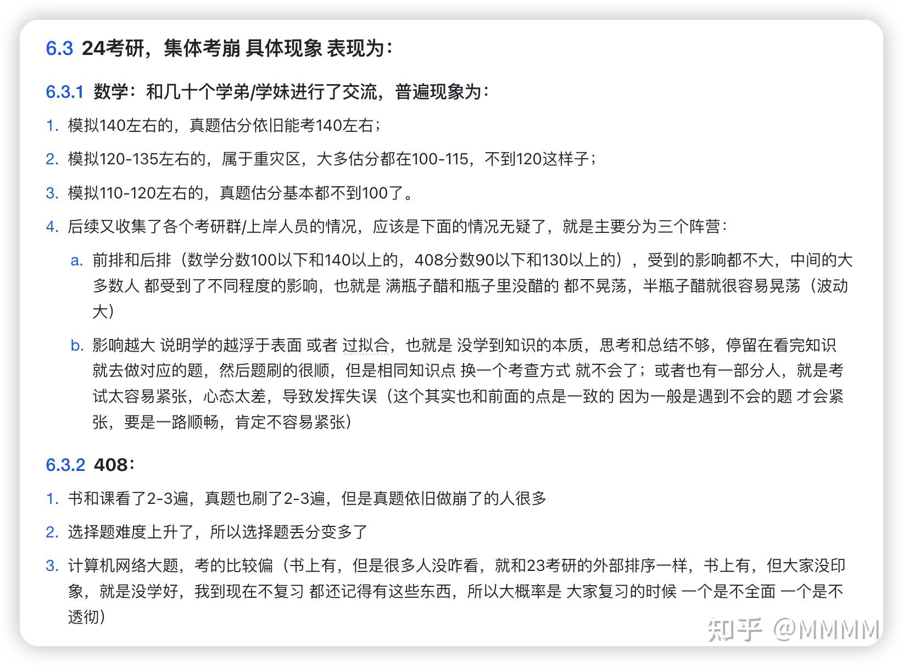

*24 集体考崩 具体表现形式*

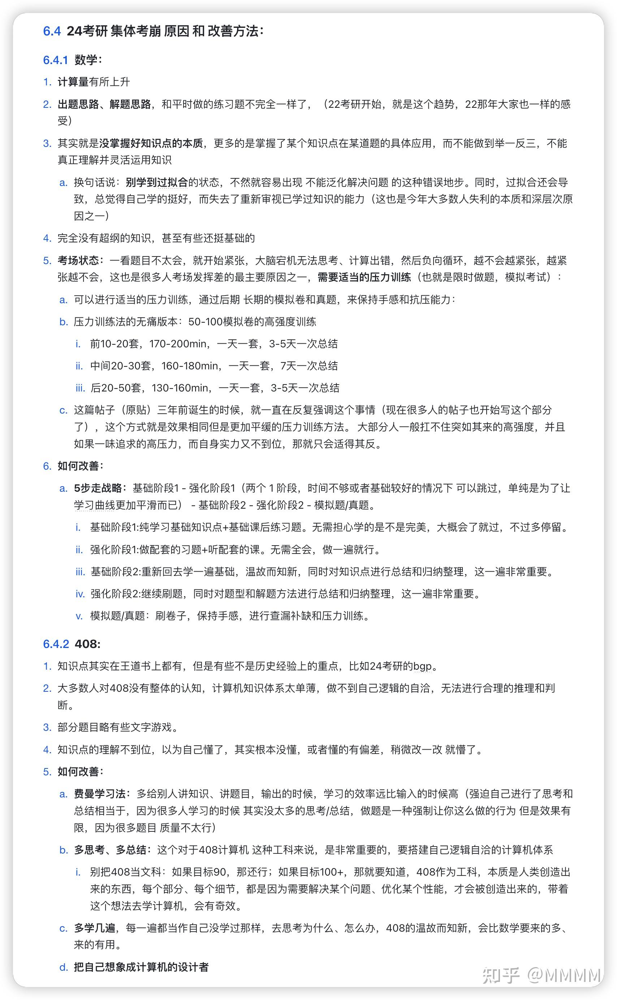

*如何改善 24考研 暴露出的问题*

### 7. 软微的实习 & 就业

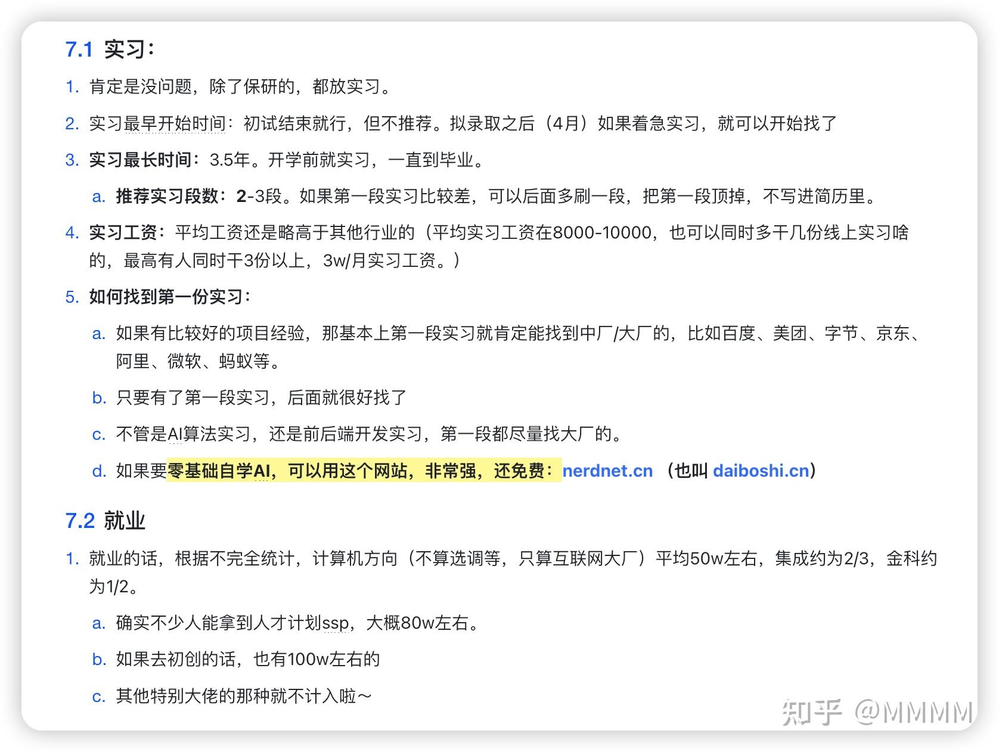

*实习就业都很好｜计算机要靠 自学 + 项目经历/实习经历*

## 第三部分：四个科目（11408）的通用学习建议

### 写在前面：

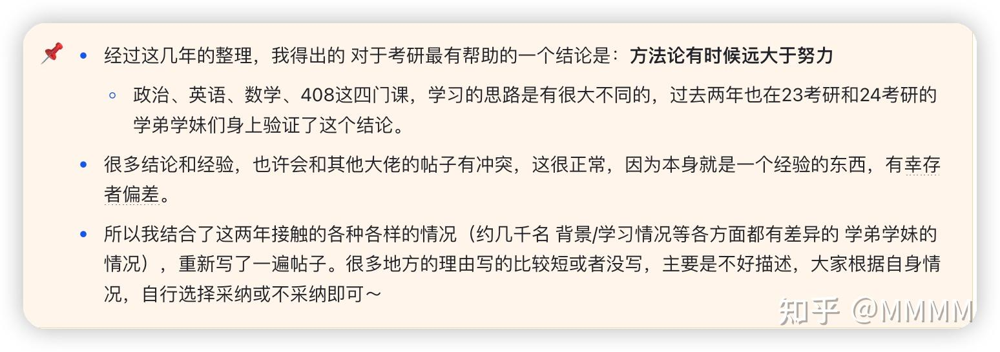

*选对方法 事半功倍｜不同科目 有不同的学习方法｜结合自身 灵活调整*

### 重要性标记符号的含义（本部分会一直使用本记号，一定要先看一下）

- S 必看
- A 尽量找时间看
- B 选看 有时间就看
- C 可看 但图一乐

若无特殊声明，意为不区分 一战、二战、跨考、科班等情况，统一相同的建议

是以目标为 政治70+、英语70+、数学130+、408专业课120+，而写的计划，根据自身目标取舍学习内容

每天学习顺序：数学 - 408 - 政治 - 英语（政治英语一般到了晚上或者状态不好、通勤、吃饭等**零散时间再学** ）

**一定不要那么在意 每天的进度** ，每天设定的目标，应该是学什么，而不是学多少。进度至少要按月算，保持心态平稳，短期内快点慢点没那么大影响，又不是进度到了分就有了，既看数量又看质量才行，**掌握程度的意义远远大于进度的意义。** 

### 1. 政治

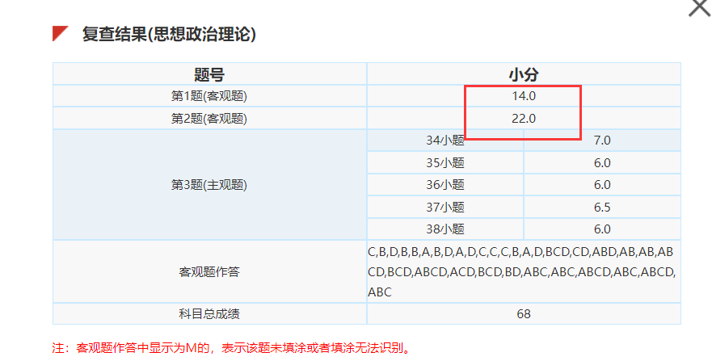

*22考研 我的政治分数*

**建议：大题写满2/3页面以上，字写好点** （这点很重要，也是人人都可以做到的 只要认真写就可以；字数硬凑也得写满，实在不行抄抄题干；**积累素材** ，有些句子在当年的政治考试中是万能的，哪个题都能写；24考研的临考前一两个月来问过我 并使用了这个方法的，都和我反馈 大题分数比预想的要高不少，所以可以参考，应该是有效的我觉得）

1. **时间阶段（具体各阶段的用书、课、题、卷子、学习策略，看对应部分，此处仅列举时间，下面三科同）** 
2. 第一阶段 听课：一战 9月，开始听课；二战可适当推迟 最晚至10月末（一战听过 二战可以不听）
3. 第二阶段 刷选择题：10月到考试前
4. 第三阶段 背大题：10/11月出肖8，12月出肖4
5. **课：** 
6. A 徐涛强化课：一战的话最好听一听，或者只听马原部分（如果一战听过，印象也比较深刻，那二战可以考虑不听），最好在肖4出来之前全部听完（肖4每年12月初出版）
7. **书：** 
8. S 肖4、肖8：没啥好说的，必买、选择必做多遍、大题必背（肖8可以不背，熟读也行）
9. A 肖1000：有时间可以当题做。我建议**直接对着答案看题目，当书背 不当题做** ，效率更高
10. B 精讲精练、徐涛的核心考案：除非时间很多，不然可以不看（我是买了没看的）
11. **大题：** 
12. S 肖4 肖8：
13. 肖4别管咋么说，你不可能不背，时间如果实在太少，背2套的至少。
14. 肖8如果没时间，可以熟读（不背）。
15. 答案中出现**频率很高的句子（也就是前面提到的素材句）** ，别管是啥题，如果字数凑不够，直接写上去就行，写了肯定不扣分（政治是按踩中多少点，来给分的，所以多写了没事）
16. A 腿姐押题冲刺（下面三个人的 都可以选看，有时间就看，没时间拉倒；最好还是熟读一下，记一些出现频率高的句子）
17. A 米鹏押题冲刺
18. A 徐涛押题冲刺
19. **注意：千万不要背了大题答案，考试就直接原封不动的写上去，这是下策，要结合题目，把不同大题的句子糅合起来成为答案。因为命题组可能会反押题，纯默写 有时候踩点会踩不中（如果做不到的话，那就直接默写吧还是）** 

5. **选择题：** 

- A 肖1000 （一战A 二战B+）：同上
- A 微信**小程序：** 随便找个靠谱的就行，能刷题就行，这类小程序非常多。吃饭啊、路上啊啥的随便做做。我用的壹硕考研，现在叫苍盾考研，直接搜就行，甚至也不用在乎做的对不对，直接就当知识来看都行（进行一个记忆和背诵，不用硬背，眼熟 有个大概逻辑，就可以了）
- B 喜马拉雅 腿姐、米鹏音频 ：知识点串讲之类的 冲刺带背啥的，在吃饭路上、回宿舍路上等等，都可以听听，就当放音乐了。

6. **时政：** 

- B 肖的书里有本时政：可以看（但是性价比一般，内容多但是考的少）；可以靠大量刷选择题，来记忆一些时政问题
- A 微信小程序：同上

7. **考前如何准备：** 

- 做好4 5 6即可，无特殊安排，因为本身开始的时候就差不多是考前了；
- 12月份就是背大题了，选择题抽时间看

8. **统计信息：** 

**信息来源：每年的复试群、新生群我都会建，由成绩单和学校录取邮件入群，信息均来自于此 或者 官网信息（很多机构每年会编数据、造假等，在此不方便点名，反正我的成绩也被他们乱归类过，那其他分数的数据就更可见一斑了，而且每年还会来偷群里统计的数据，笑死）。以下三科同样如此，不再重复赘述** 

22考研 政治均分：67分

23考研 政治均分：64分

24考研 政治均分：70分

25考研 政治均分：61分

### 2.英语

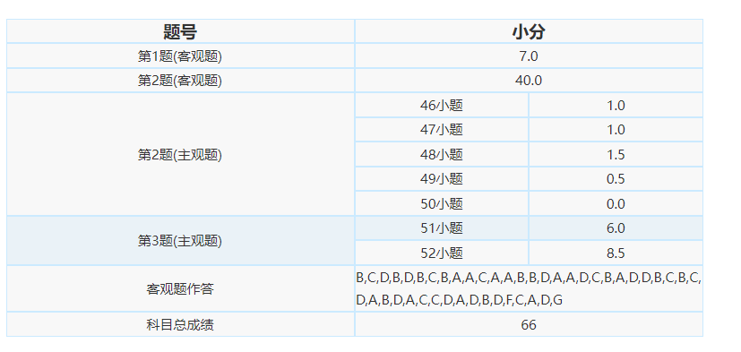

*22考研 我的英语成绩（英语一） 北京*

**建议：** 

- 多背单词（尤其注意 熟词僻义，一般挖坑概率较大）
- 多看语法和固定搭配
- 长难句看不看都行，短时间不好提高
- 准备个自己的作文语料库
- 英语是非常吃基础的，别妄想考研这点时间，就把常年拖后腿的英语，变成优势学科，能考65+就是胜利

**时间阶段** 

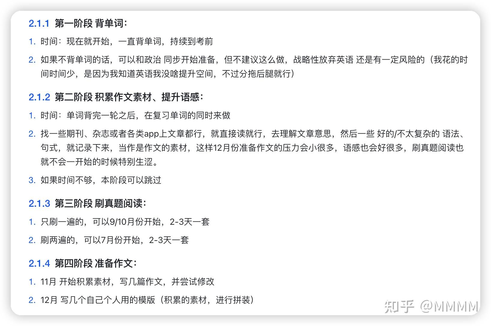

*一共四个阶段*

**学习内容：** 

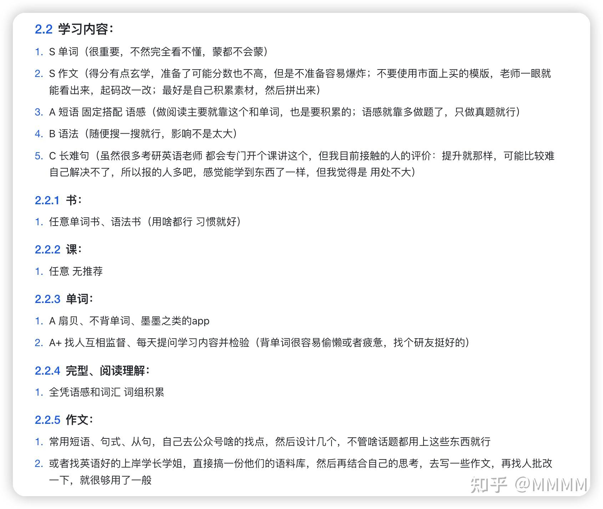

*单词+短语固定搭配+语法+阅读理解+作文*

1. **考前：** S 每天一套真题 可以不写作文，倒计时着做到考试前一天（主要是为了找语感）
2. **统计信息** ：
3. 22年：均分72左右（上下波动不超过1分）
4. 23年：均分73左右（上下波动不超过1分）
5. 24年：均分78.8
6. 25年：均分66.5

### 3.专业课408

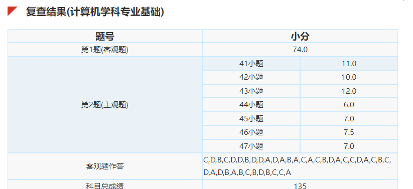

*22考研 我的408成绩*

**分析：** 和我出考场时发现的错误点差不多，选择错三个，错在争议题了，41算法题没满分 扣了一分，大概率是**因为涂抹较多** 之类的问题，后续每道题基本都有一问扣分了

**建议：** 考试遇到不会的 要**学会合理推导答案，心态不要受影响（应试技巧很重要）** ，很可能能蒙对；平时学习一定要多思考、多总结，不要很容易出现 假性理解、浮于表象、无法形成知识体系等情况。

**特殊性：** 

- 408和数学不同，尤其对于跨考来说，单纯的看书做题，很容易到中后期发现自己学的啥也不是，然后满世界找人要思维导图（年年如此）
- 这在于 数学其实大家多少都是学过的，有自己的理解，而408是一个体系，在初学的时候，大家完全不知道408全貌是什么，只能按照以前的学习方式来学习（看书、听课、做课后题），自学的话，这也确实是一个不错的办法。
- 但其实408每个科目、科目章节之间，都是有逻辑性在里面的，学习过程中，要注意 用自己的理解来构建体系，无论对错，**能解释的通、逻辑自洽** 即可，在多轮的学习中，反复去调整，这也是多轮学习的最大意义，而不是单纯的复习。
- 说到底 **408是个应用学科，要从计算机最初的设计路线来思考为什么这么设计。** 有点鸡生蛋蛋生鸡的意思了，学的好才能知道学，知道怎么学才能学的好。所以有时候会出现 很多985科班出身的 408考了个100，跨考的考了个130+，这是方法论的问题。

[408科目剖析](https://www.bilibili.com/video/BV1ey421h7sg/?vd_source=950e866ee4425c8a71616af0c89694dc)

**跨考和科班，在学408的时候，我之前常用两个例子来形容区别：** 

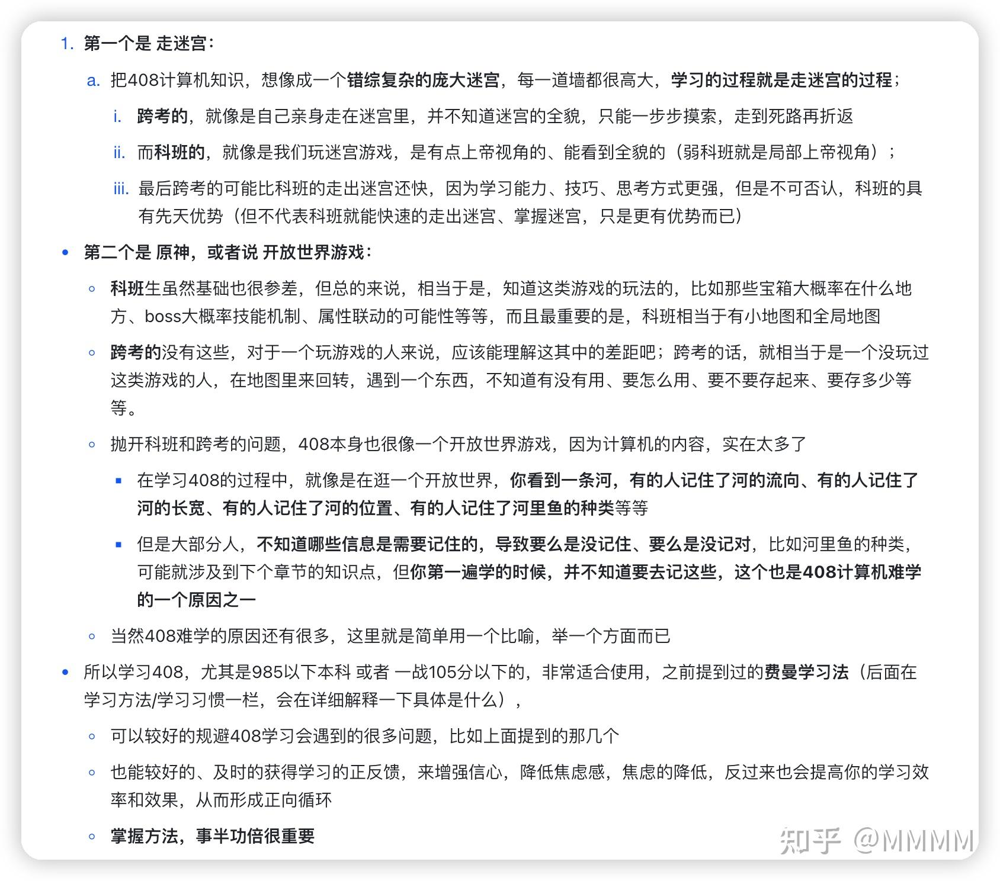

*掌握方法，才能学好*

0. **关于C语言需要的掌握程度** ：

- 能看懂书上代码的意思就行，不需要会写代码题、写程序
- 当然如果有时间可以上机写一写，简单的语法、算法操作，有利于深入理解，没时间不写也无所谓。
- 初试完，再去专门联系写代码题就可以了
- 推荐入门书籍：《C语言从入门到精通》，当然其他的也行
- 推荐入门课程：B站 翁恺，当然其他的也行

1. **时间阶段** 

**第一阶段 一轮 打基础：主要是对知识点 零散的/单独的学会，就可以了** 

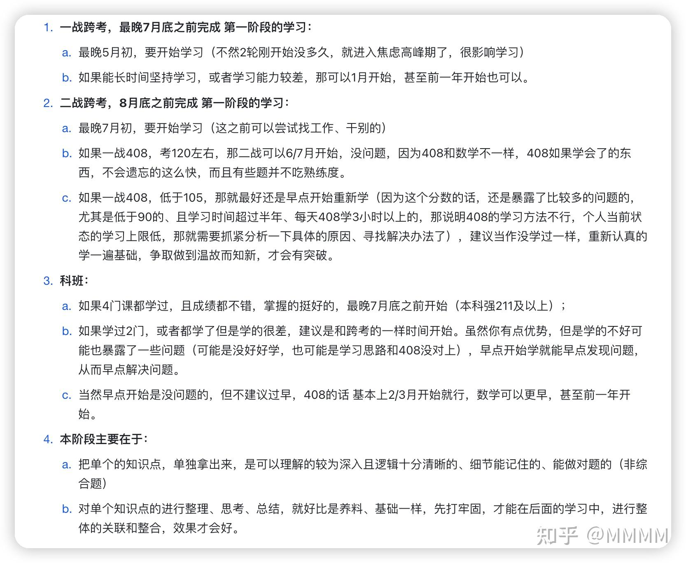

*第一阶段 打好基础*

**第二阶段 二轮 强化学习：巩固知识点的细节理解，初步建立体系** 

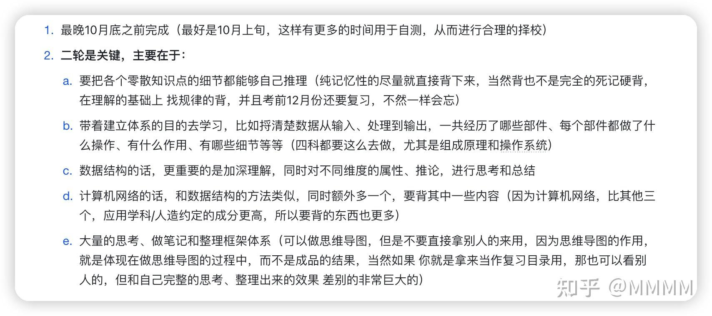

*第二阶段*

**第三阶段 三轮 查漏补缺 冲刺提高：再快速过一遍，复习掌握的不好的地方，做自己的思维导图，尽量建立完整且详细的408体系架构** 

1. 时间：11月和12月
2. 查漏补缺是必须要做的，很重要
3. 偏记忆性的知识点，12月份开始硬背
4. 一般情况自己的建立不起来体系的，实在做不到就不做了
5. **备注：如果开始学习的早（时间在12个月以上的），那可以不采用上面的三阶段法，使用五阶段法** 
6. 第一阶段：同上面的第一阶段，但更加轻量化
7. 第二阶段：同上面的第二阶段，但更加轻量化
8. 第三阶段：重新走一次第一阶段，详细的学习+复习，一般会获得更多新的理解（如果没有的话，就要考虑学习效果的问题了）
9. 第四阶段：重新走一次第二阶段，详细的、完善的框架体系搭建，一般这个阶段的话，就大概知道自己能考多少分了（如果需得不太好的话，最晚这个阶段必须要开始想办法了）
10. 第五阶段：同上面的第三阶段，查漏补缺、冲刺提高、背诵记忆等等

**2. 学习顺序：** 

1. **推荐：** 数据结构-操作系统-组成原理-网络 (全看一遍算一轮，下不重复），我一般习惯看完一本再看下一本，也可以选择交叉着看。操作系统和组成原理 有知识重叠的部分 也可以同时一起学（最好是一轮分开学，二轮一起学，因为二轮的时候 就大概知道哪些章节有关联了）
2. 两门两门的，交叉来学也是OK的，比如数据结构和组成原理，操作系统和网络，这样的顺序来学

**3. 时间安排：** 以下为一战跨考 5月份才开始的安排，其他情况可自行推后或延长时间（开始的早 每轮可弹性安排，适当延长10-20天/科，都是合理的）

- 一轮：每单科15-25天，总计最高不超过90天； S 过王道教材 大题可适当不写（如果实在不会） 选择必须要写，还要认真看答案，做笔记
- 二轮：每单科10-25天，总计最高不超过70天； S 过王道教材 **大题 和 选择题都写，做笔记 做总结** 
- 三轮：自行分配时间，补短板，同时保持强项； S 王道教材 S 王道模拟题，可以尝试自己构建体系

4. **书：** 

- **S Top帮408大礼包：教材/讲义/PPT、模拟卷、题库（小程序：Top帮研题集）** 
- S 王道大礼包：教材、模拟卷、真题
- B 黑书：详见下面 408单科的书课推荐分析
- A 各学校的教材 如谢希仁：看不看都行，其他的都看好了 还有时间可以看看（985科班很猛的，只看教材也能考高分，主要是有底子）
- C+ 天勤/竟成等：可以简单看看他的选择题

5. **课：** 

- 一战：
- 可以选择王道。优点就是不用自己找资源了，也有答疑；缺点就是答疑一般
- **推荐：Top帮408** 
- 二战：
- 之前报过王道的，二战就没必要再报了，可以自学，如果觉得自学很难提高，可以考虑其他机构的课，或者找一对一带着学（因为你对408也有一定认知了，最需要的还是老师能够根据你的情况，量身定制的去帮你，而不只是单纯的讲知识给你听，要是听了就能会，那之前就该会了）
- 如果经费有限，就不用焦虑这个问题了，相信自己！自学肯定也可以的！很多自学最后分数也很高（如果只是想报个班能安心一些、省事一些，那就看个人了）
- 如果要报小班课：因为自己一战暴露出了很多问题，如果自己比较难解决或者想办法进行一个提升（比如一战不到100，目标想考 110+ 120+，那确实可以考虑小班，但是就要仔细辨别了，这里面的差距太大了），具体分析 详见《第四部分 关于如何鉴别考研机构和考研辅导》

6. **单科详细计划（书和课）：** 

总体：

一轮：书（如王道）+ 课后选择题（如果时间充裕，第一轮可以先不听课，先自学，充分发挥自己的学习能力；如果时间不充裕，或者自学能力本身就有限，那可以第一轮就把课听了）

二轮：书 + 课后全部题（选择+填空）+ 如果掌握的不太行，课可以再听一听 + 其他书或课或题（一般就是用作查漏补缺、某些知识点的补充理解、大量题目练习 来促进思考总结的作用；可以不用，只看王道，也是够的，主要是看自己学会多少，每年自学只看王道的，也有跨考130+的）

- **数据结构：** 
- S Top帮教材
- A 王道书（代码啥的 问题太多了）
- S 一战 王道课、Top帮408课
- S 二战 Top帮408课
- A+ 二战 王道课
- A 清华邓俊辉的教材，只看和408考点重合的部分，其他的部分不看（红黑树部分 邓公是按4阶B树演变成红黑树来讲的，可以看一下）
- B- 邓俊辉习题集 配套书的那本
- A- 自己写一下书上常用或重点的代码（默写也行 抄写也行，最重要的是遍历算法，其他的就是插入删除等操作之类的）
- C 代码随想录、算法导论等算法书、力扣题（时间多可以稍微看看，初试不太有必要）
- **操作系统：** 
- S 王道书、Top帮教材
- S 王道课、Top帮408课
- B 黑书 操作系统概念（黑书都属于是 时间多就选看，没时间就不看，下同）
- B 黑书 深入理解计算机系统
- B 本科教材（如果自己本科就学过408的那几本教材，那上升为A，可以看下教材）
- C 其他黑书
- **组成原理：** 
- S 王道书、Top帮教材
- S Top帮408课
- A+ 王道课
- B 黑书 软硬件接口
- **网络：** 
- S 王道书、Top帮教材
- S Top帮408课、湖科大
- A- 王道课
- B 黑书 自顶向下

7. **考前（30-40天）：** 三轮下半段，大概11月初或11月中旬 至 正式考试的前一天，每两天一套模拟卷/真题，认真做，卡时间做（目标150min做完），正经的打分/判分，总结卷子的情况，然后总结自己的易错点、薄弱点、未知点、答案标准写法等（具体开始时间，根据卷子数量和个人情况，倒计时到考前1-3天正好写完，来安排具体哪天开始写即可）

8. **数据结构 算法大题，如何备考** 

这个问题是每年到考研后期（大概10月份开始），100个跨考生里，至少90个人都要问的问题，今年更离谱，从1月份开始就不断有人问我这个问题，并且为此而感到焦虑，觉得这部分学的差、学不会，不知道怎么办好了，影响整体的学习状态。因此特意从热门问题模块，移动到此部分，成为常驻解答。

**如果你是跨考，没有代码基础，且9月以后才看到本部分，那么：** 

- 代码题，如果想保证90%概率以上，能做出最优解，得到11-12分（满分12分），那么是性价比极低的一件事，要付出的努力远大于收获，你的目标应该是，保证能拿7-10分就行，或者6-8分也是OK的
- 那么你要做的就是掌握以下内容：可以手抄+理解+理解基础下手写
- 数组、链表的基础操作（遍历、翻转、查找特定位置、查找特定值等）
- 出入栈
- 出入队列
- 树的四种遍历（层序要会、递归前中后序、迭代后序，迭代后序比较难 实在不行就背下来），在遍历基础上进行一些操作
- 图的遍历
- 快速排序、归并排序（堆排序要理解，插入排序、选择排序、冒泡排序比较简单，依靠理解也能自己写出来应该）
- 二分查找
- 写出暴力解法，也有一半以上的分，所以至少暴力解要会写
- 如果担心写的代码bug很多，那就多写注释，把注释写的清楚一点，比如这段代码实现的功能、变量的含义、在什么时候递归返回等等，只要写的足够清楚，即使代码是有问题的，但是老师也能知道，你的思路和考虑到的细节是没问题的，也会给一些分

**如果你是跨考，5月之前看到本部分，那么：** 

- 你可以刷一些408数据结构的题，对应的力扣题目，上机实操一下，但同样不要做太多，少做点就行。因为上机会写的，手写也一样不一定能写的出来
- 看代码随想录、算法笔记中，和408数据结构相关联的部分

**如果你是科班，有上机写代码经验，那么：** 

- 建议是手写一下试试，没有IDE，手写代码的感觉，和电脑上写代码差别挺大的，可能电脑会写，手写就有点磕绊了，所以要熟悉一下
- 基本上熟悉了之后，问题就不大了

**如果你是竞赛出身，那么：** 

- 你的算法习惯和408数据结构，出入其实有点大，如果担心因此扣分，但也不想为此多花时间，那么就多写注释！写清楚就行。

9. **统计信息：** 

- **22年：** 408均分为，400以上126、390以上123、380以上121、370以上117、360以上115、350以上113。 所以408要考120以上才不拖后腿，且408对拉开分数有很大影响。
- **23年：** 平均分大约122分（进复试的，统计人数大概80%左右）
- **24年：** 平均分123.9分（全部408方向的上岸人员的平均分）
- **25年：** 平均分118.8（全部408方向的上岸人员的平均分）
- 所以，408每年的平均分其实没啥变化，并没有因为名额等原因，出现很大波动，基本上考个120+，就不算拖后腿

### 4.数学

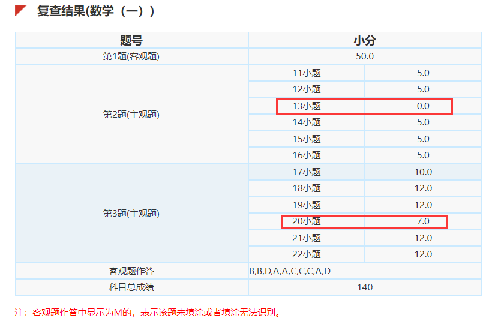

*22 数学一*

**分析：** 

- **休息不好：** 填空错在了那个求最值，本来第一次就算对了，之后又证明了最值应该在内部而不在边界，然后把算了个内部极值写上去了（这就是**作息导致的，所以不要学我的作息，第二天考数学、408 头疼的要裂开了** ）
- 不可抗力：大题错了证明题，个人认为证明的没有问题的，用的反证法，每一步都写了条件。估计是有漏洞，或者写的不是标准方法，所以扣了充分性那部分的分数（这部分属于扣分重灾区，基本上绝大多数人 这个部分都没得分）
- 步骤分：我这两年数学大题过程分基本都是满分（去年扣了一分），所以过程一定**写详细的前因后果，不要省略条件步骤，只要你足够熟练，考试时间肯定是够用的（包括题的难度、计算量等，很多时候都是第一反应找不到解题方法，或者计算缓慢 怕算错 反复算等）** 

**建议：** 

- **数学高分（130+）靠的是厚积薄发，一轮就是打基础，重点是基础知识点的掌握，同时养成数学学习的良好习惯；二轮开始刷题，主要目的是见识题型和总结各类题型 一般可以用到哪些解题思路或方法（可以单独找个笔记本记录），刷题就是各类题集都可以基本上；三轮：查漏补缺，保持手感，主要是做模拟卷和真题（别开太早 不然后期手感就不好保持了，做过的题 做第二遍，一般都记住了 有印象，效果会比较差，如果完全没印象，那就更差了，上次白做了说明），并且一定要在卷子上记录、标注自己的错误原因（比如是计算失误、知识不会、题型没见过、个别步骤想不到等等）、涉及的知识点（尽量具体一些），然后进行总结。每做3-5套卷子，就把做过的卷子都拿出来，放在一起看一下，自己总结记录的这些东西，然后继续练习** 

**数学题集难易顺序(逐渐变难):660（概念性题目比其他的多，也是这本题集的难点） - 330/1800（可以选做一部分） - 880 - 1000，难度只是个大概区分，因为每个题集自身内容，也都是有自己的难度等级划分的，都有简单题和难题** 

**1.时间阶段** 

**第一阶段 一轮 打基础：主要是对全部的知识点，进行一个初步的学习和掌握，同时做完课后的基础习题** 

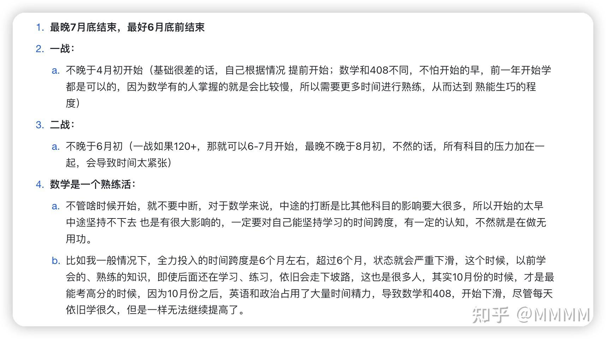

*第一阶段 打基础*

**第二阶段 二轮 强化学习：巩固知识点的理解，强化做题应用，大量刷题 见识题型** 

1. **最晚10月底之前完成，最好9月底完成** 
2. **二轮是关键** ，这个阶段就两个目的：
3. 深入理解知识点，此阶段的内容会更加难一些，也会更加综合
4. 大量刷题，题集猛做，同时总结，见识大量的题型和解题方法，才能考试得分

**第三阶段 三轮 查漏补缺 做卷子：辅导讲义、模拟卷、真题** 

1. **二轮结束，一直到现在考前一天 保持手感** 
2. 查漏补缺对于数学而已，非常重要。如果一些辅导讲义还没看，可以留作这个阶段看，一般是比较精炼的。
3. 模拟卷、真题：尽量一天一套，做完后立马评分、总结，不要分两天做，哪怕第二天不做数学，也要一天内趁热 连续的把这一套事情做完，这样的效果最好（做卷子2.30-3小时，判分、总结等30-90min）
4. 模拟一些真实考试情况，进行限时训练，训练次数多了之后，能有效避免考场上的紧张情况

**2. 书、题集、模拟卷：** 

- S 李永乐复习全书 提高篇（如果直接看有难度，就先看他的基础篇）
- 李永乐大礼包 我觉得都不错
- 辅导讲义要看，可以查漏补缺用（线代的辅导讲义作用比其他两个讲义的大一些）
- S 李正元复习全书（比李永乐的要难，适合基础好 或者 二战的）
- S 李永乐660（难度相对低，概念题更多一些，不过很多人 概念掌握的都不太行其实）
- S 李林880（这两年开始 李林的题集更贴近真题难度，每年没啥更新）
- A 张宇1000（基本也是必做，难度上限高一些）
- A+ 李林 108 （基本必做）
- B+ 汤家凤1800（这几年饱受诟病，其实不同题集的意义不同，1800的题很多，可以用他的基础题部分，来增加熟练度，所以可以适当的不全做，难题的难度上限也偏高。整体用来加强基础知识的熟练度、见识题型，我认为是不错的）
- A 武忠祥严选题（如果跟了武忠祥的课，那严选题就是 S）
- A 张宇30讲 18讲（一战最好还是不要一轮就用，用的话最好也配合其他课一起，因为张宇的总结性更强，二级结论多，我个人建议 这类的结论，最好是可以自己推理，而不是靠记忆。如果基础很好的，还是适合张宇的)
- S 李永乐、张宇、李林的全部模拟卷（李林的S+，这三人的加起来，大概一共是40套左右）
- S+ 08-25年真题（真题不用想，肯定要做，更早的可以不用做了；如果想要留几套题 作为水平测试，可以留23-25三年的，或者21-25五年的，就足够了）
- A 08年以前的真题（太早了 出题人和出题思路不一样）
- A+ 合工大模拟卷、超越卷（模拟卷计划40套以上的，可以把这个也做了）
- C 李艳芳模拟卷 （难度逆天，远远高于真题难度，可以看看图一乐）

3. **课：** 

- S 武忠祥每日一题（可以在吃饭的时候，看一看，b站就有，越接近考试的时间，就越能从中 找到自己的短板）
- A 线代：李永乐、b站up 3blue1brown（视频有助于加深对线代的直观理解）
- A 高数:武忠祥、张宇
- A+ 概率论：余炳森、方浩（主要是级数、概率论）

4. **学习顺序：** 复习全书 - 刷题 - 复习全书/讲义等 - 刷题 - 讲义(还没看的话） - 模拟卷/真题

这个是重复了两次，第一和第二阶段，适合时间非常充裕的备考情况。开始的晚的，就不需要重复两次了。

5.**时间安排：** 

- **一轮打基础：** 最晚8月初，最好6月初，完成 复习全书（不管看没看基础篇，这个时间要看完提高篇）/660/330/部分1800，若未完成 则要加大每天数学学习时间，若习惯听课，则同时要把基础课听完
- **二轮打基础：** 10月中旬之前，完成 第二遍复习全书（同第一轮看的一样）/1800/1000/880/108，完成张宇30讲/18讲（若计划内有），若习惯听课，则同时要把强化课听完；
- **三轮找手感：** 讲义查漏补缺，购买模拟卷+真题 共40-60套，从考试当天倒计时自己算，每天一套直到考试，认真做，打分，并记录自己哪块学的不好，丢分原因等（每套卷子注明 哪天 几点到几点 得分情况 丢分原因 遇到哪些新知识点）（在三轮之前不强求记录自己哪块不行 一二轮都是打基础而已）

6. **考前：** 11月之后，三轮开始时或二轮末尾，个人建议吃饭时间或休息时间看看群，研友问的问题，一般这个阶段的问题很有价值，尤其是目标院校比较难考的时候；（比如22年 408的那道堆排，考前两天就有人问 我详细回答了，就告诉大家，很可能就会考这个，但大家貌似都没看；23年也一样，也有类似的情况；数学的话，建议三轮开始的时候，或者12月初开始 没事看看群）

7. **数学考试大忌：** 考试紧张、担心做不完、疯狂反复的检查 怕出错；一定要保持平常心，减少失误就已经赢了一大半了（别像我一样自己改自己的答案 甚至还证明了一下 笑死）。这个也是23、24考研的题目情况，开始更加主动学生对知识点的理解、举一反三的能力，题型变化变多之后，对这方面的要求就更高了。

8. **统计信息：** 

22年：数学一均分为，400以上134、390以上127、380以上125、370以上123、360以上121、350以上117。 所以数学要考125以上才不拖后腿，且明显**数学是拉开分数的主要环节。** 

23年：124分左右（复试群的统计，进复试的，人不全）

24年：123.6分（408方向，统计了全部进入参加复试的）

25年：130.4分（408方向，统计了全部进入参加复试的）

**9. 数一和数二，如何选择：** 

有不少同学，看到帖子的时候，可能还没决定要考啥学校，不知道是考数一还是数二（或者是考408还是自命题）。

**数一：** 内容包含数二，如果时间够用，那就先按数一学，这样即使改考数二的话，压力也会小很多

**数二：** 如果先按数二学的话，最晚9月份想转数一，也可以，就是压力大一些。

自命题：现在这几年，每年都很多学校，陆续改考408，或者代码没改，但是考试内容范围和考试形式改了；同时自命题的学习资料更少，所以还是要谨慎考虑。408的话就是，内容更多，一般比自命题要多，不过考察内容和形式，相对稳定一些。

10. **笔记问题：** 

- 笔记主要看个人习惯，**可以单独一本，也可以直接写在书上** （我是两者都用了）
- 笔记本记录自己总结的答题技巧、与书上完全无关的知识点（如和差化积、三角形面积等）
- 书上的话主要记对该知识点的理解，和做题时总结的与该知识点相关的心得等
- 建议书上、题集上，随手记录想法；等差不多了，进行了总结精炼之后，记在笔记本上
- 要记住一个点，**不要为了记笔记而记笔记** ，一切的行为最后都是为了考高分。
- 泰勒展开式、微分方程**等** 建议笔记本记一下，因为这类的时常看看记得牢，或者每轮复习会忘，拿出来看看
- **不要什么都记，记太多了约等于什么都没记** 
- 不建议记题，我一般是，如果那个题很需要记忆或复习，就把那页折个角，然后标记一下题，解析和理解写在题边上，笔记本记得话浪费时间，卷子的话，见上面（5.三轮找手感）

**11.标记如何做：** 应该发现了，我是各类型会用图例标记的（难度3以上，我就会把该页折角，虽然90%的题我都没有再回去看过，但要看的时候起码能快速找到），你可以自己定一套图例，或用我下面给的建议，仅供参考

- 在题号上画符号，代表重要性（1最低，5最高）。
- ⭕️代表1，本题很简单且现在会做，但有点代表性
- ♦️代表2，本题简单且做出来了，但答案有更好的方法
- ▪️代表3，本题有难度，勉强能做，做对了但自己都没太懂，但能看懂答案
- ⭐️代表4，本题不会，但不是因为题太难，而是自己知识点没掌握，看答案会的
- ⭕️套⭐️，本题不会，压根一点思路没有，题太难，看答案都费劲
- 可以一道题用多个符合混合标记，我经常如此（比如疯狂画画 表达对该题的愤怒和对自己憨批的无奈）

数学考试的一些建议：**基础是SS** ，基础题大量刷 然后停几天之后再大量刷（这个有同学和我说他看了别人的有的穿插学习法，与这个的思想类似），中间停这几天很重要（就是一二轮之间1800 与 1000/880 的衔接，中间会有个二轮全书），不然会惯性思维，刷了和没刷区别不大，一定要重视基础！！！！！！！！（不要觉得1800同类型题太多就觉得垃圾）。 其次，就是**手感，也就是熟练度** ，考前每天一套模拟卷，直到考试。其他的都可以灵活调整，抓住这俩是必须的。

**12. 我的数学笔记（这放不了网盘链接了好像，在飞书备份里下载吧）** 

**13. 真题、模拟卷、题集、讲义的使用和区别：是否二刷等** 

- **二刷：** 不建议整体二刷，在第一遍的时候，把错误原因、题型等都记录下来（最方便就是记录在卷首），并在题号上进行标记，之后只刷标记的题就行。所以最好不要全都二刷，浪费时间，除非你的基础很差，一半以上都不太会
- **真题：** 用来看考试的出题类型、解题思路、常考知识点的
- **模拟卷：** 用来说找考试感觉、自我检查、查漏补缺的的
- **题集：** 用来提升知识的熟练度、见识题型、查漏补缺的的
- **讲义：** 用来查漏补缺的，因为相对更简练

### 5. 备考时要注意的一些事情：

**送给26/27考研的同学们的一些话（积累了三年多，整理了一部分，但依旧有点多好像）** 

- **脚踏实地，不要每天熬时长 自我感动：** 
- 今天少学了一点时间，也不要惶恐懊恼，始终保持一颗平常心。按月来看，和计划出入不是特别大就可以的；
- 不和他人比进度，按部就班的学习就是胜利；
- **懂得取舍，你不可能什么东西都做完：** 
- 人类最大的毛病之一就是贪婪
- 比如考研、考公、实习、就业、爱情、经济基础，这一年里，你不可能每个事情都做好的；
- **作息一定要有规律：** 
- 哪怕你像我一样晚睡晚起（但是早睡早起有利于考试发挥，亲测），也要保持规律
- 一个是有利于健康
- 一个是有利于知道自己，什么时候适合学习、效率更高
- **学习策略：** 
- 6月份之前松（进入状态为主）
- 7-10月份紧（发力期、提高期）
- 11-12月份平滑（不要大后期开始猛发力！这是长线作战的大忌，容易考前身体和精神扛不住，具体分配可以按复习轮数 灵活向前向后调整0.5-1个月）
- **适当的运动：** 
- 少量的体育锻炼，会让精神状态和记忆力更好，让大脑更清醒
- 但不要高强度运动，对身体会有很大消耗
- **减少学习以外的信息摄入：** 
- 你的大脑会不断存储你看到听到的信息，即使你没有专门去记（短视频 不要看，moba类等高强度的竞技游戏 不要玩），非要娱乐就玩点卡牌收集、挂机游戏都行（连连看也不行，因为和moba一样玩的时候要用脑，消耗精力）
- 或者听歌，看个电影，听段相声（就是一乐一笑过后啥都不记得 且过程中不消耗精力）
- **要有自信：** 
- 考研的那些大家常说的大佬们，99.9%也不是什么天才。真要是天才，咋可能轮到来考研了，基本咱们很难接触到天才的。
- 他们也不过是，曾经比我们学习更努力、基础更好的一群人而已。
- 我们现在开始努力，也是有机会追赶和超越他们的。
- **明确自己 到底想要的是什么：** 
- 目标、理想、信念、信仰，能做到第三步，那你就一定能高分上岸，至于你的信念是什么，你要自己思考
- 简单来讲，信念就是 你为了完成它，已经可以做到 放弃其他绝大多数东西，注意 是能做到，而不是想要做到，这点很重要。
- 要去看本质，而不是表象。不仅是做人，学习也是如此，或者说，遇到的所有事情都是如此。
- **量力而行，不要盲目择校：** 
- 建议10月份再确定院校。
- 如果就是非xxx学校不考的话，那也可以，有信心、有能力、能接受失败的后果的话，那就完全没任何问题，加油！
- 当然，早定好几个目标院校，还是很重要，这样就会有一个，坚定的目标了。
- 如果定不下来，那就先定是11408还是12408还是22408，至少降低了，中途换考试科目的压力。
- 可以在这个方向里，选3个学校，一个是需要很努力才能考到的，一个是正常考就可以的，一个是发挥差也可以保底的，最后根据情况，再从这三个里面，选一个进行报名就可以了。
- **时间充裕，可以做其他准备：** 
- 有一年以上的备考时间的同学，留8-12个月学初试内容就差不多了，之前的时间可以用来实习、论文、竞赛、项目（也就是做那些复试能用到的东西，同时也对你未来实习、就业、科研、读博等，都有帮助）。
- **竞赛&论文：** 如果时间充足，那搞一下竞赛和论文是很不错的，数学和计算机都可以；推荐大一、大二搞。
- **考研最重要的几点：** 
- 平稳的心态
- 良好的学习能力、学习习惯
- 自律的生活作息
- 搜集信息的能力
- 持之以恒的坚持
- **如果还在犹豫考哪里、什么时候开始学，那最好的选择，就是现在开始学习！** 
- 只要开始，那就永远不晚，但如果你一直问 是不是晚了，那肯定就是晚了。
- **学习重点：** 
- 数学和408是大头儿，是决定你考不考的上、考上什么水平的院校的关键。
- **学习方法：** 
- 不同科目的学习思路、学习方法都是不同的、有差异的，不要盲从。
- 先制定好一个大概的计划，边执行、边调整
- 找背景相似、情况相似、经验丰富的人 指指路，往往事半功倍（这也是我实习的时候，前辈们告诉我的经验，事实也确实如此，但是前提是指路的人够优秀、够真诚）
- **报班&一对一：** 
- **不要着急！不要乱报！花钱是小，耽误时间是大。** 如果还有10个月以上的时间，那就不要急，先自己学一学，别总去看机构或个人的一些言论，因为现在他们招生是越来越提前了，就是为了争抢生源，所以狠狠的散播焦虑而已。你只有先自己去学了，你才知道自己哪里学不好、为什么学不好、需要什么帮助等等，而不是轻易被别人说的带跑偏。
- **一般来说，自命题的班，主要就是图个省心** ，会给你一些课程和资料，先不说这个课程和资料质量怎么样，主要是你自己不好找，所以一般自命题的课和资料，都会比较贵一些
- 如果是统考的，比如408，那就主要是用于提高学习效率、监督学习、确保学习内容不出现偏差、缓解焦虑等等，同时对于跨考来说，有一些比较厉害且上心的人带着学习，会感觉比较心安一些（因为可能大家不了解考研，心里没底，会比较焦虑慌乱）。
- **如果找小班或者一对一的话，一定一定要找足够靠谱的** ，不然的话 会适得其反。因为小班要的就是服务，小班的定义是人数少，而不是看他起的名字（考研班级的名字是越来越多元化了 笑死）。小班最好是10个人以内，最多20个人，保证老师每天都有足够的时间和关注度，能给到你个人，掌握你每天的细节变化，这样才能真的起到服务效果，不然老师根本就没时间去了解你，更别说跟进你的进度情况、学习掌握情况了。
- **一对一的话，不建议通过机构找，抽成太多（详见第三部分）** ，教学老师基本上也都是上岸的学长学姐（并不是什么名师，甚至没有任何经验），水平也没有保证，因为机构根本不会看他们是不是真能教（我大概收到了几十个机构的邀请了，其中一半多我都走了走流程）。另外在B站、知乎、微博、抖音很多发视频、发文章、发专栏的，长篇分享自己上岸过程中 报班的好处的，尤其还带各种链接的，基本都是**机构写的文** ，或者已经加入机构的（别问为什么，问就是很多机构都有这一项，我问过的机构里基本都有这个部分，而且根据阅读量还会给钱，其实就是为了引流而已，我也被找过 还给我发过详细的文件）；建议你们自己去找目标院校的比较靠谱的学长学姐，可以在群里找，或者托人找，靠谱、认真是第一位，会教学、有足够的教学能力是第二位，时间和耐心是第三位的，分数是第四位（只要不是低的离谱就行，数学130+，408 120+，就非常足够了。如果目标不高，那数学125+，408 115+ 也是可以的）
- **二战：** 
- 课可以挑着看，如果一战已经看得很认真的话；书要全看，加强思考。
- 数学要全看；温故而知新，当作没学过那样，去重新学，有新的领悟就说明学的有效果，而不是直接去回忆之前学的东西（回忆起来但没新理解，那今年的你可能还不如去年的你（仅限于去年就已经努力学了的同学）
- **父母的支持，非常非常重要：** 
- 一定要先跟父母沟通好，获得精神支持和经济支持（我见了不少因为这些方面导致失败的例子，有些可惜的还是），这个是很重要很重要的事
- **经济支持：** 不是让你们乱买书、乱买课，钱要花在刀刃上，比如自习室、租房、日常生活、必要的报班/课支出等等
- **精神支持：** 
- 很多家长不支持考研、不了解考研、不知道考研的压力，甚至想让你考研、考公、实习等等多手一起抓，无形中总是给你造成很大压力，
- 这些情况下，尽量争取支持，如果父母死活不支持的。那最好就是远离家庭，少联系，不然会给你带来很大的负面影响，尤其是在中后期，很可能在焦虑高峰期，成为压倒你的最后一根稻草。
- **分清主要矛盾：** 
- 人生一定要时时刻刻，拎得清问题的轻重缓急，分得清主次矛盾。
- 比如考研，那你的主要矛盾，就是【考上研】，那你的一切安排和计划，都要优先围绕，如何考上研这个问题来进行思考和决策，而不是在过程中，总是去思考别的问题
- 比如：要不要恋爱、要不要花钱买书买课报班、要不要租房、要不要找自习室等等，这些都是次要矛盾，只要是你认为，对解决主要矛盾是有利的，就可以考虑去做。
- 当然，人生不同阶段、不同情况下，主要矛盾是不同的，所以第一步，一定是要先确认好，到底主要矛盾是什么，这一步如果确认不好，那后面就都白扯。
- **不要过分担心，你遇到的问题，其他很多人都会遇到：** 
- 很多人备考过程中，都会遇到各种各样的问题，比如：
- 学校要求实习/实训、经济因素影响、感情因素影响、舍友等人际关系影响、心态波动、择校焦虑、生病、意外等等
- 这些问题都是很常见的，所以不要慌。
- **跨考 & 弱科班：** 
- 我对跨考的定义是几乎完全没学过计算机，大家酌情看就行（通信工程、网络、电子信息都不能算是跨考我觉得）
- 所以不要急着给自己贴上一个标签，认为自己劣势太大，造成焦虑
- 要知道，我第一年决定跨考计算机的时候，我都没听说过IDE是啥，C语言也就只限于知道C这个字母而已。
- 先学C语言，可以简单写一些代码就可以了，不会写没事，能看懂代码的意思就行
- 不需要去刷leetcode之类的代码题，对于初试来说，性价比很低，可以复试再刷，或者二战的，可以考虑刷一些。
- 先把王道课或者Top帮408课学完再说，不要看其他资料那么多，一本都看不透的话，看再多也没用，贪多嚼不烂。
- 如果王道学起来特别费劲，那也有可能是，你的学习思路和王道对不上，可以适当看一些别的教材试一试。
- 408在过程中，感觉学的不好很正常，大家都一样，学了忘 忘了学，能够在第二遍之后，达到一个学得很好的状态就可以了。

**2. 如何进行各阶段的自我实力评估** 

如果实在担心自己的水平，不知道处于什么情况，可以进行自测

**一轮结束后的自测：** 

- 可以做前一年的模拟卷（408的话，就是王道模拟卷，数学可以做李林、张宇）或者真题，1-3套即可
- 分数能在80 90以上就可以（跨考的话）
- 60-80的就要考虑一下之后的学习策略了（如果是目标100的话，那还好）
- 60以下的，考虑一下换个目标或者想办法提高学习效率吧。 
- 计算粗心导致的丢分，可以不算。
- 知识性的错误也要分析 是理解不够清晰、深入， 还是基础概念就不清楚之类的

**报名前测试（9月底-10月中旬）：** 

- 报了各种班的，应该都会有一些测试，可以参考其结果。不过质量比较参差，所以简单参考即可。因为不一定准，可能题目偏难或偏简单，这个就看具体机构的特点了；
- 没报班的，可以拿真题测试，408的话，应该至少100以上了现在，不然证明基础打的太差了；数学大概要115以上至少，包含计算错误等等全部原因的丢分。
- 如果两科都不达标，那建议换个目标；如果都勉强达标，那之后就需要加倍努力去学，把框架和细节都再完善补充一下，然后大量练习。如果测试发现 两科都挺高的，那就继续按计划进行就行了基本上；
- 如果担心测试不准，可以找你觉得靠谱的人，来给你打分、评估。或者找人，你给他讲一遍408各科各章节 你的理解（包括细节），应该会花几天时间，但如果找的人很强，那么是很有可能，可以发现很多你自己发现不了的问题。

**3. 25考研初试结束之后，再来看这段：今天初试考完了，送给大家几句话 和 一些可能有用的学习网站** 

1. 紧张了一年了，先多和家人朋友待一待，他们才是你这一生最大的财富。
2. **不用急着对答案，没啥意义，刚考完的时候，网上很多答案都是错的甚至。** 
3. 对完感觉过不了线，你不准备复试，然后结果过线了，结果因为复试没准备，被刷了，你不是更难受吗？每年这样的例子太多了。
4. 所以估分意义不大，又不用择校，该学什么学什么就行，准备了复试的上机、项目、简历等等东西，今年哪怕真没过初试，用不上了，那二战也用的上，找实习、找工作也用的上。
5. 所以估分不管啥结果，该学习学习，该准备准备，才是正确的选择，而不是直接啥也不干了。
6. 出分了之后，我会建复试群，然后在软微群、本帖子里进行更新说明
7. 复试群主要就是让大家一起讨论复试如何准备的
8. 关于软微的学费问题：
9. 家里条件不好的，第一年的3W，可以申请国家生源地助学贷款2W（到时候学校有具体文件，申请很简单，每年一次，共计6w），毕业前没有利息。
10. 别想太多，好好休息！如果有问题不知道问谁、有话不知道给谁说，那就在群里艾特我，或者私信我就好了。
11. 算法题OJ网站 按难度就是 PTA、leetcode、AcWing，足够用了，其他的CF、洛谷啥的用不上
12. PTA就是浙大PAT考试的练习网站，理由有一些题非常基础
13. leetcode，国内学计算机的，肯定都会刷的网站，难度比较平滑，准备复试、实习、找工作，都可以。
14. AcWing，更偏竞赛一些，他的基础课很多在leetcode都是hard难度了，一般的复试 不需要这么难。不过闫总的实力还是毋庸置疑的。
15. 给跨考、弱科班、担心复试的分享几个网站（学习路线或者算法刷题手册之类的），可能跨考的连IDE是啥都不知道（反正我是这样的）

[零基础学AI的宝藏网站](https://nerdnet.cn/)

[LeetCode - 算法题（大家最常用的算法题网站）](https://leetcode.com/)

[代码随想录 - 算法题](https://programmercarl.com/)

[题解大佬｜宫水三叶 - 算法题](https://mp.weixin.qq.com/mp/appmsgalbum?__biz=MzU4NDE3MTEyMA==&action=getalbum&album_id=1715134171259420678&scene=173&from_msgid=2247488007&from_itemidx=1&count=3&nolastread=1#wechat_redirect)

[OI Wiki - 算法题](https://oi-wiki.org/)

[CS-Notes - 全面计算机学习指南 GitHub](https://github.com/CyC2018/CS-Notes)

[PTA | 程序设计类实验辅助教学平台 - 算法题](https://pintia.cn/home)

[AcWing - 算法题](https://www.acwing.com/)

[labuladong 的算法小抄 - 算法题](https://labuladong.gitee.io/algo/)

### 6. 以下为比较热门的咨询问题（经常会更新）

**问题1：求推荐数学和408 靠谱的答疑（班级或一对一）。** 

**回答：** 

1. 问题不多就在软微大群里直接问就行了（大群的水群可能比较严重，效率低，如果没事的话，不建议看）
2. 也可以在我组织的学习交流群：953990440 里提问。
3. **如果非知识类的问题的话，也可以加我qq674799975直接问我就行～** 

**问题2：数据结构要不要上机刷算法题/第一遍学的时候大题不会做。** 

**回答：** 

1. 初试阶段，算法题可以不上机写；
2. 一轮的时候，如果实在看不懂，算法大题可以不看，
3. 二轮的时候，不管咋样，算法大题都要看了，并且还要手写一下（如果是报了各种班的，那就别客气，就问一下老师，哪些题重要，如果找的是一对一的，那就不仅可以划重点大题，还可以找他要一下规范的代码答案，作为参考，因为王道408书的答案，其实比较一般，有些并不是考场上要写的那种格式）
4. 初试之后，复试之前，练leetcode或者AcWing基础课都行（2、3个月的时间，足够复试用了，rw的话）。
5. 初试如果时间很富裕，比如强科班或者二三战的，可以考虑上机写几个比较经典的算法实现，可以看算法笔记，或者刷力扣简单题。
6. 但其他科目的大题，一轮除非完全看不懂，不然最好是尽量做一做（一般也不至于完全一点也没看不懂）

**问题3：26分数线预测。** 

**回答：** 如果名额不变的话，370-380；基本上已经价值回归了，缩招的话，有可能突破380；扩招的话，也很难低于370了。（25分数低是因为政治英语太抽象了，整体低了很多，不然也是370+的分数线）

**问题4：帖子/经验看多了，零基础跨考，6月/7月才开始学习，觉得我上我也行，是不是真可以** 

**回答：** 绝大多数同学而言，完全零基础， 6/7月份才开始学习11408的话，完全靠自己，想考一个比自己本科好的学校，基本很难了，少数人还是有希望，因为各科基础好、学习方法好、压力小、情绪稳定等等。可以按下列选项评估一下自己的情况

1. 英语水平如何：是否有较好的基础，比如四六级500+至少
2. 每天学习时长：时间是否能达到9-11小时/天 （有效时间，不是高效时间）
3. 学习环境 ：好的自习室>图书馆>在家 
4. 数学基础：本科成绩85+/100 或者 高考120+，就可以认为还不错
5. 学习能力：包括应试能力、联想与想象的能力、自学能力、自律、专注力、心态等方面
6. 学习方法：有没有自己的学习方法、学习心得，是不是擅长学习

如果啥都不占，那就要慎重考虑跨考了，或者还是尽可能寻求一点外力帮助吧。

**问题5：408大题，答题的时候 是否要简述理由，要写多少** 

**回答：** 

1. 首先看题目要求，如果写了要求简述理由，那肯定是要写，大约2-3行就可以了
2. 如果题目不要求写，那就看题目的分值和问法，如果是问 请问图中A是什么，那你直接回答：A是PC，就可以了；或者问你 xxx的物理地址是什么，此时可以直接回答，也可以写一行过程，但都要先写明 答案是什么，后续想解释的话 再写明理由即可；一般如果你回答的这个内容 只有1分 那肯定是可以不写理由的，2分以上的 自己按上面的情况 酌情写。

**问题6：在宿舍或图书馆学不进去，是否需要报寄宿机构** 

**回答：** 如果自制力极差，且不差钱，可以报；也可以回家住，去自习室学习，早出晚归，不在家干别的，这样的话也可以

**问题7：明明每天8小时没有偷懒，但是进度慢或者效果差** 

**回答：** 

1. 效率太低：假努力，其实没认真在学；没有很好的时间规划，神经不够紧绷、过于放松，导致大脑不够兴奋，思考速度不够快，记忆不够准确
2. 学习方法太差：因人而异，建议找人好好分析一下具体情况

### 7. 学习方法、学习思路、学习习惯、学习思维等总结（待更新）

1. 费曼学习法：
2. 多提问，不懂不会的，多问问其他人，或者找个答疑（尤其对于跨考的来说），不要把问题留的太久。答疑班或者一对一答疑都行，只要能解决你的疑问就行（水平太次不行），尤其是408，细节很麻烦，水平太差的，可能答疑本身内容就是错的
3. 为什么学完之后，总是会快速遗忘

### 8.处事方法 看签名

这不仅对你的考研有用，对你未来的发展，也会起到长远的作用。

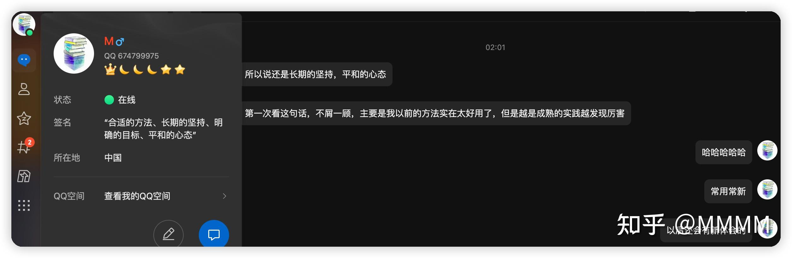

*“合适的方法、长期的坚持、明确的目标、平和的心态”*

## 第四部分：关于如何鉴别和选择考研辅导（公共课、专业课、机构、规划、答疑、讲课、一对一等）

### 1.依据

- 21考研一战，清华贵系（考了11912，自命题，初始能过 但复试难），报了王道定向班
- 22考研二战，北大软微，409分上岸（数学140 单科前三，408 135 单科前三），上岸后每天都被很多家机构找，包括但不限于：线上一对一数学授课、线上一对一408授课、线上一对一答疑、线上班级授课、线下集训营班主任等等形式，大小机构至少30+家机构吧。
- 之后在帮助大家的过程中，不管是替上岸的学弟学妹们和机构进行议价，还是替考研的同学们，分析各机构的情况。我都专门主动去和很多机构进行了接触（约50-80家吧，没细数，反正各种各样的机构都有）
- 23年研一在读，23年2月份开始，陆陆续续经常会有学弟学妹来找我，和我说：”报了xxx机构的线下班，一点用没有，老师讲的都是错的“，”感觉课表好紧，全都放在一起上课“，”老师水平不太行，讲不清楚“，”住宿还行，其他的都不太行，就当租房子住了“，”还没上完课，退款也不给退“，”一对一答疑的学长耐心不够，我基础差要问好多问题，他不想理我“。这类情况数不胜数。这些是机构的通病，因为老师可以说都是“临时工”，而如果你报了名师班，那你也不用指望，张宇、武忠祥他们亲自给你答疑。

### 2.如何识别广告

**1. 如何简单识别广告文（以某乎为例）：** 

- **挑动情绪：** 只有挑动了你的情绪，他们才能卖钱（更高端一点的，会配合一些干货，来提高你的认可和信任度）
- 本科如何如何不好
- 一战如何如何失败
- 一战xxx分上岸yyy学校
- 极力渲染上岸的喜悦情绪、失败的失落情绪，说明报班或者找他辅导的帮助有多大
- 一般分数也都是很高的那种（总分400+，或者某个单科很高），就渲染自己这个分数有多厉害
- 二战提了xxx分，要是一战就找辅导就好了
- **店铺链接：** 
- 每隔几句话，就有一个淘宝店链接
- **这种是知乎的付费推广** 
- **评论区** 
- 只敢显示筛选后一部分的评论，不敢全部开放（怕不好的评论别人看到）
- 评论区没有任何其他声音，全是求推荐机构的，回复也都是雷同的

**这类文章主要分两类** ：

1. **机构花钱雇的：** 帖子千篇一律，文章结构大同小异（当初被很多机构找过，他们会出一个范文，让我只需要在各平台上，以我的名义发布就行，每有一个学生，就会分给我40%-60%的收益，这么说大家懂了吧，至于为啥能给这么高的比例，因为带课的老师，一般都是只拿20-30%而已，他们啥也不用干，就白拿20%-40%的利润）
2. **个人出来辅导的：** 这个又分为两类
3. 一种是全文主要写干货，最后偶尔提了一下，也可以接辅导，或者评论区提了一下可以接辅导，这种一般就是自己随便做一做，不会刻意割韭菜。但是这个就完全是看个人人品了，非常的鱼龙混杂，尤其是开学之后，他面临的情况变了，可能就没办法提供高质量的服务了；或者就是单纯的人品问题；这种建议是私聊一下，问问其他问题，看看他的态度、耐心、能力、心态等等，不过一般比较难辨别。
4. 第二种就是，全篇都在挑动情绪（这个是很重要的，不是娓娓道来，而是时不时就挑动你一下，让你心潮澎湃）、渲染自己多么牛逼，这类还比较好甄别跳过。高端的会再配合写一些干货，和一些个人的经历，这类的如果写得好的话，你是无法判断区分他具体怎么样的。但是反正我之前接触过不少这类的人，这些人初心就是割韭菜罢了，没人在乎学生学的怎么样，最多是担心学的不好，影响他第二年招生罢了。而且不管他把自己说的多天花乱坠，都是泡沫，一般都是避重就轻，找个噱头就疯狂吹，就是欺负大家对于考研认知不足。一般这类的人，等你上岸了之后，再回头看，就知道了。（**这种的一般也不限制人数，尽可能多的招生，反正只要学生够多，就肯定有人能出成绩，至于成绩是不是和他有关，反正高分的就是他的功劳，低分的就是学生自己的问题。而且，很多学生自己也这么认为，只能说，一个愿打一个愿挨了。** ）

### 3. 如何看待上岸学长/学姐做考研辅导

我个人认为没什么问题，很正常，上岸了之后利用自己的知识、经验去变现，我觉得OK。

但是，我认为你的初心至少是为了学生好才行，而不是就为了割韭菜。你自己也是考研出来的，你应该知道考研的这一路上有多少艰难困苦，你不能上岸了，转身就依靠自己的优势，来坑过去的自己吧。

只要是认认真真做准备、有耐心、有知识、会教学、表达能力强，那我是很支持大家上岸后做辅导的，甚至不知道怎么做才能做好的，可以来问我。

**教育这件事，不应该是随意为之的。教育是一件很严肃、很重要的事情，至少我是这么看待的** 

你们找的机构辅导，大多时候也都是，你付钱买课时，其实并没有老师，等你们下完单之后，他们再去找上岸的学长学姐来教，两边一对接，他们后续基本就不管了。

### 4.上岸学长学姐们与机构的合作形式：

- **1. 广告：** 广告的话，基本就是机构找到上岸的学长学姐，直接或间接的打广告，你花钱买了课，他和平台分账，并且 绝大多数上岸的人都不会去认真核查这些机构的水平和质量！（因为都是学生，不用干啥就能直接赚钱，一般是不会特地花时间去调查的，也不会去在意质量怎么样），主要分为：
- 文章：内容都是机构写好的（就像上面说的那样），上岸的直接谈好价格就经常转发就行，转发频率也是他们自己定，我见过很多帖子 几乎完全相同的内容，换个人、换个标题就发了）
- 视频：一般只有大机构会这么做，让你制作一个视频，他们官方发出，这类的我觉得还好一些，至少没有同流合污，不是软文，比如一些上岸经验视频，一个视频大概几百到一两千不等。
- 后来还发现了一种更新奇的，就是套皮。不知道是机构有意找的人，还是自己有流量之后，找的机构。反正就是，看着是个人在分享一些东西，流量比较大，然后关注一下公众号之后，就会有各个机构的人，每天给你推销课程。
- **2. 答疑：** 一般机构的答疑，都是找的上岸学长学姐来给答疑。数学一般110+，408 100+，有的甚至要求更低。而且一般会有很多方式，来压缩成本，也就是给这些学长、学姐的钱很少，并且监督也参差不齐，所以也不好一棒子都打死，就看个人运气了。
- **3. 授课：** 
- 机构卖的授课，基本都是一对一形式的。
- 班课的话，他们也是一样，先卖出去课，然后找人来上。
- **你先购买课时** ，**然后机构才去给你找老师** （机构一般抽成50-80%，**越大的机构抽成比例越大，而且大机构的单位时间价格也更高** ，比如某些机构408一对一授课，一共30课时，就要25,000元（有认识的学弟在大机构做的，他到手3000多一共）。
- 大机构的话，确实还是会要求授课学长先试讲一下。不过基本上随便就能通过，尤其是机构急缺人的时候，要求很低，报班高峰期，随便就让你过了，基本上分数看着差不多就行，很多408考个100分的，就直接带班了。
- 但即使是大机构，也不会额外进行什么教学培训，像课表时间、上课教材、课件、上课内容等等，都完全是学长自己定。而他们都是第一次做，拿的钱还不多，你指望他们全身心备课备的特别好，感觉可能吗。尤其是到了7 8月份很多提前进组科研的，或者 9月份开学的，就更可能出现敷衍的情况了。反正机构也不管，他们的合同也不是和学生签的，出了问题，你只能找机构，机构也不会管，哪怕闹的很严重，最多就是按剩余课时给你退费（绝大多数情况，你是退不出来的）。
- 有些小机构实在找不到水平高的，在规定时间内他们找个差的，也一样会推荐给你，然后再进行一些美化包装。
- 有些机构也会推出一些班级课程，找一些真实的老师来授课，但是吧，不好评价反正是。

### 5.不同辅导形式的优劣势 & 适合的内容

如果能找到一个，优势是在的，同时相应劣势不明显，甚至没有相应劣势的班，那就是比较不错的。

|              | 优势                                                                                      | 劣势                                                                                        | 市场上会有的形式                                                              |
| ------------ | --------------------------------------------------------------------------------------- | ----------------------------------------------------------------------------------------- | --------------------------------------------------------------------- |
| 录播课          | 1. 价格低 2. 内容一般是反复打磨过                                                                 | 1. 可能内容老旧，更新慢 2. 没办法在课程中提问                                                             | 1. 各类授课班 2. 素材班                                                    |
| 大班（50人以上，线上） | 1. 价格相对低 2. 直播方便提问                                                                   | 1. 人数较多，老师很难了解你的具体情况 2. 一般情况下，问题回复速度会比较慢，效果差一些。 3. 非量身定做，你可能会跟不上节奏或者讲课方式不适合你的学习习惯   | 1. 授课班 2. 答疑班                                                      |
| 小班（10人以下，线上） | 1. 老师会关注每个人的详细情况（进度、遇到的问题、具体的苦难等） 2. 课程更灵活，可以根据学生的情况，调整授课内容、时间 3. 服务更加多、更加细，啥都可以问 | 1. 价格相对高一些 2. 要找到、并正确判断 哪个是靠谱的小班，是比较困难的                                                | 1. 授课班 2. 答疑班                                                      |
| 一对一（1人，线上）   | 1. 教学过程更舒适，可以随时打断交流 2. 更灵活，时间更好安排，内容也可以多次讲解 3. 和小班一样，老师很了解学生的具体情况                 | 1. 价格更高一些 2. 靠谱的不好找，并且没有其他学生进行交流、对比。 3. 教学思路不一定适合自己（要先了解一下最好）                       | 1. 授课班（靠谱的话就推荐） 2. 答疑班（靠谱的话就推荐）                                    |
| 线下班          | 1. 有学习氛围，适合不自律的人 2. 一般有住宿，不用单独租房了                                                    | 1. 价格更高 2. 老师水平参差不齐，方差极大（见过很多割韭菜的，讲的内容都是不对的甚至） 3. 不少每年换皮的小机构，在学校附近临时成立一个，包装一下就开始招商的 | 1. 暑期班 2. 短期班 这类靠谱的有效的，太少了，自己谨慎辨别吧。不过既然每年这么多线下班，那说明大家还是有这方面需求的。 |

### 6.如何不通过机构，去找一对一 & 如何判断学长学姐靠不靠谱（更新到这了）

- **渠道：** 闲鱼、知乎帖子、考研群、学校群都可以找到（微博、小红书也有，但我不咋用）
- **判断标准：** 
- **1.分数：** 高分不一定教的好，但太低的分，大概率是教不好的，数学（130+，408 120+，就够用了）
- **2.精力：** 是否本身很忙，或者带了很多个学生，比如你问：“之后开始答疑/讲课的话，我可以和其他您的学生拉群交流吗”，来看看他带了多少学生，以及他平时有多少精力放在这上面、会不会进组科研、生活上是不是一个非常爱出去玩的人等等。
- **3.逻辑是否清晰：** 多问一些问题，看他回答的时候，是不是有条不紊，逻辑清晰，如果出现言语啰嗦、前后逻辑冲突的话，那就可能不是很合适。
- **4.耐心：** 可以故意问一下重复的问题，或者表现出自己比较笨，看看是否可以耐心的讲解，帮你找到问题原因并想办法帮你解决。
- **5.是否有教课/答疑经验：** 教过初高中也行，有教过别人学习的经验就算。
- **6.专业性：** 比如408，我大概按难度等级递增，写了一些你可以要求学长学姐提供的服务
- 规划安排，做学习计划：一般为每周一次最佳，具体到天
- 划分重点（细分到节 比如 第一章第一节，哪些内容是重点）
- 用书/题集推荐（根据前后期进度情况来调整安排，而不是一次性安排）
- 书上范围内答疑（即书上的内容不理解，学长学姐进行解释，然后补充一些必要的额外知识点）
- 划分重点（从小节细分到题（不包括正文） 比如这一节 哪些题要完全理解 哪些要背下来 哪些过一遍了解即可）
- 每章节重要知识点的总结、学习角度、串联线索、导图整理等
- 扩展答疑（额外补充知识点，一般是书上讲的不太好的、未涉及的地方，进行较大较深的延展）
- 划分重点（包括正文 如王道正文哪讲得不好 该按什么顺序看 哪不太对 哪必须要背下来之类的）
- 各知识点主要考查方式（如课后题涉及的知识点 考试一般出现在选择题还是大题 是一整道题 还是某个选项）（下面开始就不是难度升级了）
- 模拟卷/真题答题情况评估（压力测试，限时模拟，甚至可以给你出题让你做）
- 章节检测（一般按章，出题 或者问答 或者 你讲这章节的内容理解 学长学姐纠正和补充）
- 思维发散和例子投射（比如用生活中的事情 来类比408的各种知识点,，二轮结束后你自己也可以尝试去这么做）
- 答题技巧和思路（课后题型如何一步步去分析题目 如何蒙题 和一些王道书上没讲 但即使不理解知识点也可以快速做对选择题的方法（不是所有题都有 仅一些题有））。
- 全程讲课 （就是带课+所有全包）
- 费曼学习，就是让你给他讲，全书的各知识点，你是如何理解的；题目你的解题思路是什么（因为很多时候，你以为的知识点理解了，可能不是完全对，或者不够透彻；题目做对的，但其实相关的知识点掌握的并不全面。）用这个方法，来进行深层次的学习，效果会十分明显，前提是对方的实力够用，且擅长发现问题，同时有足够的耐心并且十分负责任才行。

其实**很多上岸之后做一对一的，他自己很可能都不知道应该给你提供什么帮助、能给你什么帮助** ，你可以参考上面的内容，总结自己需要的帮助类型，去要求他提供相应帮助

- **形式与价格：** 
- **规划/进度安排：** 
- 一次性（100-300）：具体看细化到啥程度，建议是细化到周就行了，因为一次性的，实际执行波动会很大。
- 包月（200-500每月，持续跟进，动态调整）：每周一次，细化到天，具体看每天的安排有多细（书、课、题的整体性、连贯性等），最好是先了解一下你的个人学习时间、长期学习计划等
- 适合政治、英语
- **答疑：** 
- **按题：** 10-30/题（具体看形式）
- **按小时：** 150-400/小时。
- 好处：1. 你可以先攒着问题，有些问题在攒着的过程中你自己就会了 2. 集中答疑的效率最高 3. 集中答疑，先发问题，老师可以好好准备一下，然后视频解答，还可以给出一些其他题给你做
- 劣势：问题解决的不及时，有些问题可能会导致后面的知识学起来变困难
- **包月：** 600-2500/月，具体看频率、形式、对方分数、能力、内容等
- **建议：包月答疑，固定每天的某个时间提问** ，比如每天下午4-6点，因为你每天学习该科目的时间也是固定的，这样两边都省事。**并且如有必要可以视频答疑、搜集相关题给你做（会贵一些一般）** 
- **适合数学、408** 
- **授课：** 
- **按小时：** 一般机构都是这种，自己找的话大概200-400/小时
- **全年：** 价格区间很大，具体就看课时数、服务内容范围和质量了，

大概就是这些，学弟学妹们不要盲目报班，可以先自己学习一下试试，然后结合自身的基础、目标分数、目标院校、学习时间、学习习惯、前期学习效果等等因素，再来考虑是否需要找辅导，而不是看了太多消息就开始焦虑，然后盲目的去找辅导。

### 7.机构是如何统计，上岸某学校的学生，的本科分布情况的

我问过了一些机构，答案就是：从报了他们机构的学生中，统计的情况，然后样本估计总体。我认为这个比例，应该是有很大水分的，和真实情况差距较大，因为不同本科、不同专业的学生 报班意愿、选择的机构 都具有很大的随机性。所以大概看看就好。**官网没有的数据，考研机构几乎不可能有，都是包装而已，除非花大力气去挨个找上岸学生去调查（比如软微上岸，电子信息大方向的每个学生的小方向，每年那几家机构都是乱写基本上，我的成绩都被归为金科了我记得）** 

## 第五部分 个人考研经历（一战清华本部 11912 复试失败，二战北大软微 11408 成功上岸）

### 1.个人背景

- 东北财经大学：一个双非的财经大学（在财经院校的里还算不错的）
- 专业：会计学（考11408属于是文科大跨了，应该很难有比这个更跨的了）
- 年龄：本科毕业，在北京工作了挺多年之后来考研的，不是在校的应届考研学生
- 基础：
- 偏科，英语很差，分数比我高的大佬们 政治英语基本都比我高多了（441的大佬 数学和专业课的分数，和我这两科的分数是一样的，可想而知，我的政治英语是拖了后腿的）
- 本科没有政治课，所以政治全是考研备考的时候学的
- 数一很多内容，本科是没学过的（其实学过的数学内容，毕业多年也早忘光了）
- 408完全不懂，第一年连IDE是啥都不知道，代码在哪写才能运行都不知道，C语言也仅限于认识C这个字母而已
- 环境：身边人都很支持，这一点很重要，至少心理负担会少一部分，而且学习起来，也很更加轻松。

### 2. 考研经历

- **一战（21考研 清华大学计算机系本部 也就是常说的 贵系，初试科目11912，初试380分，复试被刷了）** 

2020年初，辞掉了工作。

2020年5月，正式开始一战的备考。首先是学习c语言，看了c语言的书《C语言从入门到精通》，B站看了翁恺。

**学习内容：** 

- 由于脱离学生身份多年，太久不学习了，尤其是这种书本+做题的形式，一开始根本没办法专心学习，学不进去。
- 6月开始才有点进入学习状态。
- 王道书一共看了三遍（说是3遍，其实第3遍一共就看了几天，就是随便翻了翻）
- 912 数据结构，邓公的书和习题集，看了算是2.5遍，邓公的课和ppt也看了。
- 黑书买了挺多，但都没咋看。
- 基本每天就是只学习数学和专业课，差不多46开，因为计算机基础一点没有，所以只能多花点时间。
- 第二轮的时候，才开始写了王道数据结构的大题，一轮压根不会写，不过稍微能看懂一点点。
- 政治英语是11月初开始的，基本上英语就是刷刷真题，最后准备了下作文语料；政治就听了徐涛强化课，看了点1000题，背了肖4肖8。

**学习环境：** 

- 我是租了个自习室的座位，每天去自习室学的，座位旁边有个大窗户，没事了就看一下，还挺好的。
- 个人推荐的学习环境：自习室>图书馆>租房的个人房间>学校宿舍>家里（自制力强的也可以在家学，不偷懒、家里人不打扰就行)
- 因为找的自习室离家近，并且大家都在学习，互相也不认识，更有学习氛围；而且点外卖可以在茶水间吃，还有打印机、微波炉、阅读室啥的（别找环境差的自习室，得不偿失）；同时也有监控，书啥的也不担心丢。
- 我找的自习室就是居民楼，然后里面改造成了自习室，放了桌子椅子啥的。

**个人作息：** 

- 我的作息没有参考价值，我是晚睡晚起，没准几点（一般都2点之后，有时候5点6点）。
- 建议还是规律一点，而且不要晚睡晚起，至少10点之前起来学习，半夜3点之前睡觉。
- 不然的话，不仅会导致第二天上午基本没有，学习时间大打折扣。同时正式考试的时间段，是早上最晚7点多就要起床的，你会非常不适应，会让你白天的考试很吃亏，大脑非常不活跃，这个我深有体会（基本上会导致10-30分的波动下滑）。
- 第一天考试可能靠意志力还能硬撑，但是连续第二天的话，整个人都是木的，眼疼头疼基本上是必然的。
- 如果实在改不了作息，那就和我一样晚睡晚起，至少保证睡眠时间充足，这比你早起两小时要重要，不然的话，长期下去，超过6个月，作息不规律或者不充足，身体会吃不消，出现明显的大脑迟钝、记忆力下降、免疫力下降等情况。

**学习时间：** 

- 我每天的学习时间大概10-14小时，如中午12点-晚上1点这种的，中间除了30min吃饭，其他都在学习，灵活性比较大（**不是每天都学满14小时，那一般人谁顶得住啊，长期下来人该没了** ）
- 不要7月之前，就开始疯狂每天学10个小时以上，除非你能一直保持到12月考试。长期保持这样的高强度，能保持6个月以上的，已经不是一般人了。前期可以6-8小时就行了。
- 建议7月份或第二轮的时候，再适当加长时间，不然身体和精神，都很容易在考前松懈或垮掉，尤其是10月11月左右。
- **建议的整体策略：前松中紧后平。** 
- 前期（7月之前）找状态、买书、打听消息、学习相关基础并入门，可以时间上稍微放松（6-8小时每天）；
- 中期（7-10月）进入高速学习状态，可以每天多学点时间，是进步的关键时期；后期大概11月开始，进入不松不紧的状态，心态平稳最重要，规律学习，有利于考试发挥，同时安排好时间，因为政治英语的复习强度开始加大，要合理分配数学和408的时间（建议数学还是至少每天都要学和做题，408偶尔少学一点，问题不大，因为408真学透了，是不那么容易忘了，但是数学是吃熟练度的，所以不能中断学习和练习）。

**放松：** 

- 我的学习过程中，基本全程都戴耳机，放一些意义不明的歌曲 或者 郭德纲相声（基本上听烂了，学习、吃饭、路上、睡前，基本上是一直循环播放）
- 玩了一个很弱智的手机游戏，应该是叫 最强蜗牛，反正就是随便点点就完事了每天，不需要脑子。

**报班：** 

1. **一战 清华912** 

- 一战考912的时候，报了王道的定向班（还是叫领学班，忘了），对于一战跨考来说，尤其是自命题院校，确实会省事很多，不然自己都不知道要学啥，搜集信息也很困难。
- 我就是图省事报的，但是反正各种原因吧，我是完全靠自学的。

**成绩：** 

- 初试380，数学139，政治英语都是60+，专业课108好像，初试分数也是中等偏下。
- 主要是没写过代码，数据结构那道代码题，虽然一看就知道是剪枝回溯，除了第一问代码，剩下的都答的挺好，代码改来改去，改到最后也不是很正确，只好把思路当注释写在写不明白的那部分上去了。但是清华912对这道代码题是很严格的，代码不是全对，基本就没分。这道题是16、18、还是24分我忘了，反正我得了0分，笑死。
- 那道代码题的难度，对应leetcode的hard难度，因为准备复试的时候，这类的题我已经写的信手拈来了，笑死。
- 不过这个题对于912来说，不算难题，中规中矩。只能说一战那是实力不够，没招，学的时间太短了，实在没时间练习写代码。
- 复试被刷了，一共24人进复试，有12个录取名额；
- 上机分数大概在13-16名应该是，处于中等偏下。
- 主要还是复试的同学都太强了，我一个跨考的，只学了半年的考研知识，完全比不过人家（清本、北本、acm金银各种都有）

**准备复试：** 

- 初试之后，开始学如何上机，四处找人问哈哈哈哈哈。比如咋下载IDE、找在线OJ网站等。
- 先学了C语言，刷的PTA的题，从printf("Hello World!"）开始做的，然后就是打印图形啥的，PTA的题，基本上是全做完了（除了英文题和一些对当时的我来说 太难的题）。
- 然后开始刷其他的OJ网站，比如AcWing，leetcode，牛客（有清华真题，还有一个网站也有真题，但记不得叫啥了）等，还有各个大学的OJ网站等，前后起码用了6、7个网站在刷题吧。
- 自己写了排序之类王道书上有的的算法（插入、选择、快速、归并、堆等等），完全0基础，学起来确实有点难，但是也挺好玩的。

**招生情况变化：** 清深21考研那年，开始优先录取一志愿了（以往据学长说的是：本部被刷的和清深一志愿的一起复试），21是清深录取完了，给本部被刷的留了几个名额。

**结果：** 最后是清深的其他学院录取了，但是不想去深圳，就拒绝了。

**2. 二战（22考研，北京大学软件与微电子学院 11408，409分，上岸）** 

2021年7月，正式开始二战备考。

**学习内容：** 

- 政英战略性放弃，11月初开始政治，12月初开始英语（别学我，不建议战略性放弃这两门，因为压力会大一些，我是知道自己这两科学了也不一定有效果，性价比低，所以不学）。
- 数学和去年一样，市面的题基本都做了，660 330 1800 1000 880这些，不一一列举了；
- 模拟卷/真题加起来大概50-60套吧。因为二战所以真题做的不是很多（一部分原因是时间不够了，22那年 卷子的发货时间很混乱，导致最后给卷子计数的时候，计错了，所以最后做不完了。最好是隔两天看看卷子发货情况，不然发丢了都不知道）。
- 408买了王道教材、模拟题、真题、知识点串讲的一本忘了叫啥（买的时候就都带了，但没看过），二战就没报王道班了，感觉没用，也没听王道的课。大概看了2.5遍的书，做了模拟题和真题（因为一战都认真学过了，二战很多内容都还记得其实，所以408花的时间没有数学的多）

**学习环境：** 

- 依旧是之前的那个自习室，换了个位置，更加靠近窗户了，挺舒服。

**个人的作息：** 

- 作息时间比一战更差了，基本每天都在3点之后才睡，有时候4、5点才睡。

**学习时间：** 

- 还是每天10-14小时

**放松：** 

- 学习过程全程戴耳机，循环播放郭德纲相声，休息的时候也听其实；
- 游戏的话，玩了世界弹射物语，号养的还挺猛的哈哈哈哈，上岸之后还卖了800块钱（依然是不建议玩那种太带脑子的游戏，可以偶尔需要用脑子，但不能全程都需要花精力），这个游戏就是提前配队、对轴、打活动、组队，基本上配好了，打的时候就全自动就行，所以不麻烦，但也挺有意思。

**学习状态：** 

- 总体状态是不如一战的，从心态和身体状态上，都有所下降，学习效果也变差了很多其实，这个也是我个人作息的问题，以及一些人生和生活上面的变化等等。
- 不过整体还是很平稳的，自己能够扛住，所以波动不是太大。

**初试成绩：** 

- 数学140，408 135，英语66，政治68，总分409；
- 还算满意，虽然数学分数丢的有点可惜，感觉是可以满分150的本来（这就是为啥我一直强调，作息要好，不然就会像我这样，考试时间段内很难顶，而且数学和专业课还是第二天考，人都麻了）；
- 408还好，有几个脑抽写错的，但也有几个蒙对的，所以还可以；
- 英语很知足了，预期就是62-70之间；
- 政治比预想的低一些，不过也很不错，预期刷66-72之间。

**复试：** 

- 初试完之后，我拉了上机算法打卡群（包括开学后也建立类似的群），leetcode用了3个月，刷了800-1000道题我记得大概是，主要是easy和mid题，hard比较少（上岸后又刷了一部分，总计1200-1300题差不多）
- 也看了一些人工智能的相关书籍，比如《统计分析方法》、西瓜书之类的，很多同学也都一起看了，评价是，看了也没啥用，老师不会问，我们十多个人，都没被问这些书上学了啥。
- 项目就是网上随便找了一个，很简单的小游戏（建议是别随便找，这个有点坑，太简单了没意义，太难了自己学不透，而且技术栈互相重叠，前置知识太多）。这个也没咋问，后面我知道是这东西太简单了，毫无意义。
- 最后复试成绩85（比平均分82/83 只高一点点）。应该是我的状态、回答的内容老师们比较喜欢，因为简历上没啥东西，所以基本上知识类的问的相对多一些（这个也是不好的，如果回答的老师不满意，很可能会被pass掉，比如23届396的学弟，就有点惨）。只不过每个知识问题，我都可以回答很多发散的内容出来，所以分数还行。不过当时也有些发挥不好，一些简单问题明明是会的，但是回答的岔了，所以分数不是特别高。
- 复试分数22年平均分应该是82左右。

**找导师：** 

- 上岸后我就开始找导师了，我是7月份直接加入项目组的（不是搞科研的，是工程类的），约等于找好了导师（组内其他人，4月份就进组了基本上）

**上岸感受：** 

- 北大藏龙卧虎，但同时方差极大；
- 充满了机会，也充满了挑战。
- 给大家一句忠告：研究生，别把自己当成学生，别用学生的眼光和思维去看待问题、处理问题。第五部分 个人考研经历（一战清华本部 11912 复试失败，二战北大软微 11408 成功上岸）

## 第六部分 关于跨考、在职与辞职

### 1.跨考

**首先想清楚，自己为什么要跨考，如以下几点：** 

- 首先，为什么不喜欢当前的专业：发展前景？工作机会？本身的兴趣？工作强度？
- 其次，明确自己是不是真的喜欢计算机或者擅长学习计算机：如果有时间的话，比如大一大二，可以先尝试接触一下计算机的实际工作，如果没机会接触，那就做点开发项目、科研项目，还没机会的话，那就刷一刷算法题，看看自己喜不喜欢。
- 最后，跨考目的是什么：薪资高？那你目标薪资多少？达到这个水平是否现实？工作强度能否接受？工作地点能都接受？

**然后思考，跨考的难度，如以下几点：** 

- 首先，自己的计算机基础有多少：学过其中1-2门课？完全没学过但会c语言？文科跨考，一点也不会，甚至C语言都没听说过？
- 其次，搜集一下哪些学校对跨考的歧视小：尤其是复试，不会单纯因为你跨考就不要你，或者给你低分就行；看能力的就很正常，因为这个不算歧视跨考本身，而是能力不足。
- 最后，要有心理准备，要付出比其他人更多的努力，甚至是加倍的时间（学习完全不懂的领域，过程会很艰难，尤其是开头和结尾，万事开头难，结尾升华更难）

**最后判断，其他客观因素是否支持自己跨考，能否承担失败的后果，如以下几点：** 

- 父母亲人是否支持：是全力支持（精神+经济），还是仅仅是口头的支持，其实更想给你安排的别的安稳工作，或者想让你考个公务员。后者的话，在你备考过程中出现较大压力和负面情绪的时候，家人可能会给你的情绪火上浇油。而且经济支持也体现在很多方面，比如更舒适的学习环境等等。
- 如果一战失败，是否考虑二战：这个要提前想好，虽然所有人都想一战上岸，但肯定有人要二战；假如一战失败，你要怎么做？是联系导师去实验室打杂，还是找个实习干一干，等过几个月再回来备考，还是直接无缝衔接继续备考下一年等等。能否接受一战失败？
- 如果二战了，结果二战也失败了怎么办，还要转行吗，能接受得了这个风险吗？还是回去原专业找工作吗？
- 如果一战目标是软微，学到一半觉得不太行，能接受跳车差一点的学校吗？会不会特别遗憾、后悔？
- 以上这些提前想清楚，那么在备考过程中，心态就会更好一些，不然在几个焦虑高峰期的时间段，你的学习状态很容易出现较大的波动，导致本可以上岸的人，最后上不了岸，甚至频繁出现弃考的行为。

**如何开始、规划自己的学习：** 

- 以上内容都想好了，也处理好了，那就可以开始准备学习的事情了
- **规划：** 
- 首先判断自己未来有多少时间能用于学习，比如学校会不会安排实习等内容，占用多少时间；有多少课要上，是不是要翘课；每天能学习多久；朋友找你出去玩怎么办？
- 要听哪些课、看哪些书？要不要报班？报什么类型的班？报哪个机构的班？
- 在哪里学？吃饭、住宿怎么解决？
- 如果出现意外情况怎么处理：舍友很吵很打扰？学校临时安排不可抗的课程或实习？发现自己学不会？
- 制作大概的学习计划表：具体到月份即可
- **学习环节：** 
- 和数学一样，先打基础，不要着急，反复夯实，多思考，要比数学更多的思考，因为计算机各个科目和环节是有联系的，他是一个应用学科，而数学是基础学科，这是有区别的，学习方法是不同的。
- 由简入难，不要急躁也不要懈怠，坚持积累几个月之后就会发现自己的进步
- 就像搭积木，你要先把每一块积木的样子、形状、颜色都先了解透（即零散的知识点掌握），这一步做的越好，那么之后讲他们拼接在一起的时候，才能更快速、更准确、更牢固（也就是搭建体系）。前者决定了你的分数下限，后者决定你的分数上限！
- **外力帮助 不要不好意思开口问：** 
- 每次进入一个未知领域，很可能会不知道都应该学啥、如何学，这个时候多问问前辈肯定没错（这也是我最近实习，很多对我有帮助的人，给我讲的他们的经验），也许一个东西，你自己学三天就能学会，但是前辈的一个指点，你一个小时就把这个东西学透了。前者自学固然体现了你的学习能力很强，但后者才是你成功的关键（人生很多事都是如此，所以不仅仅是努力就可以，还要会努力）。
- **心态问题：** 
- 记住一个点，闻道有先后，术业有专攻，科班的到最后考试，不一定比跨考的强
- 各种情况你都想好了，那么剩下的就是实践了。不管最后走向哪个方向，都要让自己心态平稳，时刻冷静。这对于未来方方面面的发展都是有用的。

### 2.在职与辞职

在职考研是真的很困难，即使你的工作很闲也一样，除非闲到你不用去公司，也没什么人找你。一般能考虑在职的，不是国企这种，就是家人介绍的清闲工作，建议如下：

- 如果没办法下定决心，早早辞职，无法承担丢了工作又考不上学的结果，那就先学习几个月，看看情况，情况乐观的话，就6月份、8月份考虑辞职（如果10月份再辞职，就有点太晚了，**两边都想要，结果往往两边都会失去** ），如果可以请长假（2-6个月）最好，或者暂时停职
- 如果是经济压力很大，需要自己工作攒钱，那最好是上半年全职工作攒钱（下班时间学习）；下半年找个清闲的工作（半天的那种兼职工作），主要精力用于学习。

辞职之后，家里支持就最好回家备考，经济压力进一步下降（不用担心啃老，你和你的家庭是一体的，一起前进才是正确的，而不是压力都自己扛着），找个自习室早出晚归，就不会太受打扰。不想回家就租房学习，可以找个研友一起住，当地太贵就去周边便宜的城市（研友的选择就比较关键了）

但是一定要早做决定，优柔寡断不可取。

## 第七部分 关于研友、租房、在校等学习环境

### 1.研友

如何选择线下研友，是一个比较难以形容的问题，我只能列举一些，需要考虑的点：

- **作息时间：** 作息同步，这个很重要，毕竟同住
- **生活习惯：** 各自能接受就行
- **目标院校** ：最好是不同，甚至最好是考试科目也不同。没有利益关系，就只有互助关系了。
- **互补：** 信息收集能力（院校、资料等）、学习能力（学得快、学的好）、自律能力（能坚持学习），最好是各自都有，或者一人占一部分，进行互补
- **经济状况、家庭状况：** 家里都支持最好，不至于因为经济因素、家庭因素，互相影响学习状态，得不偿失，尤其是后期，还得听别人诉苦也是很麻烦的。
- **找研友的途径：** 
- 本科宿舍舍友
- 本科校友
- 高中朋友
- 考研群群友
- 帖子等网络途径

如何选择线上研友，这个比较简单，试错成本低，建议：

- **擅长的能力互补：** 搜集信息、心态、学习能力、自律、组织能力
- **5-10人小群最佳：** 人太少了，互助不够全面；人太多了，就会混乱，会有摸鱼的伸手党

不建议和对象一起住，除非两个人都是要考研的，且都完全以学习为主的理性人士，不然会很分散精力。当然也不建议分手，一段感情来之不易，在不同阶段 做好自己就可以了。

### 2.租房

辞职考研、学校宿舍舍友比较差劲（熬夜打游戏、性格怪异）的可以参考：

- **地点：** 
- 优先在目标院校或者自习室周围租房，减少通勤
- 其次就是吃饭问题，最好附近有个小饭馆（如果不能在学校吃的话，这点在长期学习时很重要），或者自习室可以点外卖也行。
- 交通要便利，或者电动车、自行车前往自习室也可以
- **房子：** 
- 不要租太老旧的，一是影响心情，二是东西容易坏，报修麻烦，三是隔音差（虽然新房子可能也差）
- 可以在便宜的地段或者省市地区租房，不一定在家乡或者学校所在地
- 可以直接自如（价格高一些，但是装修风格、保洁、维修都很好）
- 亲戚的空房子也行，起码省钱，就是半途可能会出现，亲戚要住，不得不搬走的尴尬处境

### 3.在校

在校学生在宿舍住的话，基本就是图书馆或者学校里面的教室、自习室了，基本上就没多太多的选择了。

## 第八部分 其他

- **不要直接套用本帖的内容，仅供参考** ，因为每个人的情况都有很大的不同，我尽量把大部分情况都考虑到了，但是一定是因人而异的，要具体问题具体分析，实在不行就私信问问我
- **很高兴你能看到认真的看到这里，如果觉得有用的请留个赞同、喜欢或者评论，让我知道你们觉得真的有用** 
- **如果需要的话，建议收藏，我会一直更新下去的！** 
- 最后，考研不易，希望大家都能认真努力的坚持下去，我也十分荣幸能以本帖来帮助到大家，加油！

### 科研（北大的一些老师）

大部分都是和 具身智能（也就是机器人、自动驾驶） 有关的（因为确实火）

[北京大学董豪老师：招具身智能、智能机器人、计算机视觉科研实习生\博士\硕士\博士后](https://zhuanlan.zhihu.com/p/568456535?utm_campaign=shareopn&utm_medium=social&utm_psn=1800542989866643459&utm_source=wechat_session)

[北大杨耀东，招收强化学习科研实习生](https://zhuanlan.zhihu.com/p/570205006?utm_campaign=shareopn&utm_medium=social&utm_psn=1800543136801497090&utm_source=wechat_session)

[科研实习丨北京大学情感智能机器人实验室招收本科实习生](https://zhuanlan.zhihu.com/p/495025795?utm_campaign=shareopn&utm_medium=social&utm_psn=1800543473637675008&utm_source=wechat_session)

[仉shang hang](https://www.shanghangzhang.com/)

## 第九部分 关于复试(因为签有保密协议，不能透露具体内容，只简单说明复试要准备哪些方面）

1. 算法：跨考完全没写过代码的话 可以 pta（有非常基础的题） - leetcode - acwing（偏难题多一些 因为主要是面向竞赛的）， 按顺序看 找合适自己的，其他网站如codeforces、洛谷，有基础也可以看，目前形式为老师读题 学生手写算法 难度不算很大（力扣简单和部分中等题难度，明年不一定）。刷题手册可以看 代码随想录、算法笔记啥的，在帖子前面也贴了链接了。
2. 机试：22、23、24年都没有，25大概率还是没有，但不保证
3. 笔试：算法题+简答题；算法题大概leetcode的medium和少量easy和hard；简答题的话，各类都可能，比如实际开发类问题、AI类问题、数据库等方面，基本上是超出408的；这个也不用太担心，大部人都不太会，实在担心就加群【885884619】。
4. 英语：需要准备一点口语问答（自我介绍时有时无，会有专业课问答）
5. 专业课：408四门都可能会问，建议至少一门精三门会，提问内容会超过408范围不少；
6. 个人自述（简历）里写啥问啥：别不懂装懂 写自己不太会的东西；要有比较亮眼的实践经验、竞赛获奖是最好的
7. 关于竞赛、项目、论文：有最好，没有的话，也来不及准备竞赛和论文了；可以初试完搞个项目（简历上实践经验方面，最好是有2个东西，1个太单薄了），能说得好最重要；
8. **新写了一篇软微的复试攻略，可以参考一下，希望对大家有帮助[https://zhuanlan.zhihu.com/p/26930675365](https://zhuanlan.zhihu.com/p/26930675365)** 

**每年出分之后，我都会建复试群，今年也一样，到时候拿成绩单私信我就行** 

### 最后，十分荣幸你能认真的看完本帖，感谢你的信任。如果觉得有用的话，可以点个赞！同时也希望上岸之后，能在您的经验帖或考研群里，添加上本帖的链接，让更多的考研人看到，我们一起帮助以后辛苦求学的学弟学妹们吧

在你跳转到别的帖子之前，可以先**点个赞 ** 哈哈哈哈哈（这对我很重要，很希望得到大家的认可和反馈）！怕你们看完别人的就不记得回来给我点赞了呜呜呜呜

因为之前的帖子，被人多次恶意举报没了，大几十万的浏览和喜欢都没了，大家点点赞，给更多的人看到～

## 附录 其他关于软微的经验贴（持续更新）

**软微复试流程 & 经验** 

[https://zhuanlan.zhihu.com/p/26930675365](https://zhuanlan.zhihu.com/p/26930675365)

### 24考研 上岸贴

初试430，杨尼尔 408 145（应该是全国第一目前来看）

[24跨考软微11408一战430经验贴](https://zhuanlan.zhihu.com/p/684902150)

初试434，狗哥 给大伙上压力！

[24考研北京11408一战软微434分记录贴](https://zhuanlan.zhihu.com/p/684253427)

初试417

[24考研11408一战软微417分经验帖](https://zhuanlan.zhihu.com/p/690258204)

### 24考研 失败贴

[24二战软微计算机低分失败抱怨帖（367）](https://zhuanlan.zhihu.com/p/684420027)

[24一战软微，简评11408考试](https://zhuanlan.zhihu.com/p/674561596)

[二战软微计算机低分失败帖（366）](https://zhuanlan.zhihu.com/p/684081110)

[二战软微计算机失败乱谈](https://zhuanlan.zhihu.com/p/684150150)

[24考研11408 北大软微失败教训帖](https://zhuanlan.zhihu.com/p/676513083)

[跨考一战科软二战软微失败贴（调剂上岸上科大）](https://zhuanlan.zhihu.com/p/684256793)

### 23考研经验贴

1. 懒懒，均衡发展

[11408北大软微计算机 412分菜鸡帖](https://zhuanlan.zhihu.com/p/609004723)

2. 数一150

[23考研数一150上岸北大经验贴](https://zhuanlan.zhihu.com/p/609387874)

3. 计算机408方向第一名

[23医学跨考软微11408一战433分交流帖](https://zhuanlan.zhihu.com/p/621765126)

4. 北京大学计算机学院（原信科拆分）计算机系统结构专业，初试、复试第一

[2023北大计算机学硕考研经验](https://zhuanlan.zhihu.com/p/618544676)

### 22考研经验贴

1. 火佬，英语86爆杀（先贴冰火二佬，在rw也是一等一的爆杀实力，而且人超好）

[22软微11408初试400经验贴](https://zhuanlan.zhihu.com/p/451102960)

2. 冰佬，公共课的神，帖子写的非常清晰

[22年北大考研11408一战初试403分经验贴](https://zhuanlan.zhihu.com/p/470725890)

3. strive佬，心态拿捏

[杭电一战北大软微经历](https://zhuanlan.zhihu.com/p/452356931)

4.复试逆袭，天选之子

[零基础一战双非三跨上岸北大软微](https://zhuanlan.zhihu.com/p/491312470)

5.400分大佬，各科比较均衡

[22考研北大软微计算机经验帖](https://zhuanlan.zhihu.com/p/490409887)

6.中规中矩 368+85

[北大软微上岸心得，希望能帮助到后面的考生](https://zhuanlan.zhihu.com/p/491368379)

9.科班大佬，数学130 专业课135，总分412

[2022一战北大软微经验帖](https://zhuanlan.zhihu.com/p/492762814)

10.劝退帖（定心丸 熊猫哥！呜呜呜）

[北大软微技术类0.02分落榜教训贴](https://zhuanlan.zhihu.com/p/495268838)

12.二本大佬，高分经验分享

[二本跨考混子二战圆梦北大](https://zhuanlan.zhihu.com/p/495877830)

13.成功调剂物理学院

[22年北大考研上岸经验贴（软微和物院）](https://zhuanlan.zhihu.com/p/508834632)

14.在职二战上岸

[22在职二战北大软微记录与总结](https://zhuanlan.zhihu.com/p/510589662)

15. 418均衡大佬

[2023 考研想考北大软微计算机，该如何准备?](https://www.zhihu.com/question/524963011/answer/2417395508)

### 21考研经验贴

1.洛神赋

[21年数一148分经验贴](https://zhuanlan.zhihu.com/p/361712701)

2.精神领袖mmt

[末流985二战北大软微考研流水账](https://zhuanlan.zhihu.com/p/366428503)

### 励志区

### 整活区

1.1 软微圣经大全

[a](https://github.com/fjh1997/ruanweibible#)

1.2 内容 软微圣经（大群聊天版）

[a](http://www.zhihu.com/question/474012605/answer/2044816723)

2.玩梗贴

[如何考上北大计算机研究生(玩梗版)](https://zhuanlan.zhihu.com/p/491817891)