# 1.大作文（图表）总结

0.重点必会单词/词组

**account for/make up** 占.......比例

**illustrate** *v.* （用图表、例子等）说明，阐明

**depict**：描绘；描述

1.开头

正如图表中生动描绘的那样

As vividly depicted in the chart

正如饼图生动展示的那样

As is vividly illustrated in the pie chart

描述折线图要列出具体的数据！！！

rising from 63.78 million to 78.11 million. Meanwhile, the number of museums also grew steadily, from 4,165 to 4,692.

2.中间

这种显著差异可归因于

This significant disparity can be ascribed to

可以合理地归因于

can be reasonably attributed to

3.结尾

展望未来，随着....

 Looking ahead, as

展望未来

Looking into the future，

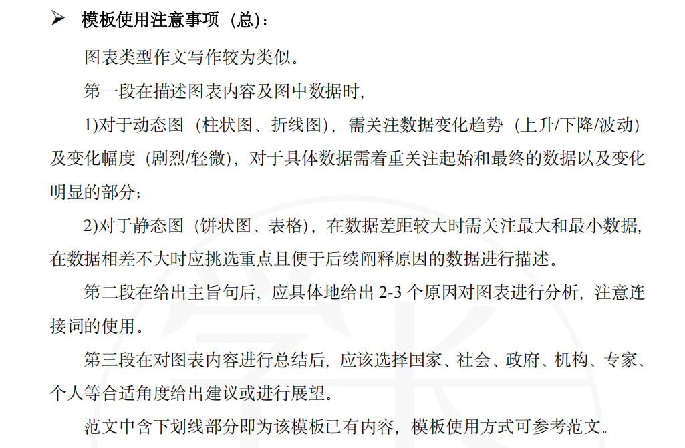

# 我的作文：15+30分钟

## 12年小作文（投诉信）

## 15年小作文（通知）

Volunteers Wanted!
Starting from July 15, a three-week summer camp is to be hosted for high school students on our campus. It features various academic and entrepreneurial activities, such as a series of lectures by prominent professors and a business plan competition, which are designed to inspire students to attain greater achievements.

In order to ensure the smooth running of the event, we are recruiting volunteers to assist us in organizing it.
The qualities we value most in candidates include patience, willingness to help others and effective communication skills. Previous experience of volunteering in similar programs is a plus but not a prerequisite.

Are you expecting an exciting and rewarding experience? If yes, please do not hesitate to join us by sending your application form to 12345@hotmail.com by June 25.

The Students’ Union

## 14年大作文（柱状图--对比）

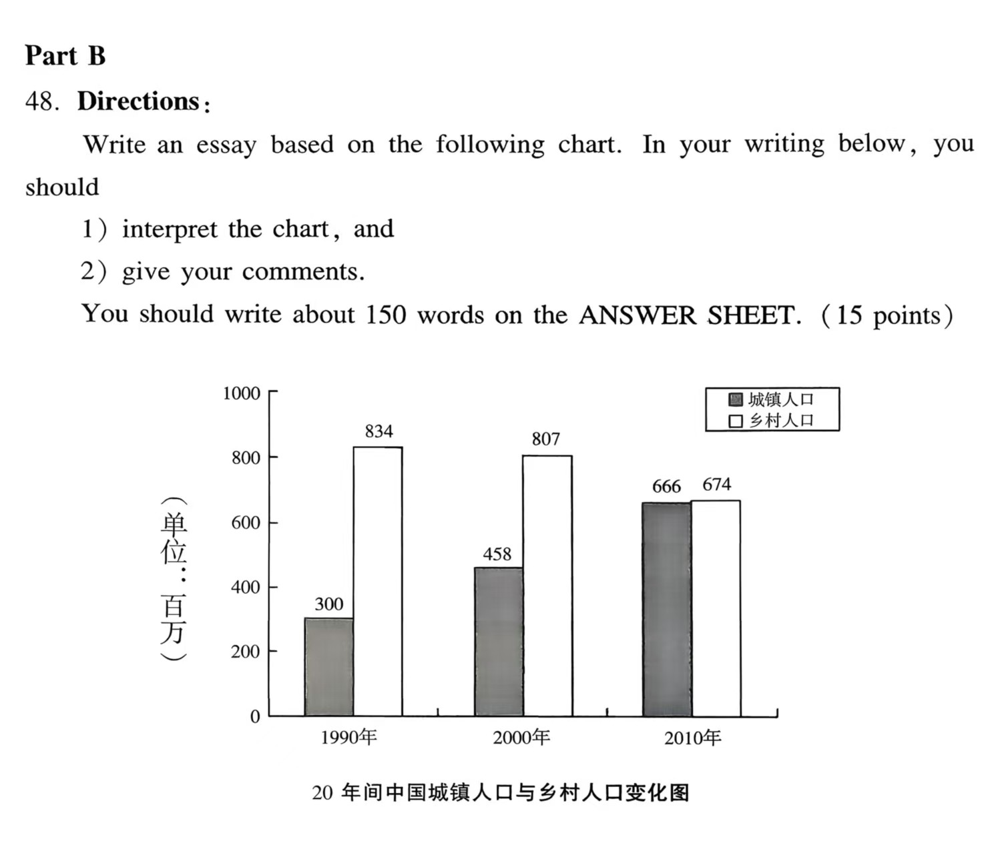

As vividly shown in the bar chart, China’s urban and rural population showed distinct changes between 1990 and 2010. In 1990, the rural population (834 million) far exceeded the urban population (300 million). By 2000, the rural population dropped to 807 million while the urban population rose to 458 million. In 2010, the rural population further decreased to 674 million, and the urban population increased to 666 million, narrowing the gap significantly.

This trend reflects China’s rapid urbanization over the 20-year period. On one hand, urban areas offered more job opportunities and better public services, attracting a large number of rural residents to migrate. On the other hand, industrialization and urban development accelerated the expansion of urban populations.

Looking ahead, urbanization is likely to continue, but efforts should be made to balance urban-rural development—such as improving rural infrastructure and public services. This will help reduce the urban-rural gap and promote more coordinated social progress.

## 20年小作文（建议信）

Dear Friends,

I’m so delighted that you trust me to arrange your trip. I’m writing to inform you of the historical attraction to visit — the Terracotta Army, one of the greatest archaeological discoveries of all time — and share some travel tips.

Located to the east of downtown Xi’an, the Terracotta Army is a massive collection of life-size clay warriors and horses buried in the tomb of China’s first Emperor. It offers a fascinating glimpse into the country’s glorious past. To get a better view of these breathtaking sculptures, you may consider avoiding public holidays in China or setting out early if you have to visit the museum on those days. In addition, it’s also advisable to hire a multilingual audio guide at the ticket office, which will certainly make your trip informative.

Hope this trip suits your taste and that you all enjoy it.

Yours sincerely,
Li Ming

## 20年大作文（图表--饼图）<练习>

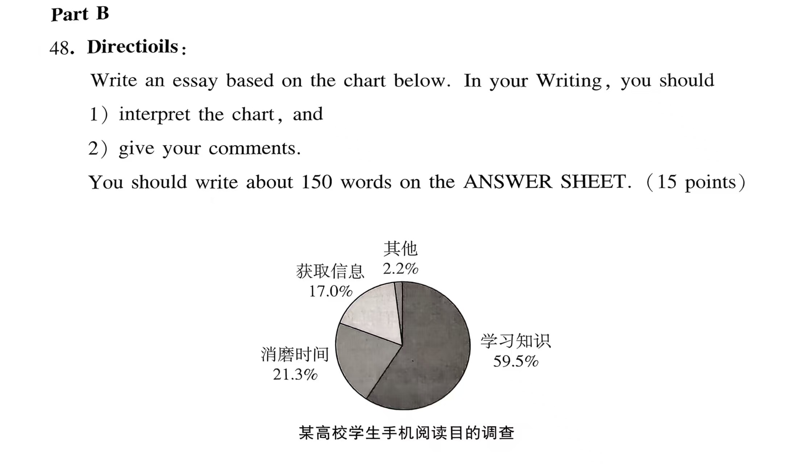

As vividly presented in the pie chart, the data stems from a survey on mobile reading purposes among students at a certain university. Learning knowledge emerges as the leading motive, making up 59.5%. Killing time accounts for 21.3%, while obtaining information and other purposes constitute 17.0% and 2.2% respectively.

This distribution reveals that mobile reading, once seen merely as a pastime, has evolved into a means for self-improvement and information acquisition. For one thing, college students, in their pivotal academic phase, naturally prioritize mobile reading to gain knowledge, aiming to enhance their academic performance and competitive edge in the job market. For another, the widespread use of smartphones provides easy access to both educational resources and casual content, so some students use them to kill time while others seek information about current affairs and practical matters.

As a young people, I believe that we should use mobile phones in a rational way. Meanwhile, it is not advisable for anyone to be addicted to online games or social networks

译文：

正如图表生动呈现的那样，这些数据源于对某大学学生移动阅读目的的一项调查。学习知识是最主要的动机，占比59.5%；消磨时间占21.3%；获取信息和其他目的分别占17.0%和2.2%。

这一分布表明，曾经仅被视为消遣方式的移动阅读，如今已演变为自我提升和信息获取的途径。一方面，处于学业关键阶段的大学生，自然会优先通过移动阅读获取知识，旨在提高学业成绩并增强在就业市场的竞争力。另一方面，智能手机的广泛应用使得教育资源和休闲内容都易于获取，因此部分学生用它来消磨时间，而另一些学生则通过它获取时事和实用信息。

作为一个年轻人，我认为我们应该合理使用手机。同时，任何人都不应该沉迷于在线游戏或社交网络。

## 21年小作文（邀请信）

Dear Jack,

I’m writing to invite you to participate in an online meeting I’m organizing about Chinese culture. Knowing you’re interested in Chinese culture, I hope you can join us. Here are the details:

The meeting will be held on Zoom next Monday morning. It will last one hour, during which we’ll have professors knowledgeable about Chinese culture share insights. We’ll learn how to celebrate traditional festivals like the Spring Festival and explore Chinese customs’ history and development.

I’d appreciate it if you can join. Looking forward to your reply.

Yours sincerely,
Li Ming

## 21年大作文（图表-柱状图）<练习>

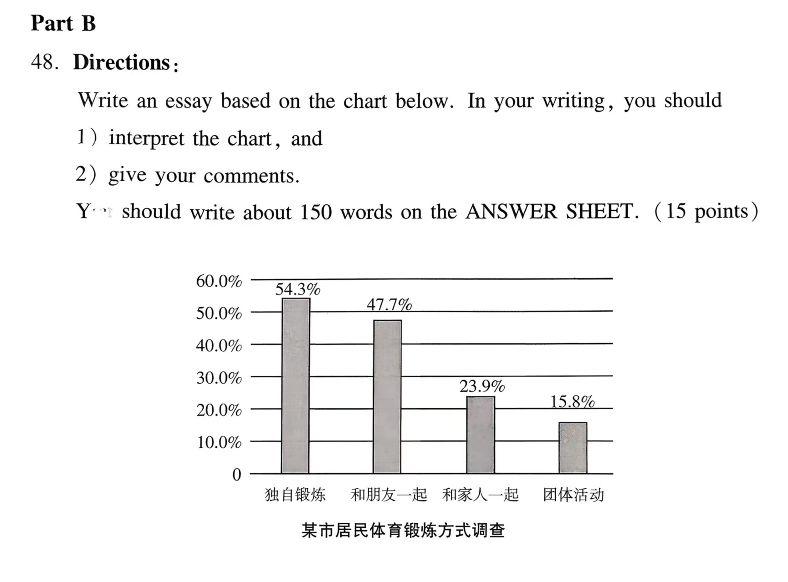

As vividly illustrated in the bar chart, the survey on residents' exercise methods in a certain city reveals notable differences. Exercising alone stands out as the most prevalent choice, accounting for 54.3%. Exercising with friends follows closely at 47.7%, while exercising with family and engaging in group activities constitute 23.9% and 15.8% respectively.

This pattern can be attributed to two key drivers. For one thing, in today’s fast-paced life, exercising alone offers unparalleled flexibility in terms of time and location, enabling residents to seamlessly integrate workouts into their busy schedules. For another, exercising with friends not only serves as a means of physical fitness but also fosters social connections, making it a favored option. Exercising with family, though conducive to strengthening family bonds, is often constrained by conflicting timetables. Group activities, with their rigid arrangements, have a relatively low participation rate as they lack the convenience of other methods.

I, as a college student, deem that it is of great necessity for youngsters to do sports every day. It is doing sports that helps us to maintain physical and mental health.

译文：

正如图表生动所示，某城市居民锻炼方式的调查呈现出显著差异。独自锻炼是最普遍的选择，占比54.3%；与朋友一起锻炼紧随其后，占比47.7%；与家人一起锻炼和参与团体活动分别占23.9%和15.8%。

这一模式主要源于两个关键因素。一方面，在如今快节奏的生活中，独自锻炼在时间和地点上具有无可比拟的灵活性，使居民能够将锻炼无缝融入繁忙的日程。另一方面，与朋友一起锻炼不仅是强身健体的方式，还能促进社交联系，因此成为受欢迎的选择。与家人一起锻炼虽有助于增进家庭纽带，但常受时间冲突的限制。团体活动因安排较为固定，参与率相对较低，因为它缺乏其他锻炼方式的便利性。

作为一名大学生，我认为年轻人很有必要每天运动。正是运动帮助我们保持身体和心理的健康。

## 23年大作文（图表-折线图）<练习>

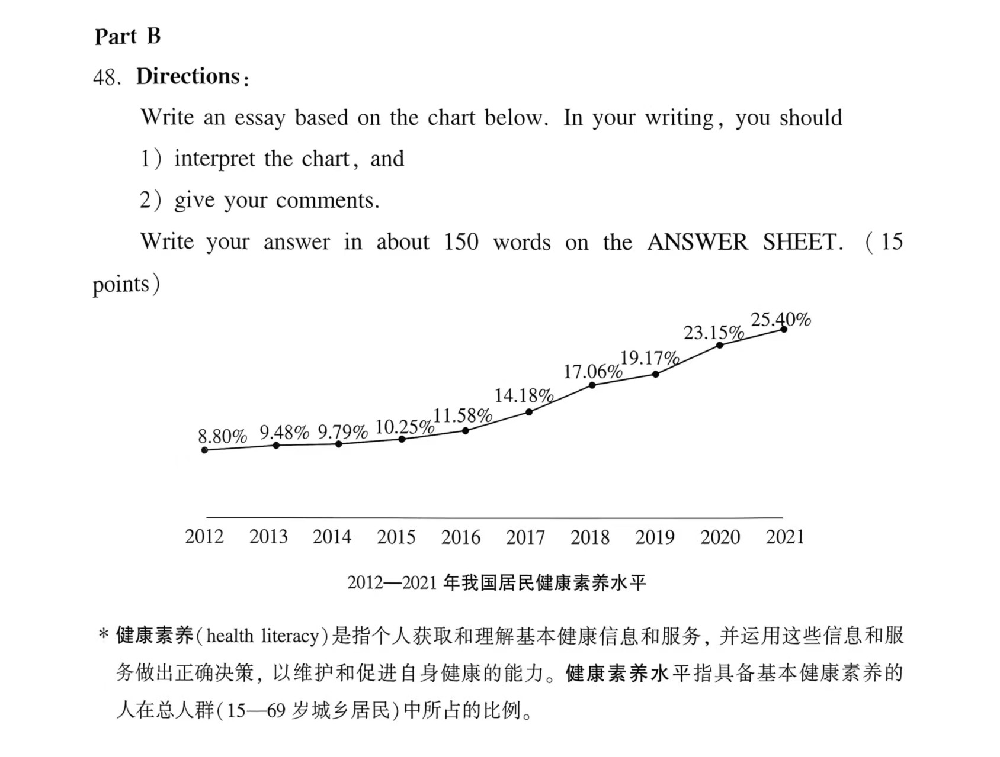

As vividly depicted in the line chart, China’s residents’ health literacy level (the proportion of people aged 15-69 with basic health literacy) saw a steady upward trend from 2012 to 2021: it started at 8.80% in 2012, gradually rose year by year, and reached 25.40% in 2021.

This continuous growth stems from two key factors. First, the government has actively promoted public health education through campaigns and media, raising residents’ awareness of health knowledge. Second, the popularization of the internet has made health information more accessible, enabling people to better understand and use health resources.

As a youngster who is preparing for the national entrance exam for postgraduate studies, I pay much attention to my health and I do sports regularly, which can bring me full energy, inspire my passion for life and help me improve efficiency in learning. 

译文：

正如折线图所生动呈现的那样，2012 至 2021 年间，我国居民健康素养水平（即 15—69 岁人群具备基本健康素养的比例）呈现稳步上升趋势：该数据在 2012 年为 8.80%，此后逐年稳步攀升，到 2021 年已达到 25.40%。

这一持续增长态势源于两大关键因素。其一，政府通过开展各类宣传活动与媒体传播，积极推进全民健康科普教育，提升了居民的健康知识知晓率。其二，互联网的普及让健康信息触手可及，助力大众更好地理解和运用各类健康资源。

作为一名正在备战全国硕士研究生招生考试的青年，我十分重视自身健康状况，坚持规律运动。规律运动不仅能为我充沛精力，激发生活热情，更有助于提升我的学习效率。

## 24年小作文（建议信）

Dear Jack,

I’m writing to share my plan for our survey on old house protection in the ancient town.

First, we’ll visit the town’s cultural office this Saturday morning to get official data on the current state of old houses. Then, in the afternoon, we’ll interview 10 local residents to learn about their views on protection. After that, we’ll sort out the information and draft a brief report by next Monday.

Does this plan work for you? Let me know if you have any better ideas about the survey process or content.

Looking forward to your reply.

Yours sincerely,
Li Ming

## 24年大作文（柱状图）

As vividly depicted in the bar chart, the survey on college students’ key gains from labor practice courses shows distinct results. Learning relevant knowledge ranks first, with 91.3% of students benefiting from it. Enhancing hands-on skills follows closely at 84.8%, while feeling emotionally refreshed accounts for 54.4%, and improving cooperation abilities makes up 32.6%.

This pattern aligns with the core goals of labor practice courses. For one thing, these courses are designed to deliver practical knowledge and skill training, explaining the high percentages for “learning knowledge” and “enhancing hands-on skills.” For another, individual-focused tasks in such courses may limit opportunities for collaborative work, leading to the lower share of “improving cooperation abilities.”

Looking ahead, labor practice courses could integrate more group-based tasks to boost students’ cooperation skills, while maintaining their strengths in knowledge and skill development. This would help the courses better foster well-rounded competencies for students.

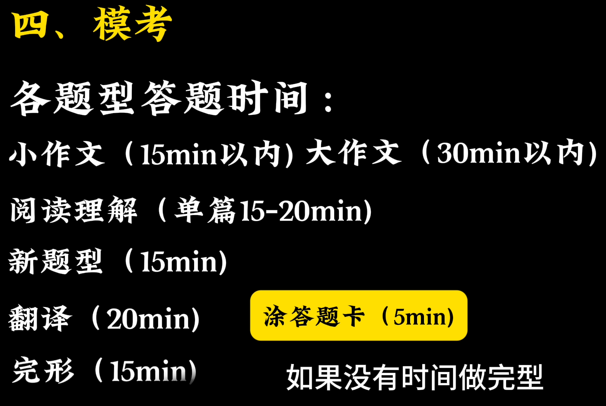

# 2.小作文模板

## 1.道歉信

Dear XXX，

​	I am writing this letter to express my sincere apology for  (需要道歉的事件)

​	The reason is that (具体原因：如：The reason is that I am caught up in a sudden task that can’t be postponed.

**原因是我临时接手了一项无法推迟的任务**。/The reason is that an unexpected issue comes up, which requires immediate attention.

**原因是出现了一个意外问题，需要立即处理**。). Therefore，I can’t manage my time properly. I understand this might have disappointed you, and I wonder if we could （具体补救方法，如：reschedule for （时间）reschedule for next Monday at 2 PM  to complete the pending task.**不知我们能否重新安排在下周一下午 2 点完成这项未竟的任务**）. 

​	Once again，I feel sorry for any trouble I have caused and hope you can forgive me. Looking forward to your reply.

yours sincerely，

XXX

## 2.建议信

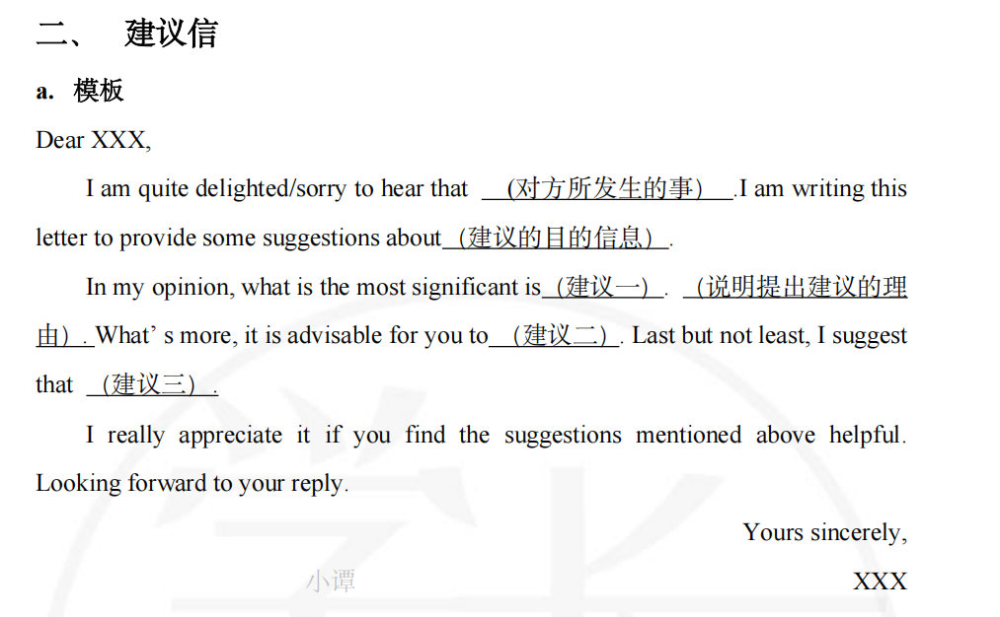

## 3.邀请信

Dear XXX，

​	I am writing this letter/email to warmly invite you to attend our forthcoming 活动名称，which is organized to 活动目的.  Here are some details.

​	As scheduled，the event will be held in 地点 from （开始时间，例如 8：00 a.m.）to （结束时间） on （日期）.

First of all，there will be.........  After that，.............Besides，...........

​	I will appreciate it if you can accept my invitation. I am looking forward to your reply.

Yours sincerely,
Li Ming

## 4.投诉信

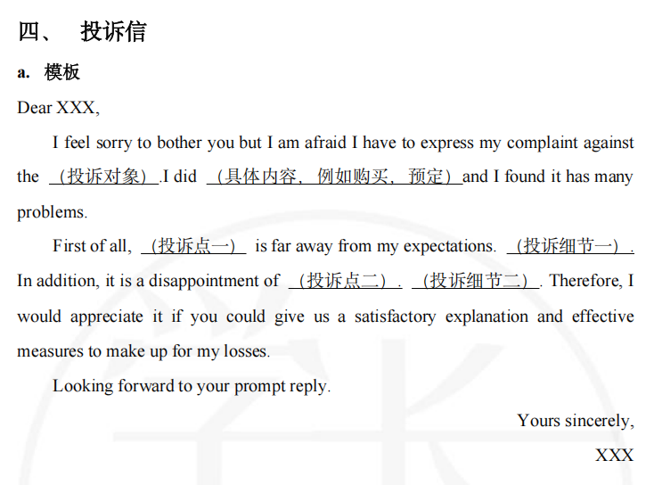

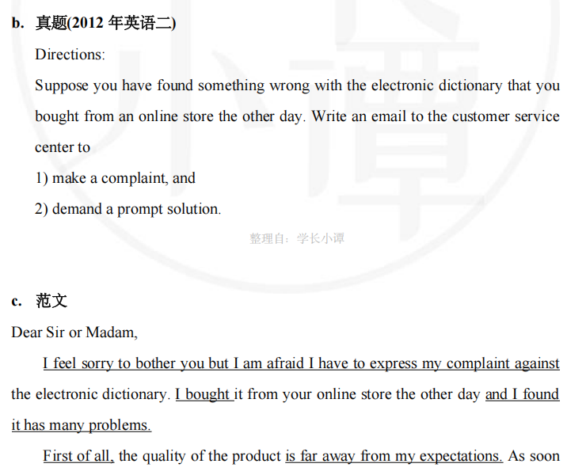

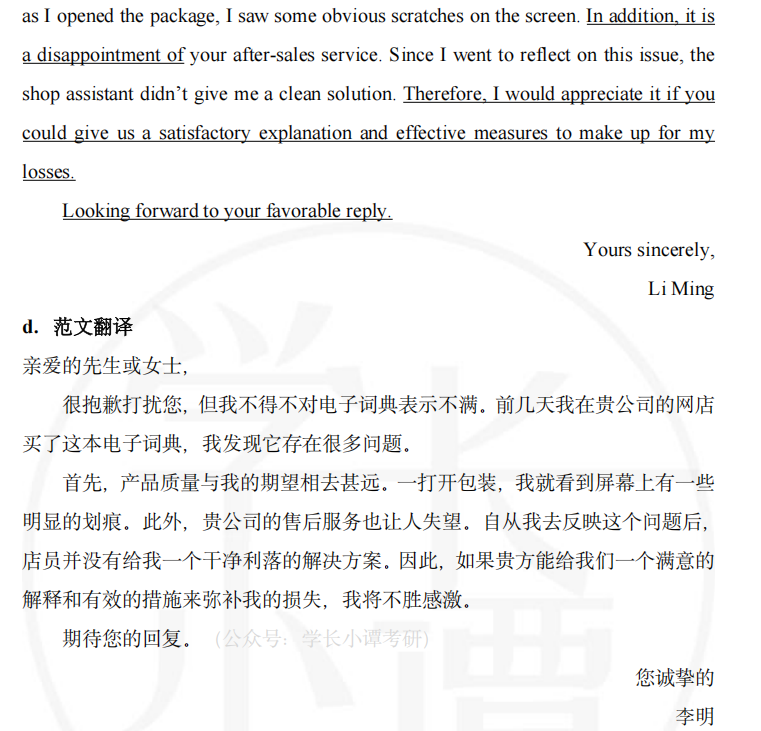

## 5.介绍信

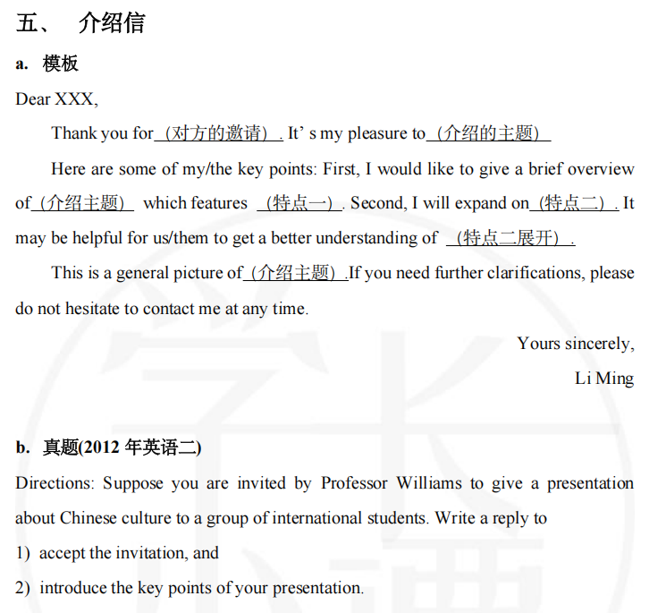

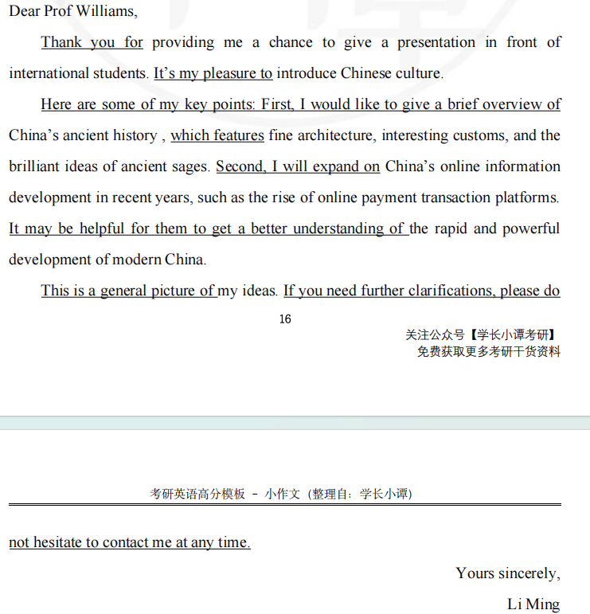

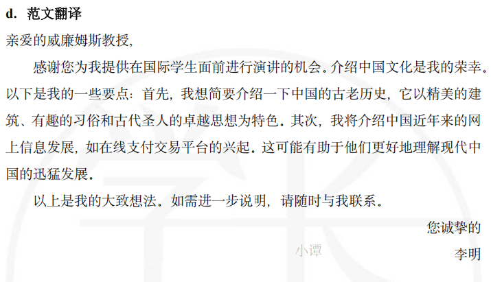

## 6.通知

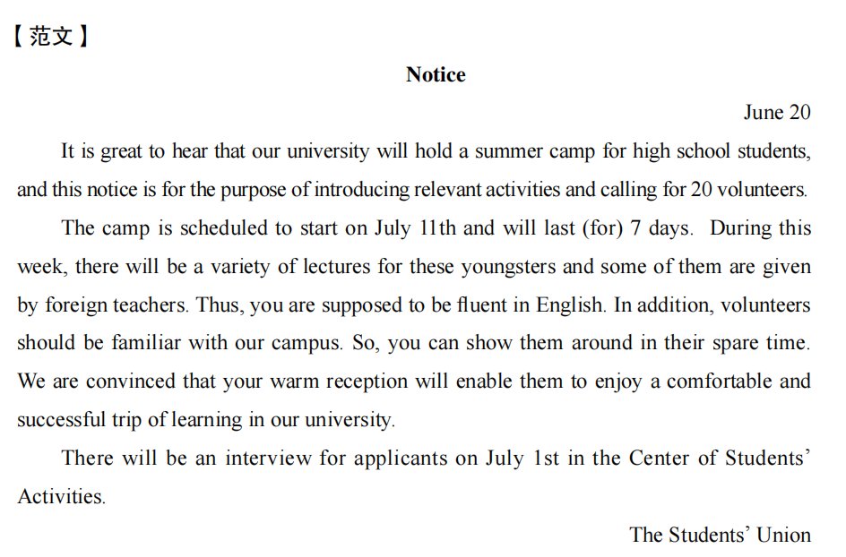

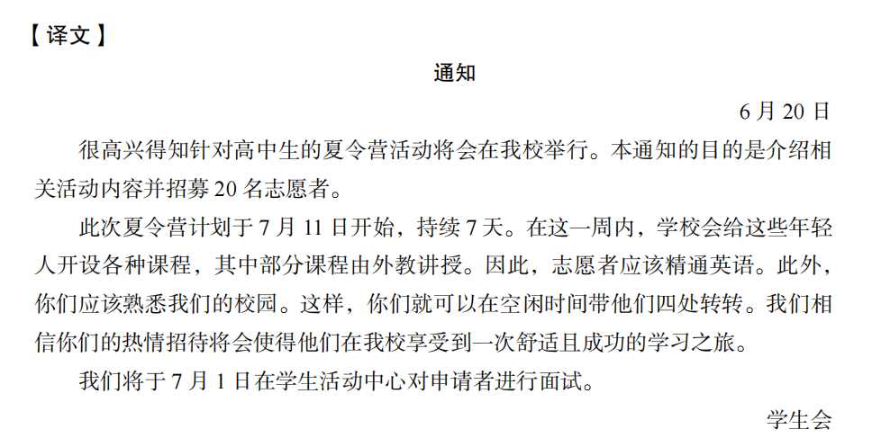

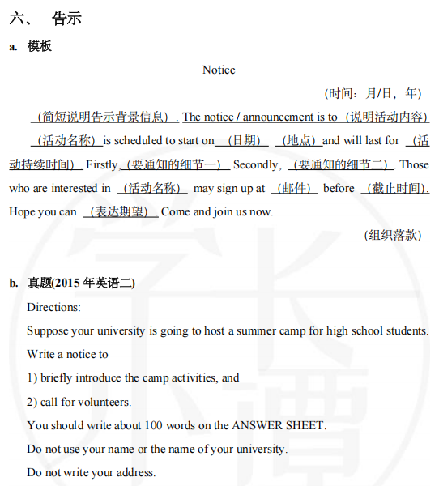

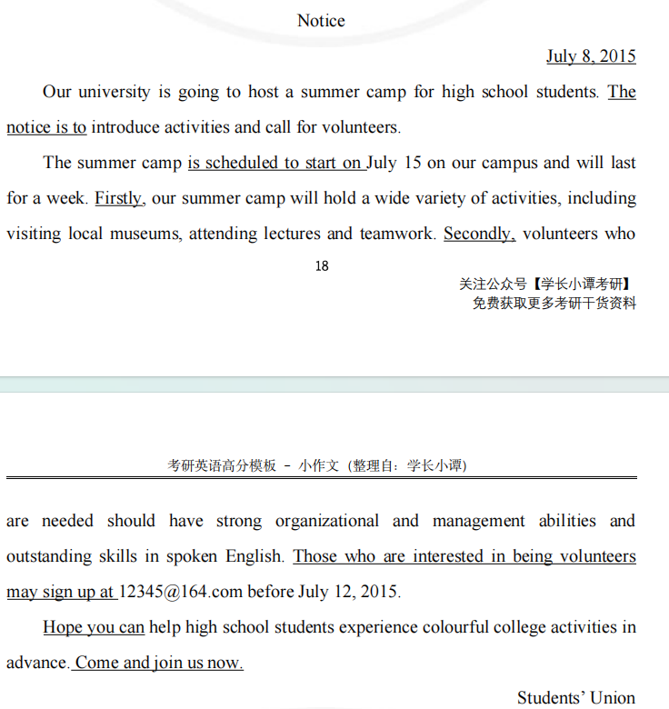

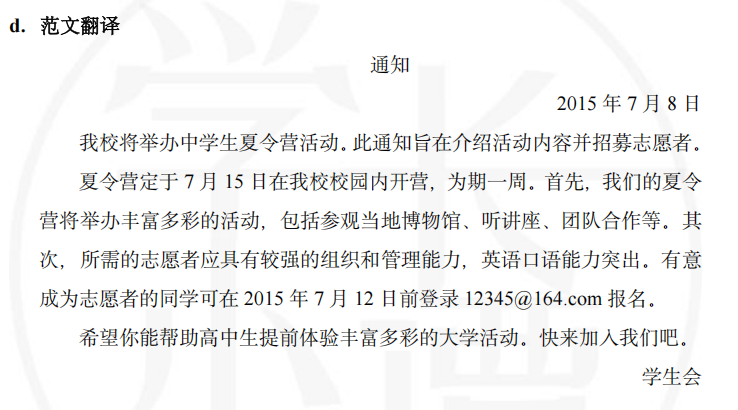

# 3.大作文模板

## 1.柱状图

多条柱状：Specifically, the proportion of the Chinese brands increased dramatically from 25% in 2008 to some 32% in 2009. In stark contrast, that of the Japanese brands experienced/enjoy/suffer a sharp decline/surge from nearly 35% to 25% during the same period. 

As vividly depicted in the bar chart，the changes in/survey on （图表主题） in a  （范围，school/countryside/city/community） show/shows distinct trends/preferences/differences.(概括描述图表内容，包括趋势（上升/下降/波动）、幅度（大/小）、数据（始/终/强调变化大部分））.

This disparity can be attributed to several key factors. In the first place,[原因1].What's more，[原因2].Besides，[原因3]

As a young people, I believe that

## 2.饼状图

As vividly depicted in the pie chart, the （图表主题） in （范围） show distinct proportions. [核心类别 1] ranks first, accounting for [百分比 1]. Following closely is [核心类别 2], which takes up [百分比 2]. [类别 3]  constitute [百分比 3] , while [类别 4] and [类别5] constitute [百分比 4] and [百分比 5] respectively. 

There are several key factors contributing to this distribution. In the first place,[原因1].What's more，[原因2].Besides，[原因3]

As a young people, I believe that

## 3.折线图

上升/下降：

xx increase/rise/drop sharply/gradually from xxx to xx

xx show an upward trend/ a downward trend from xxx to xxx

As vividly depicted in the line chart，the number of（概括描述图表内容，包括趋势（上升/下降/波动）、幅度（大/小）、数据（始/终/强调变化大）

This trend can be attributed to several key factors. In the first place,[原因1].What's more，[原因2].Besides，[原因3]

As a young people, I believe that

## 4.表格

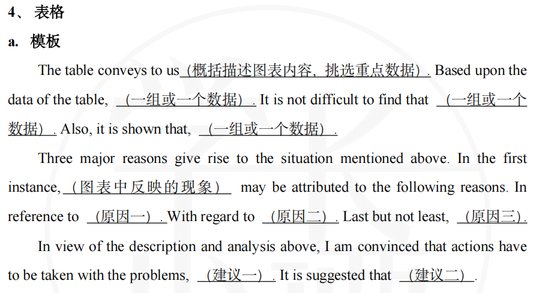

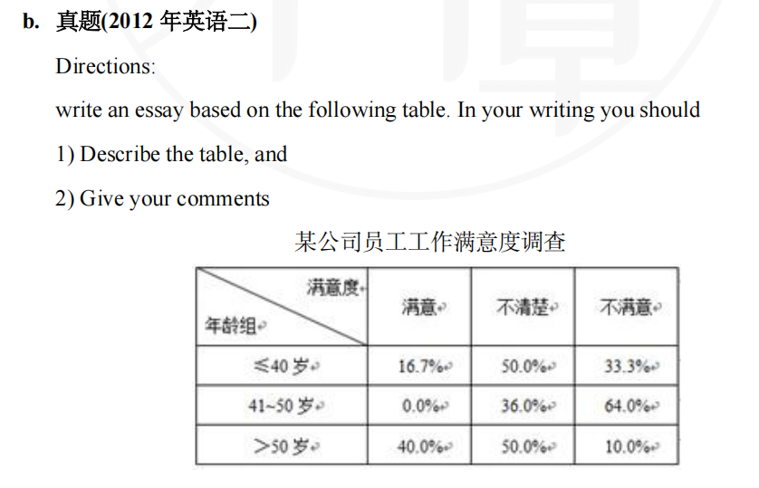

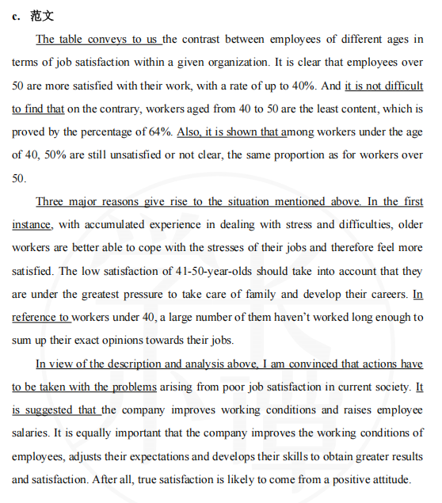

## 5.材料作文（新大纲）

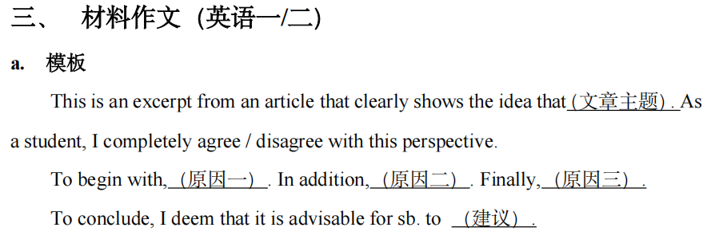
